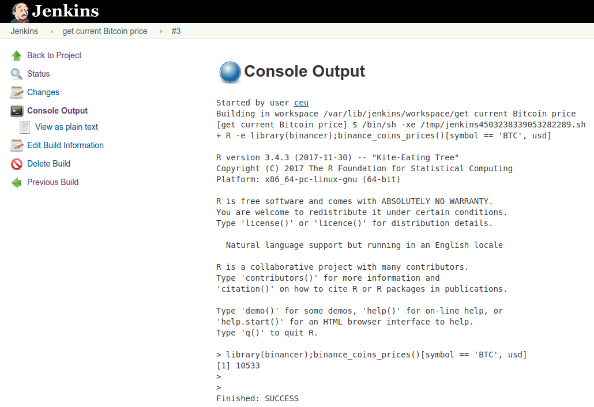

## dummy slide

<!--javascript to remove dummy slide-->
<script>
document.getElementById("dummy-slide").remove();
</script>

<!--end dummy slide-->
</section>

<section>
<section class="titleslide slide level1">
<h1>Intro</h1>


## Every Data Science project starts with ... ETL

> - Have you ever written an R script to be run in a non-interactive way?
> - Have you ever scheduled an R script to run without human intervention?
> - Did it work?
> - Do you have any R script running in production?
> - ... with central logging, proper monitoring and alerting?
> - ... run on cheap spot-instances with real-time performance metrics collected and feeding an AI picking the optimal instance type for the next run?

## Every BI consulting firm have developed its own ...

> - job scheduler
> - data repository and metadata documentation tool
> - central logging
> - and a few other things ...

## Every BI consulting firm have developed its own ... {data-transition="none"}

- job scheduler
- data repository and metadata documentation tool
- central logging
- and a few other things ...

Today we can just pick the right open-source tool, such as

- Jenkins
- Airflow or Luigi
- `cronR` and `taskscheduleR` R packages
- cloud services (eg AWS Batch, Cloudwatch, Lambda)

----


Source: <a href="https://thecodinglove.com/when-my-co-worker-wants-to-simplify-code-that-took">thecodinglove.com</a>

## TODO move version control here

not only for r packages ... but scripts ... ad-hoc reports as we;l

</section></section>
<section>
<section class="titleslide slide level1">
  <h2>Clean code!</h2>
  <!-- <video width="80%" controls> -->
  <!--   <source src="todo" type="video/mp4"> -->
  <!-- </video> -->

## Code style

kid driving the car animgif?

## Code style

It can be anything ... just be consistent!

> - [Google's R Style Guide](https://google.github.io/styleguide/Rguide.xml)
> - [Hadley Wickham: Style guide. In *Advanced R*](http://adv-r.had.co.nz/Style.html)
> - [The `tidyverse` style guide](https://style.tidyverse.org)
> - Internal company style Guide

<div class="fragment">
Extra hints:

- use [EditorConfig](https://editorconfig.org)! [R-bloggers article](https://www.r-bloggers.com/editorconfig-force-unified-coding-style-from-all-your-contributors/)
- use [`lintr`](https://github.com/jimhester/lintr)
- use `lintr` in a pull request builder / CI tool
</div>

## DRY

```r
metrics[, ctr := round(clicks / impressions, 2)]
metrics[, rpc := round(revenue / clicks, 2)]
```

<div class="fragment">
```r
metrics[, ctr := clicks / impressions]
metrics[, rpc := revenue / clicks]
for (v in c('ctr', 'rpc')) {
  metrics[, (v) := round(get(v))]
}
```
</div>

<div class="fragment">
```r
for (v in names(which(sapply(metrics, class) == 'numeric'))) {
  metrics[, (v) := round(get(v))]
}
```
</div>

<div class="fragment">
```r
round_metrics <- function(data) {
    ...
}
metrics <- round_metrics(metrics)
```
</div>

<div class="fragment">
```r
library(myPackage)
metrics <- round_metrics(metrics)
```
</div>

## Document and potentially open-source your code

<div style="float:left;">
  <blockquote class="twitter-tweet" data-lang="en"><p lang="en" dir="ltr">Decided to spend a couple hours coding in the hope of a modern and flexible logging engine in <a href="https://twitter.com/hashtag/rstats?src=hash&amp;ref_src=twsrc%5Etfw">#rstats</a>, then ended up thinking about and sketching the &quot;Anatomy of a Logging&quot; (tm) also writing docs for days 😜<br><br>Looking forward to any feedback and comment! <a href="https://t.co/GbT1uXfNX9">https://t.co/GbT1uXfNX9</a> <a href="https://t.co/uXsnKfDxsi">pic.twitter.com/uXsnKfDxsi</a></p>&mdash; Gergely Daróczi (@daroczig) <a href="https://twitter.com/daroczig/status/1067461632677330944?ref_src=twsrc%5Etfw">November 27, 2018</a></blockquote>
</div>

<div class="fragment" style="float:left; max-width:50%;">
- Use `roxygen2`, potentially with markdown
- Run `R CMD check` frequently to check on your docs
- Pick a permissive license
- Build your R package homepage with `pkgdown`
</div>
<div style="float:none;"></div>

</section></section>
<section>
<section class="titleslide slide level1">
  <h2>Don't get confused ...</h2>
  <video width="80%" controls>
    <source src="https://video.twimg.com/tweet_video/CXSk_PVUEAAQQg9.mp4" type="video/mp4">
  </video>
  

## ... use version control!

<a href="https://twitter.com/daroczig/status/682966258904510464">
  <!--  -->
  <video width="80%" controls>
    <source src="https://video.twimg.com/tweet_video/CXSk_PVUEAAQQg9.mp4" type="video/mp4">
  </video>
  
</a>

## git 101

Start from scratch:

```bash
git init .
git add .
git commit -m "hello world"
git push origin master
```

Contribute to an existing project:

```bash
git clone https://github.com/foo/bar
git branch -b feature-branch
git add .; git add -u .
git commit -m "add my new cool feature"
git push origin feature-branch
```

</section></section>
<section>
<section class="titleslide slide level1">
<h1>When I desperatly search in the logs why the app crashed</h1>

<a href="https://thecodinglove.com/when-i-desperatly-search-in-the-logs-why-the-app">
  <video width="80%" autoplay loop>
    <source src="https://ljdchost.com/010/ab2UUrD.webm" type="video/webm">
  </video>
</a>

## logger: a lightweight, modern and flexibly logging utility for R

```r
library(logger)
log_threshold(TRACE)
log_info('Script starting up...')
#> INFO [2019-04-04 04:25:17] Script starting up...
log_info('The mtcars dataset has {nrow(mtcars)} rows!')
#> INFO [2019-04-04 04:25:17] The mtcars dataset has 32 rows!
log_eval(nrow(mtcars))
#> TRACE [2019-04-04 04:25:17] 'nrow(mtcars)' => '32L'
```

----

`cat demo.R`

```r
library(logger)
pkgs <- available.packages()
log_info('There are {nrow(pkgs)} R packages hosted on CRAN!')
for (letter in letters) {
    lpkgs <- sum(grepl(letter, pkgs[, 'Package'], ignore.case = TRUE))
    log_level(if (lpkgs < 5000) TRACE else DEBUG,
              '{lpkgs} R packages including the {shQuote(letter)} letter')
}
```

<div class="fragment">

`Rscript demo.R`

```apache
INFO [2018-20-11 22:49:37] There are 13433 R packages hosted on CRAN!
DEBUG [2018-20-11 22:49:38] 6300 R packages including the 'a' letter
DEBUG [2018-20-11 22:49:38] 6772 R packages including the 'e' letter
DEBUG [2018-20-11 22:49:38] 5412 R packages including the 'i' letter
DEBUG [2018-20-11 22:49:38] 7014 R packages including the 'r' letter
DEBUG [2018-20-11 22:49:38] 6402 R packages including the 's' letter
DEBUG [2018-20-11 22:49:38] 5864 R packages including the 't' letter
```

</div>

## Colorized output

```r
library(logger)
log_layout(layout_glue_colors)
log_threshold(TRACE)
log_info('Starting the script...')
log_debug('This is the second log line')
log_trace('Note that the 2nd line is being placed right after the 1st one.')
log_success('Doing pretty well so far!')
log_warn('But beware, as some errors might come :/')
log_error('This is a problem')
log_debug('Note that getting an error is usually bad')
log_error('This is another problem')
log_fatal('The last problem')
```

<div class="fragment">
  
</div>

## The Anatomy of a Log Request


## Custom formatter / layout / appender

```r
log_threshold(WARN)
log_formatter(formatter_sprintf)
log_layout(layout_json(c('time', 'node', 'user', 'pid', 'msg')))
t <- tempfile()
log_appender(appender_file(t))
log_debug('I am a low level log message that will not be printed with a high log level threshold')
log_warn(
    'I am %s higher level log message that is very likely to be printed!',
    letters[1])
cat(readLines(t))
```

<div class="fragment">

```json
{
    "time": "2019-04-04 04:51:54",
    "node": "nevermind",
    "user": "daroczig",
    "pid": 22842,
    "msg": "I am a higher level log message that is very likely to be printed!"
}
```
</div>

## More about logging

```r
with_log_threshold(log_warn('booo'), threshold = ERROR)

log_with_separator('This message is worth a {1e3} words')
#> INFO [2019-03-29 19:00:15] =====================================================
#> INFO [2019-03-29 19:00:15] = This message is worth a 1000 words                =
#> INFO [2019-03-29 19:00:15] =====================================================

log_with_separator('Some critical KPI down!!!', separator = '$')
#> INFO [2019-03-29 19:00:15] $$$$$$$$$$$$$$$$$$$$$$$$$$$$$$$$$$$$$$$$$$$$$$$$$$$$$
#> INFO [2019-03-29 19:00:15] $ Some critical KPI down!!!                         $
#> INFO [2019-03-29 19:00:15] $$$$$$$$$$$$$$$$$$$$$$$$$$$$$$$$$$$$$$$$$$$$$$$$$$$$$

log_with_separator(paste(
  'A very important message with a bunch of extra words that will',
  'eventually wrap into a multi-line message for our quite nice demo :wow:'),
  width = 60)
#> INFO [2019-03-29 19:00:15] =================================
#> INFO [2019-03-29 19:00:15] = A very important message      =
#> INFO [2019-03-29 19:00:15] = with a bunch of extra words   =
#> INFO [2019-03-29 19:00:15] = that will eventually wrap     =
#> INFO [2019-03-29 19:00:15] = into a multi-line message     =
#> INFO [2019-03-29 19:00:15] = for our quite nice demo       =
#> INFO [2019-03-29 19:00:15] = :wow:                         =
#> INFO [2019-03-29 19:00:15] =================================
```

https://daroczig.github.io/logger

</section></section>
<section>
<section class="titleslide slide level1">
<h1>Database connections</h1>

```r
library(DBI)
con <- dbConnect(
    RMySQL::MySQL(),
    dbname = "shinydemo",
    host = "shiny-demo.csa7qlmguqrf.us-east-1.rds.amazonaws.com",
    username = "guest",
    password = "guest")

query <- dbSendQuery(
    con,
    "SELECT Continent, COUNT(DISTINCT(Region)) FROM Country GROUP BY Continent")
res <- dbFetch(query)
dbClearResult(query)

dbDisconnect(con)
```

## Why secure database credentials?

<blockquote cite="Andrew Hoffman">
  "When I woke up the next morning, I had four emails and a missed phone call from Amazon AWS -- something about 140 servers running on my AWS account, mining Bitcoin." -- Andrew Hoffman
</blockquote>  

<div class="fragment">

```sql
SELECT
  TO_HEX(CODE_POINTS_TO_BYTES([0xac, num2, num3, num4])) AS nonce
FROM
  UNNEST(GENERATE_ARRAY(0, 255)) num2,
  UNNEST(GENERATE_ARRAY(0, 255)) num3,
  UNNEST(GENERATE_ARRAY(0, 255)) num4
WHERE
TO_HEX(REVERSE(SHA256(SHA256(CONCAT(FROM_HEX(
  '000000204a4ef98461ee26898076e6a2cfc7c764d02b5f8d670832000000000000000000f99f5c4d5025979fcb33d245536a55b628d4564c075c0210cbbc941ad79fdbc5e491b55a494a5117'), CODE_POINTS_TO_BYTES([0xac, num2, num3, num4]) ))))) LIKE '000000000000000000%'
```

Source: [How to mine Bitcoin on Google’s BigQuery](https://medium.com/@urish/thank-you-google-how-to-mine-bitcoin-on-googles-bigquery-1c8e17b04e62)

</div>

## Loading MySQL configuration from global options

```r
library(DBI)
con <- dbConnect(
    RMySQL::MySQL(),
    dbname = "shinydemo",
    host = "shiny-demo.csa7qlmguqrf.us-east-1.rds.amazonaws.com",
    username = getOption("my_username"),
    password = getOption("my_password"))
```
    
<div class="fragment">

But how to set those global options on the server?

```bash
$ cat .Rprofile
options('my_username' = 'guest')
options('my_password' = 'guest')
```

</div>

## Loading MySQL configuration from the keyring


```r
con <- DBI::dbConnect(
    conf$drv,
    dbname = conf$dbname,
    host = conf$host,
    username = keyring::key_get("my_username"),
    password = keyring::key_get("my_password"))
```

<div class="fragment">
Great for the single-desktop R user, but how to make use of it on a remote server?
</div>

## Using a pre-configured Data Source Name

```r
con <- DBI::dbConnect(odbc::odbc(), dsn = "shinydemo")
```

<div class="fragment">
But we still need someone to set up / deploy configuration.
</div>

## Using a MySQL configuration file

```r
con <- dbConnect(RMySQL::MySQL(), group = "shinydemo")
```

<div class="fragment">
But we still need to set up `~/.my.cnf`: \scriptsize

```bash
[shinydemo]
user=guest
password=guest
database=shinydemo
host=shiny-demo.csa7qlmguqrf.us-east-1.rds.amazonaws.com
```

And then `.pgpass` etc as well.
</div>

## Loading MySQL configuration from more general, custom files

```r
mysql_user <- readRDS('secrets/mysql_user.RData')
mysql_pass <- readRDS('secrets/mysql_pass.RData')

library(DBI)
con <- dbConnect(
    RMySQL::MySQL(),
    dbname = "shinydemo",
    host = "shiny-demo.csa7qlmguqrf.us-east-1.rds.amazonaws.com",
    username = mysql_user,
    password = mysql_pass)
```

<div class="fragment">
Again, how to get those *unencrypted* `RData` files to the server?
</div>

## Loading MySQL configuration from encrypted custom files

```r
library(secret); try(local_key(), silent = TRUE)

vault <- file.path(tempdir(), ".vault"); dir.create(vault); create_vault(vault)

key_dir <- file.path(system.file(package = "secret"), "user_keys")
alice_public_key <- file.path(key_dir, "alice.pub")
alice_private_key <- file.path(key_dir, "alice.pem")
add_user("alice", alice_public_key, vault = vault)

secret_to_keep <- c(password = "guest", username = "guest")
add_secret("secret_one", secret_to_keep, users = "alice", vault = vault)

secrets <- get_secret("secret_one", key = alice_private_key, vault = vault)
mysql_user <- secrets$my_username; mysql_pass <- secrets$my_password

con <- DBI::dbConnect(
    RMySQL::MySQL(), dbname = "shinydemo",
    host = "shiny-demo.csa7qlmguqrf.us-east-1.rds.amazonaws.com",
    username = mysql_user, password = mysql_pass)
```

<div class="fragment">
But how to get the private key to a new server?
</div>

## Loading MySQL configuration from environment variables

```r
library(DBI)
con <- dbConnect(
    RMySQL::MySQL(),
    dbname = "shinydemo",
    host = "shiny-demo.csa7qlmguqrf.us-east-1.rds.amazonaws.com",
    username = Sys.getenv("my_username"),
    password = Sys.getenv("my_password"))
```

<div class="fragment">
Again, how to set those env vars on the server?

```bash
$ cat .Renviron
my_username = "guest"
my_password = "guest"

$ docker run --env my_username=guest --env my_password=guest my_docker_image ...

$ aws ecs register-task-definition --container-definitions ...
```
</div>

## Loading MySQL configuration from config files v1

```r
conf <- config::get("shinydemo")
con  <- DBI::dbConnect(
    RMySQL::MySQL(),
    dbname = conf$dbname,
    host = conf$host,
    username = conf$username,
    password = conf$password)
```

With the below YAML config:

```yaml
default:
  shinydemo:
    host: shiny-demo.csa7qlmguqrf.us-east-1.rds.amazonaws.com
    username: guest
    password: guest
    dbname: shinydemo
```

## Loading MySQL configuration from config files v2

```r
conf <- config::get("shinydemo")
do.call(DBI::dbConnect, conf)
```

With the below YAML config:

```yaml
default:
  shinydemo:
    drv: !expr RMySQL::MySQL()
    host: shiny-demo.csa7qlmguqrf.us-east-1.rds.amazonaws.com
    username: guest
    password: guest
    dbname: shinydemo
```

<div class="fragment">
But again, we have to get the YAML file to the server in a secure way :/
</div>

## Amazon KMS for passwords


\footnotesize Source: [AWS Encryption SDK](http://docs.aws.amazon.com/encryption-sdk/latest/developer-guide/introduction.html#concepts)

## Amazon KMS for 4+ kbytes data


\footnotesize Source: [AWS Encryption SDK](http://docs.aws.amazon.com/encryption-sdk/latest/developer-guide/introduction.html#concepts)

## Loading MySQL configuration from config files v3

```r
conf <- config::get("shinydemo")
do.call(DBI::dbConnect, conf)
```

With the below YAML config:

```yaml
default:
  shinydemo:
    drv: !expr RMySQL::MySQL()
    host: shiny-demo.csa7qlmguqrf.us-east-1.rds.amazonaws.com
    username: !aws_kms ...
    password: !aws_kms ...
    dbname: shinydemo
```

## TODO

sss

## Examples

```r
todo
```


</section></section>
<section>
<section class="titleslide slide level1">
<h1>Storing secrets</h1>

todo

## Examples

```r
todo
```


</section></section>
<section>
<section class="titleslide slide level1">
<h1>Scheduling jobs</h1>


## Installing Jenkins

1. Install Jenkins from https://pkg.jenkins.io/debian-stable/

```shell
wget -q -O - https://pkg.jenkins.io/debian-stable/jenkins.io.key | sudo apt-key add -
echo "deb https://pkg.jenkins.io/debian-stable binary/" | sudo tee -a /etc/apt/sources.list
sudo apt update
sudo apt install openjdk-8-jdk-headless jenkins
sudo netstat -tapen | grep java
```

2. Open up port 8080 in the related security group / firewall
3. Access Jenkins from your browser and finish installation

    1. Read the initial admin password:

    ```shell
    sudo cat /var/lib/jenkins/secrets/initialAdminPassword
    ```

    2. Proceed with installing the suggested plugins
    3. Create your first user(s)

## Scheduling jobs via cron

crontab.guru

H => hash

## Jenkins output



rotation

sync to cloudwatch

## Jenkins plugins

todo

extended email (edit subject / body, attachement, inline images -- even from docker)
slack notification


</section></section>
<section>
<section class="titleslide slide level1">
<h1>Reproducible jobs</h1>


1. example dockerfile
2. MRAN
2. dockerhub
3. exeample docker run command
4. docker-run wrapper
5. spot instances

---

https://stackoverflow.com/questions/8175912/load-multiple-packages-at-once/8176099#8176099

---

<blockquote class="twitter-tweet" data-lang="en" align="center" conversation="none"><p lang="en" dir="ltr">How it feels when you look into a new issue opened for some of your stale <a href="https://twitter.com/hashtag/rstats?src=hash&amp;ref_src=twsrc%5Etfw">#rstats</a> projects <a href="https://t.co/CvuED5eB5A">https://t.co/CvuED5eB5A</a> <a href="https://t.co/LGQC76bcOX">pic.twitter.com/LGQC76bcOX</a></p>&mdash; Gergely Daróczi (@daroczig) <a href="https://twitter.com/daroczig/status/675342535267495936?ref_src=twsrc%5Etfw">December 11, 2015</a></blockquote>

## code

```r
1 + 2
ggplot(mtcars, aes(3)
```

## Later on

https://github.com/rajgoel/reveal.js-plugins/tree/master/embed-tweet

https://twitter.com/daroczig/status/675342535267495936

https://twitter.com/daroczig/status/682966258904510464

</section></section>

<script async src="https://platform.twitter.com/widgets.js" charset="utf-8"></script>
