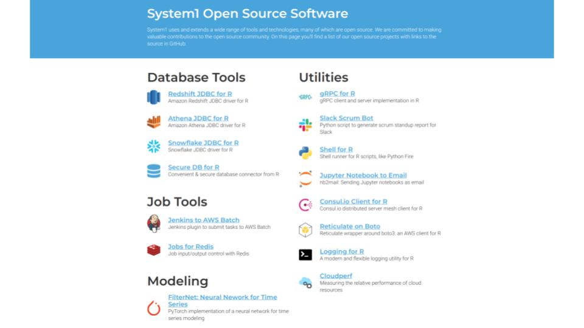
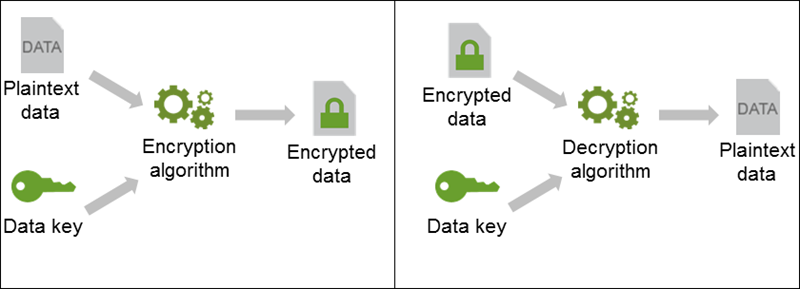
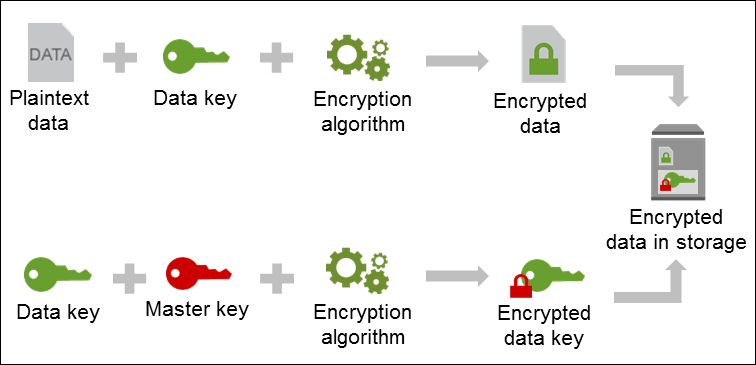
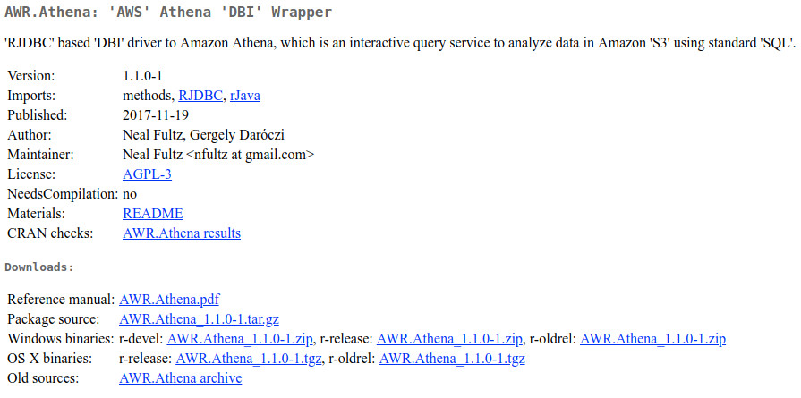
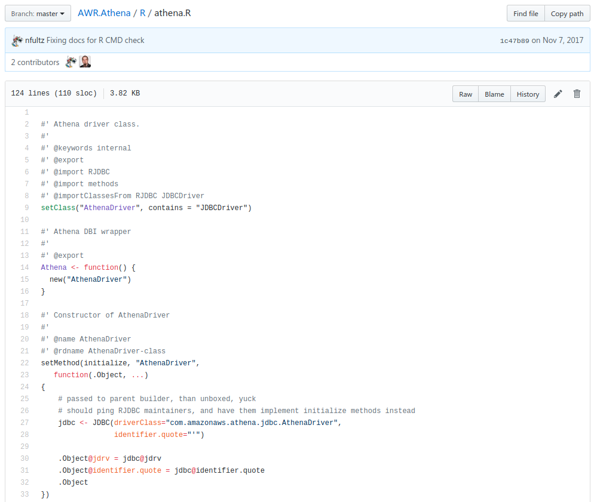
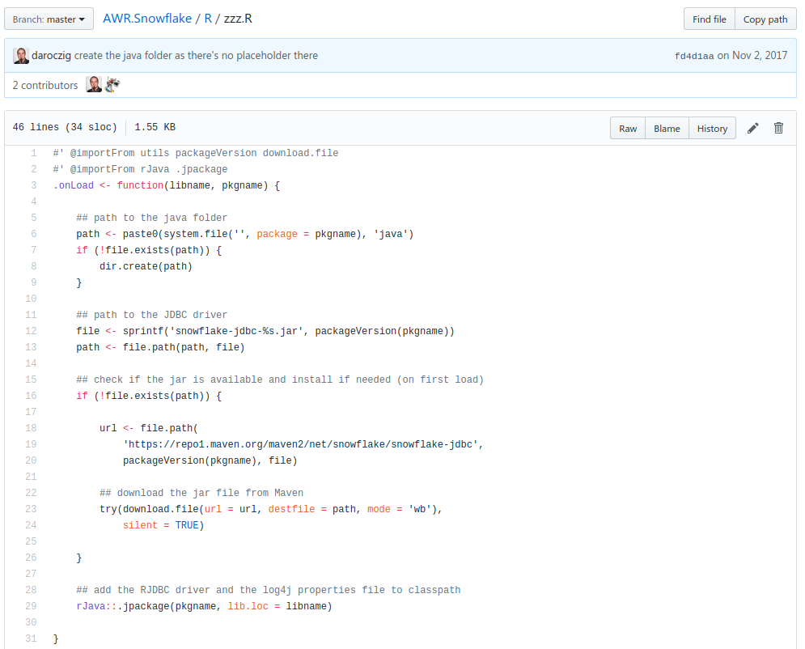
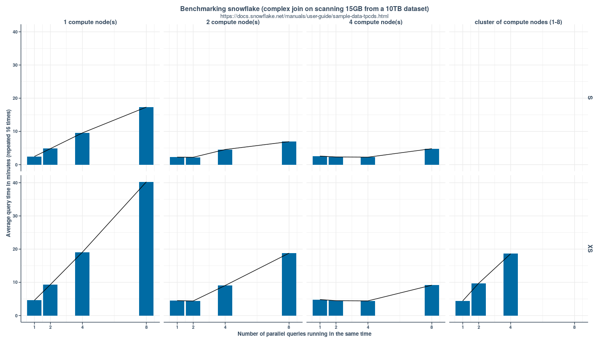
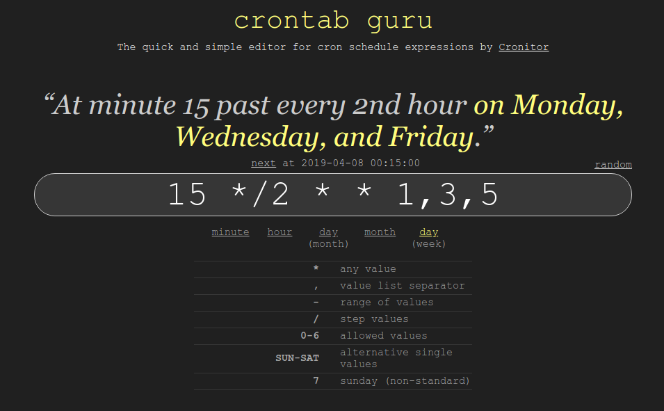
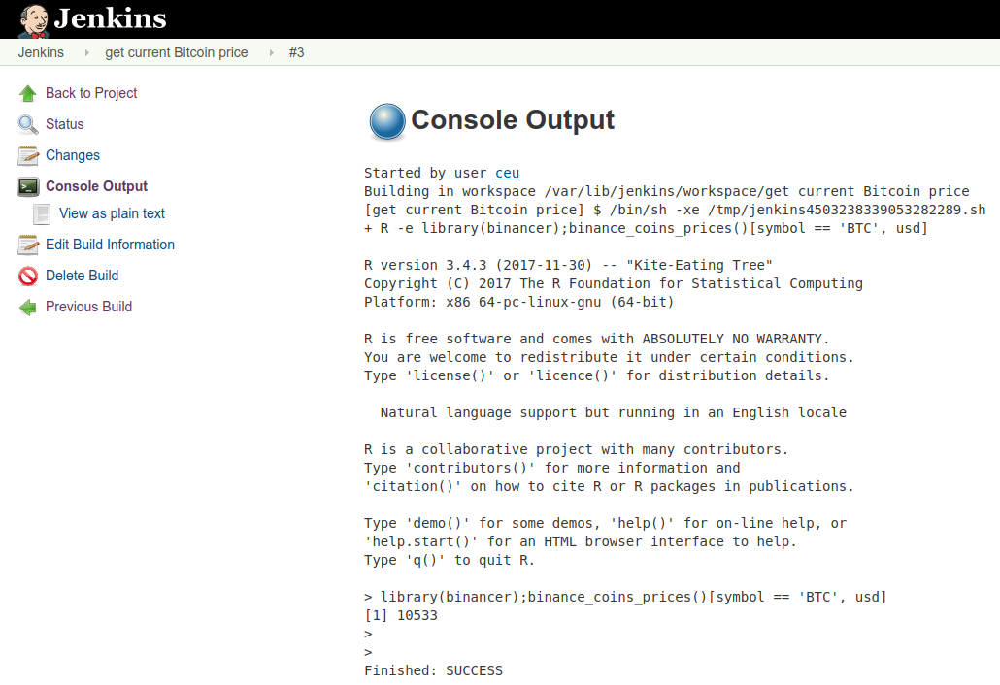

## dummy slide

<!--javascript to remove dummy slide-->
<script>
document.getElementById("dummy-slide").remove();
</script>

<!--end dummy slide-->
</section>

<section>
<section class="titleslide slide level1">
<h1>$ whoami</h1>


## $ whoami


## $ whoami

</section></section>

<section>
<section class="titleslide slide level1">
<h1>Intro</h1>


## Every Data Science project starts with ... ETL

> - Have you ever written an R script to be run in a non-interactive way?
> - Did it work?
> - Have you ever scheduled an R script to run without human intervention?
> - Do you have any R script running in production?
> - ... with central logging, proper monitoring and alerting?
> - ... run on cheap spot-instances with real-time performance metrics collected and feeding an AI picking the optimal instance type for the next run?

## Every BI consulting firm have developed its own ...

> - job scheduler
> - data repository and metadata documentation tool
> - central logging
- and a few other things ...

## Every BI consulting firm have developed its own ... {data-transition="none"}

- job scheduler
- data repository and metadata documentation tool
- central logging
- and a few other things ...

Today we can just pick the right open-source tool, such as

- Jenkins
- Airflow or Luigi
- `cronR` and `taskscheduleR` R packages
- cloud services (eg AWS Batch, Cloudwatch, Lambda)

----


Source: <a href="https://thecodinglove.com/when-my-co-worker-wants-to-simplify-code-that-took">When my co-worker wants to simplify code ...</a>

</section></section>
<section>
<section class="titleslide slide level1">
  <h2>Don't get confused ...</h2>
  <video width="60%" controls>
    <source src="https://video.twimg.com/tweet_video/CXSk_PVUEAAQQg9.mp4" type="video/mp4">
  </video>
  

## ... use version control!


Source: <a href="https://thecodinglove.com/a-junior-vs-a-senior-during-a-huge-system-failure">A junior vs a senior during a huge system failure</a>

## git 101

Start from scratch:

```bash
git init .
git add .
git commit -m "hello world"
git push origin master
```

Contribute to an existing project:

```bash
git clone https://github.com/foo/bar
git branch -b feature-branch
git add .; git add -u .
git commit -m "add my new cool feature"
git push origin feature-branch
```

## git 102

Version control all your scripts!

> - R packages
> - R scripts
> - Other scripts
> - Configuration files
> - `Rmd` reports
> - Ad-hoc queries

<div class="fragment">
As you ~~might~~ will need these later!
</div>

## git 201


Read more at https://happygitwithr.com

</section></section>
<section>
<section class="titleslide slide level1">
  <h2>Clean code!</h2>


Source: [Junior dev being awesome](http://devopsreactions.tumblr.com/post/150627947026/junior-dev-being-awesome)

## Code style

It can be anything ... just be consistent!

> - [Google's R Style Guide](https://google.github.io/styleguide/Rguide.xml)
> - [Hadley Wickham: Style guide. In *Advanced R*](http://adv-r.had.co.nz/Style.html)
> - [The `tidyverse` style guide](https://style.tidyverse.org)
> - Internal company style Guide

<div class="fragment">
Extra hints:

> - use [EditorConfig](https://editorconfig.org)! [R-bloggers article](https://www.r-bloggers.com/editorconfig-force-unified-coding-style-from-all-your-contributors/)
> - use [`lintr`](https://github.com/jimhester/lintr)
> - use `lintr` in a pull request builder / CI tool
</div>

## DRY

```r
metrics[, ctr := round(clicks / impressions, 2)]
metrics[, rpc := round(revenue / clicks, 2)]
```

<div class="fragment">
```r
metrics[, ctr := clicks / impressions]
metrics[, rpc := revenue / clicks]
for (v in c('ctr', 'rpc')) {
  metrics[, (v) := round(get(v))]
}
```
</div>

<div class="fragment">
```r
for (v in names(which(sapply(metrics, class) == 'numeric'))) {
  metrics[, (v) := round(get(v))]
}
```
</div>

<div class="fragment">
```r
round_metrics <- function(data) {
    ...
}
metrics <- round_metrics(metrics)
```
</div>

<div class="fragment">
```r
library(myPackage)
metrics <- round_metrics(metrics)
```
</div>

## Document and potentially open-source your code

<div style="float:left;">
  <blockquote class="twitter-tweet" data-lang="en"><p lang="en" dir="ltr">Decided to spend a couple hours coding in the hope of a modern and flexible logging engine in <a href="https://twitter.com/hashtag/rstats?src=hash&amp;ref_src=twsrc%5Etfw">#rstats</a>, then ended up thinking about and sketching the &quot;Anatomy of a Logging&quot; (tm) also writing docs for days 😜<br><br>Looking forward to any feedback and comment! <a href="https://t.co/GbT1uXfNX9">https://t.co/GbT1uXfNX9</a> <a href="https://t.co/uXsnKfDxsi">pic.twitter.com/uXsnKfDxsi</a></p>&mdash; Gergely Daróczi (@daroczig) <a href="https://twitter.com/daroczig/status/1067461632677330944?ref_src=twsrc%5Etfw">November 27, 2018</a></blockquote>
</div>

<div class="fragment" style="float:left; max-width:50%;">
> - Pick a permissive license!
> - Use `roxygen2`, potentially with markdown
> - Write vignettes
> - Run `R CMD check` frequently to check on your docs
> - Build your R package homepage with `pkgdown`
</div>
<div style="float:none;"></div>

## Read more!
 
<div style="float:left; width:50%;">


*Code Smells and Feels* by Jenny Bryan
</div>

<div style="float:left; width:50%;">


*Advanced R* by Hadley Wickham
</div>

<div style="float:none;"></div>

## Read even more!
 
<div style="float:left; width:50%;">


*Clean Code* by Robert C. Martin
</div>

<div style="float:left; width:50%;">


*Refactoring* by Martin Fowler et al.
</div>

<div style="float:none;"></div>

</section></section>
<section>
<section class="titleslide slide level1">
<h1>When I desperatly search in the logs why the app crashed</h1>

<a href="https://thecodinglove.com/when-i-desperatly-search-in-the-logs-why-the-app">
  <video width="80%" autoplay loop>
    <source src="https://ljdchost.com/010/ab2UUrD.webm" type="video/webm">
  </video>
</a>

## logger: a lightweight, modern and flexibly logging utility for R

```r
library(logger)
log_info('Script starting up...')
#> INFO [2019-04-04 04:25:17] Script starting up...
log_info('The mtcars dataset has {nrow(mtcars)} rows!')
#> INFO [2019-04-04 04:25:17] The mtcars dataset has 32 rows!
```

<div class="fragment">
```r
log_threshold(TRACE)
log_eval(nrow(mtcars), level = TRACE)
#> TRACE [2019-04-04 04:25:17] 'nrow(mtcars)' => '32L'
```
</div>

----

`cat demo.R`

```r
library(logger)
pkgs <- available.packages()
log_info('There are {nrow(pkgs)} R packages hosted on CRAN!')
for (letter in letters) {
    lpkgs <- sum(grepl(letter, pkgs[, 'Package'], ignore.case = TRUE))
    log_level(if (lpkgs < 5000) TRACE else DEBUG,
              '{lpkgs} R packages including the {shQuote(letter)} letter')
}
```

<div class="fragment">

`Rscript demo.R`

```apache
INFO [2018-11-20 22:49:37] There are 13433 R packages hosted on CRAN!
DEBUG [2018-11-20 22:49:38] 6300 R packages including the 'a' letter
DEBUG [2018-11-20 22:49:38] 6772 R packages including the 'e' letter
DEBUG [2018-11-20 22:49:38] 5412 R packages including the 'i' letter
DEBUG [2018-11-20 22:49:38] 7014 R packages including the 'r' letter
DEBUG [2018-11-20 22:49:38] 6402 R packages including the 's' letter
DEBUG [2018-11-20 22:49:38] 5864 R packages including the 't' letter
```

</div>

## Colorized output

```r
library(logger)
log_layout(layout_glue_colors)
log_threshold(TRACE)
log_info('Starting the script...')
log_debug('This is the second log line')
log_trace('Note that the 2nd line is being placed right after the 1st one.')
log_success('Doing pretty well so far!')
log_warn('But beware, as some errors might come :/')
log_error('This is a problem')
log_debug('Note that getting an error is usually bad')
log_error('This is another problem')
log_fatal('The last problem')
```

<div class="fragment">
  
</div>

## The Anatomy of a Log Request


## Custom formatter / layout / appender

```r
log_threshold(WARN)
log_formatter(formatter_sprintf)
log_layout(layout_json(c('time', 'node', 'user', 'pid', 'msg')))
t <- tempfile()
log_appender(appender_file(t))
log_debug('I am a low level log message that will not be printed with a high log level threshold')
log_warn(
    'I am %s higher level log message that is very likely to be printed!',
    letters[1])
cat(readLines(t))
```

<div class="fragment">

```json
{
    "time": "2019-04-04 04:51:54",
    "node": "nevermind",
    "user": "daroczig",
    "pid": 22842,
    "msg": "I am a higher level log message that is very likely to be printed!"
}
```
</div>

## More about logging

```r
with_log_threshold(log_warn('booo'), threshold = ERROR)

log_with_separator('This message is worth a {1e3} words')
#> INFO [2019-03-29 19:00:15] =====================================================
#> INFO [2019-03-29 19:00:15] = This message is worth a 1000 words                =
#> INFO [2019-03-29 19:00:15] =====================================================

log_with_separator('Some critical KPI down!!!', separator = '$')
#> INFO [2019-03-29 19:00:15] $$$$$$$$$$$$$$$$$$$$$$$$$$$$$$$$$$$$$$$$$$$$$$$$$$$$$
#> INFO [2019-03-29 19:00:15] $ Some critical KPI down!!!                         $
#> INFO [2019-03-29 19:00:15] $$$$$$$$$$$$$$$$$$$$$$$$$$$$$$$$$$$$$$$$$$$$$$$$$$$$$

log_with_separator(paste(
  'A very important message with a bunch of extra words that will',
  'eventually wrap into a multi-line message for our quite nice demo :wow:'),
  width = 60)
#> INFO [2019-03-29 19:00:15] =================================
#> INFO [2019-03-29 19:00:15] = A very important message      =
#> INFO [2019-03-29 19:00:15] = with a bunch of extra words   =
#> INFO [2019-03-29 19:00:15] = that will eventually wrap     =
#> INFO [2019-03-29 19:00:15] = into a multi-line message     =
#> INFO [2019-03-29 19:00:15] = for our quite nice demo       =
#> INFO [2019-03-29 19:00:15] = :wow:                         =
#> INFO [2019-03-29 19:00:15] =================================

appender_slack(channel = "#alerts")
log_error('We have a problem!')
```

https://daroczig.github.io/logger

</section></section>
<section>
<section class="titleslide slide level1">
<h1>Database connections</h1>

```r
library(DBI)
con <- dbConnect(
    RMySQL::MySQL(),
    dbname = "shinydemo",
    host = "shiny-demo.csa7qlmguqrf.us-east-1.rds.amazonaws.com",
    username = "guest",
    password = "guest")

query <- dbSendQuery(
    con,
    "SELECT Continent, COUNT(DISTINCT(Region)) FROM Country GROUP BY Continent")
res <- dbFetch(query)
dbClearResult(query)

dbDisconnect(con)
```

Spot the issues in the above code block!

## Why secure database credentials?

<blockquote cite="Andrew Hoffman">
  "When I woke up the next morning, I had four emails and a missed phone call from Amazon AWS -- something about 140 servers running on my AWS account, mining Bitcoin." -- Andrew Hoffman
</blockquote>  

<div class="fragment">

```sql
SELECT
  TO_HEX(CODE_POINTS_TO_BYTES([0xac, num2, num3, num4])) AS nonce
FROM
  UNNEST(GENERATE_ARRAY(0, 255)) num2,
  UNNEST(GENERATE_ARRAY(0, 255)) num3,
  UNNEST(GENERATE_ARRAY(0, 255)) num4
WHERE
TO_HEX(REVERSE(SHA256(SHA256(CONCAT(FROM_HEX(
  '000000204a4ef98461ee26898076e6a2cfc7c764d02b5f8d670832000000000000000000f99f5c4d5025979fcb33d245536a55b628d4564c075c0210cbbc941ad79fdbc5e491b55a494a5117'), CODE_POINTS_TO_BYTES([0xac, num2, num3, num4]) ))))) LIKE '000000000000000000%'
```

Source: [How to mine Bitcoin on Google’s BigQuery](https://medium.com/@urish/thank-you-google-how-to-mine-bitcoin-on-googles-bigquery-1c8e17b04e62)

</div>

## Loading MySQL configuration from global options

```r
library(DBI)
con <- dbConnect(
    RMySQL::MySQL(),
    dbname = "shinydemo",
    host = "shiny-demo.csa7qlmguqrf.us-east-1.rds.amazonaws.com",
    username = getOption("my_username"),
    password = getOption("my_password"))
```
    
<div class="fragment">

But how to set those global options on the server?

```bash
$ cat .Rprofile
options('my_username' = 'guest')
options('my_password' = 'guest')
```

</div>

## Loading MySQL configuration from the keyring


```r
con <- DBI::dbConnect(
    conf$drv,
    dbname = conf$dbname,
    host = conf$host,
    username = keyring::key_get("my_username"),
    password = keyring::key_get("my_password"))
```

<div class="fragment">
Great for the single-desktop R user, but how to make use of it on a remote server?
</div>

## Using a pre-configured Data Source Name

```r
con <- DBI::dbConnect(odbc::odbc(), dsn = "shinydemo")
```

<div class="fragment">
But we still need someone to set up / deploy configuration.
</div>

## Using a MySQL configuration file

```r
con <- dbConnect(RMySQL::MySQL(), group = "shinydemo")
```

<div class="fragment">
But we still need to set up `~/.my.cnf`: \scriptsize

```bash
[shinydemo]
user=guest
password=guest
database=shinydemo
host=shiny-demo.csa7qlmguqrf.us-east-1.rds.amazonaws.com
```

And then `.pgpass` etc as well.
</div>

## Loading MySQL configuration from more general, custom files

```r
mysql_user <- readRDS('secrets/mysql_user.RData')
mysql_pass <- readRDS('secrets/mysql_pass.RData')

library(DBI)
con <- dbConnect(
    RMySQL::MySQL(),
    dbname = "shinydemo",
    host = "shiny-demo.csa7qlmguqrf.us-east-1.rds.amazonaws.com",
    username = mysql_user,
    password = mysql_pass)
```

<div class="fragment">
Again, how to get those *unencrypted* `RData` files to the server?
</div>

## Loading MySQL configuration from encrypted custom files

```r
library(secret); try(local_key(), silent = TRUE)

vault <- file.path(tempdir(), ".vault"); dir.create(vault); create_vault(vault)

key_dir <- file.path(system.file(package = "secret"), "user_keys")
alice_public_key <- file.path(key_dir, "alice.pub")
alice_private_key <- file.path(key_dir, "alice.pem")
add_user("alice", alice_public_key, vault = vault)

secret_to_keep <- c(password = "guest", username = "guest")
add_secret("secret_one", secret_to_keep, users = "alice", vault = vault)

secrets <- get_secret("secret_one", key = alice_private_key, vault = vault)
mysql_user <- secrets$my_username; mysql_pass <- secrets$my_password

con <- DBI::dbConnect(
    RMySQL::MySQL(), dbname = "shinydemo",
    host = "shiny-demo.csa7qlmguqrf.us-east-1.rds.amazonaws.com",
    username = mysql_user, password = mysql_pass)
```

<div class="fragment">
But how to get the private key to a new server?
</div>

## Loading MySQL configuration from environment variables

```r
library(DBI)
con <- dbConnect(
    RMySQL::MySQL(),
    dbname = "shinydemo",
    host = "shiny-demo.csa7qlmguqrf.us-east-1.rds.amazonaws.com",
    username = Sys.getenv("my_username"),
    password = Sys.getenv("my_password"))
```

<div class="fragment">
Again, how to set those env vars on the server?

```bash
$ cat .Renviron
my_username = "guest"
my_password = "guest"

$ docker run --env my_username=guest --env my_password=guest my_docker_image ...

$ aws ecs register-task-definition --container-definitions ...
```
</div>

## Loading MySQL configuration from config files v1

```r
conf <- config::get("shinydemo")
con  <- DBI::dbConnect(
    RMySQL::MySQL(),
    dbname = conf$dbname,
    host = conf$host,
    username = conf$username,
    password = conf$password)
```

With the below YAML config:

```yaml
default:
  shinydemo:
    host: shiny-demo.csa7qlmguqrf.us-east-1.rds.amazonaws.com
    username: guest
    password: guest
    dbname: shinydemo
```

## Loading MySQL configuration from config files v2

```r
conf <- config::get("shinydemo")
do.call(DBI::dbConnect, conf)
```

With the below YAML config:

```yaml
default:
  shinydemo:
    drv: !expr RMySQL::MySQL()
    host: shiny-demo.csa7qlmguqrf.us-east-1.rds.amazonaws.com
    username: guest
    password: guest
    dbname: shinydemo
```

<div class="fragment">
But again, we have to get the YAML file to the server in a secure way :/
</div>

## Amazon KMS for passwords



\footnotesize Source: [AWS Encryption SDK](http://docs.aws.amazon.com/encryption-sdk/latest/developer-guide/introduction.html#concepts)

## Amazon KMS for 4+ kbytes data



\footnotesize Source: [AWS Encryption SDK](http://docs.aws.amazon.com/encryption-sdk/latest/developer-guide/introduction.html#concepts)

## Loading MySQL configuration from config files v3

```r
conf <- config::get("shinydemo")
do.call(DBI::dbConnect, conf)
```

With the below YAML config:

```yaml
default:
  shinydemo:
    drv: !expr RMySQL::MySQL()
    host: shiny-demo.csa7qlmguqrf.us-east-1.rds.amazonaws.com
    username: !aws_kms |
      AQICAHiMkU2ZNbL+kRcQoM3wGpuLb8HbIKjM9VcEGt72rZV2SAE6IQVMFPyj9JBP7cEgf9oT
      AAAAYzBhBgkqhkiG9w0BBwagVDBSAgEAME0GCSqGSIb3DQEHATAeBglghkgBZQMEAS4wEQQM
      Q8zMzSSMTX0UzT0dAgEQgCBlwaYQyO29zKbtIBuQtSHBWxqgyu49/lUQKZn8CCwmyQ==
    password: !aws_kms |
      AQICAHiMkU2ZNbL+kRcQoM3wGpuLb8HbIKjM9VcEGt72rZV2SAE6IQVMFPyj9JBP7cEgf9oT
      AAAAYzBhBgkqhkiG9w0BBwagVDBSAgEAME0GCSqGSIb3DQEHATAeBglghkgBZQMEAS4wEQQM
      Q8zMzSSMTX0UzT0dAgEQgCBlwaYQyO29zKbtIBuQtSHBWxqgyu49/lUQKZn8CCwmyQ==
    dbname: shinydemo
```

## Parsing a YAML config with KMS


```r
db_config <- function(db, db_config_path = getOption('db_config_path') {

    if (!file.exists(db_config_path)) {
        stop(paste('DB config file not found at', db_config_path))
    }

    db_secrets <- yaml.load_file(
        db_config_path,
        handlers = list('kms' = function(x) structure(x, class = c('kms'))))

    hasName(db_secrets, db) || stop('Database ', db, ' not found, check ', db_config_path)

    flog.debug('Looking up config for {db}')

    rapply(db_secrets[[db]], kms_decrypt, classes = 'kms', how = 'replace')

})
```

## Using a YAML config with KMS

```r
> options('db_config_path' = ...)
> db_config('shinydemo')
$drv
<MySQLDriver>

$host
[1] "shiny-demo.csa7qlmguqrf.us-east-1.rds.amazonaws.com"

$username
[1] "guest"

$password
[1] "guest"

$dbname
[1] "shinydemo"
```
 
## Reminder: motivation
 
```r
## connect to the database
library(DBI)
con <- dbConnect(
    RMySQL::MySQL(),
    dbname = "shinydemo",
    host = "shiny-demo.csa7qlmguqrf.us-east-1.rds.amazonaws.com",
    username = "guest",
    password = "guest")

## run a query
query <- dbSendQuery(
    con,
    "SELECT Continent, COUNT(DISTINCT(Region)) FROM Country GROUP BY Continent")
res <- dbFetch(query)
dbClearResult(query)

## say good bye
dbDisconnect(con)
```

## Reminder: motivation
 
```r
## connect to the database
library(DBI)
con <- do.call(dbConnect, db_config('shinydemo'))

## run a query
query <- dbSendQuery(
    con,
    "SELECT Continent, COUNT(DISTINCT(Region)) FROM Country GROUP BY Continent")
res <- dbFetch(query)
dbClearResult(query)

## say good bye
dbDisconnect(con)
```
 
## Reminder: motivation
 

 
Source: [xkcd/1205](https://xkcd.com/1205/)
 
## A simple wrapper to connect AND query

```r
db_query <- function(sql, db) {

    db <- db_connect(db)

    on.exit({
        db_close(db)
    })
    
    dbGetQuery(db, sql)
    
}
```

## A simple wrapper to connect AND query v2

```r
db_query <- function(sql, db, ...) {

    if (!is.object(db)) {
        db <- db_connect(db, ...)
        on.exit({
          db_close(db)
        })
    }

    assert_attr(db, 'db')
    assert_string(sql)

    log_info("Executing:**********")
    log_info(sql)
    log_info("********************")

    start <- Sys.time()
    result_set <- dbGetQuery(db, sql)
    time_to_exec <- Sys.time() - start

    log_info("Finished in %s returning %s rows",
             format(time_to_exec, digits = 4),
             nrow(result_set))

    attr(result_set, 'when') <- start
    attr(result_set, 'db') <- attr(db, 'db')
    attr(result_set, 'time_to_exec') <- time_to_exec
    attr(result_set, 'statement') <-  sql

    result_set

}
```
 
## db_query example

Bundled `db_config.yml` coming with the `dbr` package:

```yaml
sqlite:
  drv: !expr RSQLite::SQLite()
  dbname: !expr tempfile()
```

<div class="fragment">
```r
> db_query('SELECT 42', 'sqlite')

INFO [2018-07-12 02:46:25] Connecting to sqlite 
INFO [2018-07-12 02:46:25] Executing:**********
INFO [2018-07-12 02:46:25] SELECT 42
INFO [2018-07-12 02:46:25] ********************
INFO [2018-07-12 02:46:25] Finished in 0.001331 secs returning 1 rows
INFO [2018-07-12 02:46:25] Closing connection to sqlite
  42
1 42
```
</div>
 
## db_query features: attributes

```r
> str(db_query('SELECT 42', 'sqlite'))

INFO [2018-07-11 17:07:12] Connecting to sqlite 
INFO [2018-07-11 17:07:12] Executing:**********
INFO [2018-07-11 17:07:12] SELECT 42
INFO [2018-07-11 17:07:12] ********************
INFO [2018-07-11 17:07:12] Finished in 0.0007429 secs returning 1 rows
INFO [2018-07-11 17:07:12] Closing connection to sqlite

'data.frame':	1 obs. of  1 variable:
 $ 42: int 42
 - attr(*, "when")= POSIXct, format: "2018-07-11 17:07:12"
 - attr(*, "db")= chr "sqlite"
 - attr(*, "time_to_exec")=Class 'difftime'  atomic [1:1] 0.000743
  .. ..- attr(*, "units")= chr "secs"
 - attr(*, "statement")= chr "SELECT 42"
```

## db_query features: making use of attributes

```r
> res <- db_query('SELECT CURRENT_TIMESTAMP AS time, 42 AS everything', 'sqlite')
INFO [2018-07-12 02:44:57] Connecting to sqlite 
INFO [2018-07-12 02:44:57] Executing:**********
INFO [2018-07-12 02:44:57] SELECT CURRENT_TIMESTAMP AS time, 42 AS everything
INFO [2018-07-12 02:44:57] ********************
INFO [2018-07-12 02:44:57] Finished in 0.0007801 secs returning 1 rows
INFO [2018-07-12 02:44:57] Closing connection to sqlite

> res
                 time everything
1 2018-07-12 00:44:57         42
```

<div class="fragment">
```r
> db_refresh(res)
INFO [2018-07-12 02:48:20] Connecting to sqlite 
INFO [2018-07-12 02:48:20] Executing:**********
INFO [2018-07-12 02:48:20] SELECT CURRENT_TIMESTAMP AS time, 42 AS everything
INFO [2018-07-12 02:48:20] ********************
INFO [2018-07-12 02:48:20] Finished in 0.0005436 secs returning 1 rows
INFO [2018-07-12 02:48:20] Closing connection to sqlite

time everything
1 2019-04-06 08:48:20         42
```
</div>

## db_query features: connections

```r
> db_query('SELECT 42', 'sqlite')
INFO [2018-07-12 02:46:25] Connecting to sqlite 
INFO [2018-07-12 02:46:25] Executing:**********
INFO [2018-07-12 02:46:25] SELECT 42
INFO [2018-07-12 02:46:25] ********************
INFO [2018-07-12 02:46:25] Finished in 0.001331 secs returning 1 rows
INFO [2018-07-12 02:46:25] Closing connection to sqlite
```
 
<div class="fragment">
Reusing connections:

```r
> con <- db_connect('sqlite')
INFO [2018-07-12 02:54:17] Connecting to sqlite 
> db_query('SELECT 42', con)
INFO [2018-07-12 02:53:48] Executing:**********
INFO [2018-07-12 02:53:48] SELECT 42
INFO [2018-07-12 02:53:48] ********************
INFO [2018-07-12 02:53:48] Finished in 0.0009012 secs returning 1 rows
```
</div>

## db_query features: connections

```r
> con <- db_connect('sqlite')
INFO [2018-07-12 02:58:00] Connecting to sqlite 
> db_query('SELECT 42', 'sqlite')
INFO [2018-07-12 02:58:07] Connecting to sqlite 
INFO [2018-07-12 02:58:07] Executing:**********
INFO [2018-07-12 02:58:07] SELECT 42
INFO [2018-07-12 02:58:07] ********************
INFO [2018-07-12 02:58:07] Finished in 0.0007277 secs returning 1 rows
INFO [2018-07-12 02:58:07] Closing connection to sqlite
```

<div class="fragment">
```r
> con <- db_connect('sqlite', cache = TRUE)
INFO [2018-07-12 02:59:31] Connecting to sqlite 
> db_query('SELECT 42', 'sqlite')
INFO [2018-07-12 02:59:33] Executing:**********
INFO [2018-07-12 02:59:33] SELECT 42
INFO [2018-07-12 02:59:33] ********************
INFO [2018-07-12 02:59:33] Finished in 0.0009344 secs returning 1 rows
```
</div>

<div class="fragment">
```r
> db_close(db_connect('sqlite', cache = FALSE))
INFO [2018-07-12 02:59:55] Connecting to sqlite 
INFO [2018-07-12 02:59:55] Closing connection to sqlite
```
</div>

## db_query features: forking

```r
> system.time(db_config('shinydemo'))
   user  system elapsed 
  3.359   0.092   5.236 
```

<div class="fragment">
```r
> system.time(db_config('shinydemo'))
   user  system elapsed 
  0.001   0.000   0.001 
```
</div>

<div class="fragment">
It's not caching the connection this time, only the credentials.
</div>

<div class="fragment">
```r
> db_config_invalidate_cache()
INFO [2018-07-12 03:03:38] Invalidating cache on already loaded DB config(s)
```
</div> 

## db_query features: forking

```r
> parallel::mclapply(1:16, function(i) db_query("SELECT 42", "sqlite"), mc.cores = 8)
INFO [2018-07-12 03:05:04] Connecting to sqlite 
INFO [2018-07-12 03:05:04] Executing:**********
INFO [2018-07-12 03:05:04] SELECT 42
INFO [2018-07-12 03:05:04] Connecting to sqlite 
INFO [2018-07-12 03:05:04] ********************
INFO [2018-07-12 03:05:04] Executing:**********
INFO [2018-07-12 03:05:04] Finished in 0.001053 secs returning 1 rows
INFO [2018-07-12 03:05:04] SELECT 42
INFO [2018-07-12 03:05:04] Closing connection to sqlite
INFO [2018-07-12 03:05:04] ********************
INFO [2018-07-12 03:05:04] Connecting to sqlite 
INFO [2018-07-12 03:05:04] Connecting to sqlite 
INFO [2018-07-12 03:05:04] Executing:**********
INFO [2018-07-12 03:05:04] Finished in 0.005117 secs returning 1 rows
INFO [2018-07-12 03:05:04] SELECT 42
INFO [2018-07-12 03:05:04] Closing connection to sqlite
INFO [2018-07-12 03:05:04] ********************
INFO [2018-07-12 03:05:04] Connecting to sqlite 
INFO [2018-07-12 03:05:04] Executing:**********
INFO [2018-07-12 03:05:04] Connecting to sqlite 
INFO [2018-07-12 03:05:04] Finished in 0.003497 secs returning 1 rows
INFO [2018-07-12 03:05:04] SELECT 42
INFO [2018-07-12 03:05:04] ********************
INFO [2018-07-12 03:05:04] Executing:**********
INFO [2018-07-12 03:05:04] Connecting to sqlite 
INFO [2018-07-12 03:05:04] Closing connection to sqlite
INFO [2018-07-12 03:05:04] SELECT 42
INFO [2018-07-12 03:05:04] Executing:**********
INFO [2018-07-12 03:05:04] ********************
INFO [2018-07-12 03:05:04] Executing:**********
INFO [2018-07-12 03:05:04] SELECT 42
INFO [2018-07-12 03:05:04] Finished in 0.0008972 secs returning 1 rows
INFO [2018-07-12 03:05:04] SELECT 42
INFO [2018-07-12 03:05:04] Finished in 0.00947 secs returning 1 rows
INFO [2018-07-12 03:05:04] ********************
INFO [2018-07-12 03:05:04] ********************
INFO [2018-07-12 03:05:04] Finished in 0.001237 secs returning 1 rows
INFO [2018-07-12 03:05:04] Connecting to sqlite 
INFO [2018-07-12 03:05:04] Closing connection to sqlite
INFO [2018-07-12 03:05:04] Finished in 0.001038 secs returning 1 rows
INFO [2018-07-12 03:05:04] Connecting to sqlite 
INFO [2018-07-12 03:05:04] Closing connection to sqlite
INFO [2018-07-12 03:05:04] Closing connection to sqlite
INFO [2018-07-12 03:05:04] Connecting to sqlite 
INFO [2018-07-12 03:05:04] Connecting to sqlite 
INFO [2018-07-12 03:05:04] Connecting to sqlite 
INFO [2018-07-12 03:05:04] Executing:**********
INFO [2018-07-12 03:05:05] SELECT 42
INFO [2018-07-12 03:05:05] Executing:**********
INFO [2018-07-12 03:05:05] Executing:**********
INFO [2018-07-12 03:05:05] ********************
INFO [2018-07-12 03:05:05] Closing connection to sqlite
INFO [2018-07-12 03:05:05] Executing:**********
INFO [2018-07-12 03:05:05] Connecting to sqlite 
INFO [2018-07-12 03:05:05] SELECT 42
INFO [2018-07-12 03:05:05] SELECT 42
INFO [2018-07-12 03:05:05] Finished in 0.0009949 secs returning 1 rows
INFO [2018-07-12 03:05:05] ********************
INFO [2018-07-12 03:05:05] Executing:**********
INFO [2018-07-12 03:05:05] SELECT 42
INFO [2018-07-12 03:05:05] SELECT 42
INFO [2018-07-12 03:05:05] Closing connection to sqlite
INFO [2018-07-12 03:05:05] Executing:**********
INFO [2018-07-12 03:05:05] ********************
INFO [2018-07-12 03:05:05] ********************
INFO [2018-07-12 03:05:05] Finished in 0.001511 secs returning 1 rows
INFO [2018-07-12 03:05:05] Closing connection to sqlite
INFO [2018-07-12 03:05:05] ********************
INFO [2018-07-12 03:05:05] SELECT 42
INFO [2018-07-12 03:05:05] Connecting to sqlite 
INFO [2018-07-12 03:05:05] ********************
INFO [2018-07-12 03:05:05] Finished in 0.001259 secs returning 1 rows
INFO [2018-07-12 03:05:05] Executing:**********
INFO [2018-07-12 03:05:05] Closing connection to sqlite
INFO [2018-07-12 03:05:05] SELECT 42
INFO [2018-07-12 03:05:05] Finished in 0.001187 secs returning 1 rows
INFO [2018-07-12 03:05:05] ********************
INFO [2018-07-12 03:05:05] Finished in 0.03187 secs returning 1 rows
INFO [2018-07-12 03:05:05] Finished in 0.009078 secs returning 1 rows
INFO [2018-07-12 03:05:05] Finished in 0.0009627 secs returning 1 rows
INFO [2018-07-12 03:05:05] Closing connection to sqlite
INFO [2018-07-12 03:05:05] Closing connection to sqlite
INFO [2018-07-12 03:05:05] Closing connection to sqlite
INFO [2018-07-12 03:05:05] Connecting to sqlite 
INFO [2018-07-12 03:05:05] Closing connection to sqlite
INFO [2018-07-12 03:05:05] Connecting to sqlite 
INFO [2018-07-12 03:05:05] Executing:**********
INFO [2018-07-12 03:05:05] Executing:**********
INFO [2018-07-12 03:05:05] SELECT 42
INFO [2018-07-12 03:05:05] SELECT 42
INFO [2018-07-12 03:05:05] ********************
INFO [2018-07-12 03:05:05] ********************
INFO [2018-07-12 03:05:05] Finished in 0.0007973 secs returning 1 rows
INFO [2018-07-12 03:05:05] Finished in 0.0007989 secs returning 1 rows
INFO [2018-07-12 03:05:05] Closing connection to sqlite
INFO [2018-07-12 03:05:05] Closing connection to sqlite
```
 
## Extending DBI to be able to use db_query



## Extending DBI to be able to use db_query
 


## Extending DBI to be able to use db_query
 

 
## Benchmarking!!!
 
Transaction Processing Performance Council (TPC) Benchmarks ™ 10 TB
 
```sql
with v1 as(
  select i_category, i_brand, cc_name, d_year, d_moy,
        sum(cs_sales_price) sum_sales,
        avg(sum(cs_sales_price)) over
          (partition by i_category, i_brand,
                     cc_name, d_year)
          avg_monthly_sales,
        rank() over
          (partition by i_category, i_brand,
                     cc_name
           order by d_year, d_moy) rn
  from tpcds_sf10tcl.item, tpcds_sf10tcl.catalog_sales, tpcds_sf10tcl.date_dim, tpcds_sf10tcl.call_center
  where cs_item_sk = i_item_sk and
       cs_sold_date_sk = d_date_sk and
       cc_call_center_sk= cs_call_center_sk and
       (
         d_year = {year} or
         ( d_year = {year}-1 and d_moy =12) or
         ( d_year = {year}+1 and d_moy =1)
       )
  group by i_category, i_brand,
          cc_name , d_year, d_moy),
v2 as(
  select v1.i_category ,v1.d_year, v1.d_moy ,v1.avg_monthly_sales
        ,v1.sum_sales, v1_lag.sum_sales psum, v1_lead.sum_sales nsum
  from v1, v1 v1_lag, v1 v1_lead
  where v1.i_category = v1_lag.i_category and
       v1.i_category = v1_lead.i_category and
       v1.i_brand = v1_lag.i_brand and
       v1.i_brand = v1_lead.i_brand and
       v1.cc_name = v1_lag.cc_name and
       v1.cc_name = v1_lead.cc_name and
       v1.rn = v1_lag.rn + 1 and
       v1.rn = v1_lead.rn - 1)
select  *
from v2
where  d_year = {year} and
        avg_monthly_sales > 0 and
        case when avg_monthly_sales > 0 then abs(sum_sales - avg_monthly_sales) / avg_monthly_sales else null end > 0.1
order by sum_sales - avg_monthly_sales, 3
limit 100
```
 
## Benchmarking!!!

```r
warehouse_type <- 'S'
warehouses <- 2
threads <- 4

for (i in 1:4) {
    assign(glue('con{i}', db_connect('snowflake', warehouse = paste0(warehouse_type, i)))   
}

mclapply(1:16, function(i, warehouse, threads) {
    timing <- system.time(db_query(
        query,
        db = get(paste0('con', i %% warehouses + 1)),
        year = 1999))
    data.table(
        warehouse = warehouse,
        threads = threads,
        time = timing[[3]])
}, mc.cores = threads, threads = threads)

for (i in 1:4) {
    db_close(get(paste0('con', i %% 4 + 1)))
}
```

## A more complex benchmark
 
 
 
## A more complex benchmark
 
 

## There's more!
 
```yaml
dbr:
  shinydemo:
    countries:
      count: SELECT COUNT(*) FROM Country
      europe: |-
        SELECT Code
        FROM Country
        WHERE Continent = 'Europe'
    cities:
      europe_large: |-
        SELECT Name
        FROM City
        WHERE
          Population > 1000000 AND
          Name IN (
            {sql_chunk('dbr.shinydemo.cities.europe', indent_after_linebreak = 4)}))
```

https://github.com/daroczig/dbr/blob/master/inst/example_sql_chunks.yaml
 
## There's more! 
 
 ```r
sql_chunk('dbr.shinydemo.cities.europe_large')
#> SELECT Name
#> FROM City
#> WHERE
#>   Population > 1000000 AND
#>   Name IN (
#>     SELECT Name
#>     FROM City
#>     WHERE CountryCode IN (
#>       SELECT Code
#>       FROM Country
#>       WHERE Continent = 'Europe')))
```

https://github.com/daroczig/dbr

</section></section>
<section>
<section class="titleslide slide level1">
<h1>More on the cloud ...</h1>
 


## From Java to Python
 
 

## botor: Reticulate wrapper on 'boto3'

Loading the `botor` package might take a while as it will also `import` the `boto3` Python module in the background:

```r
system.time(library(botor))
#>    user  system elapsed 
#>   1.131   0.250   1.191
```
 
<div class="fragment">
```r
iam_whoami()
#> [1] "gergely-dev"
```
</div>
 
<div class="fragment">
```r
kms_decrypt("QWERTY...")
#> [1] "Hi there!"
```
</div>
 
## Useful AWS S3 helpers
 
```r
t <- tempfile()
s3_download_file('s3://botor/example-data/mtcars.csv', t)
read.csv(t)
unlink(t)
```
 
<div class="fragment">
```r
s3_read('s3://botor/example-data/mtcars.csv', read.csv)
#> DEBUG [2019-04-06 02:08:14] Downloaded 1303 bytes from s3://botor/example-data/mtcars.csv and saved at '/tmp/Rtmpme20BF/filec247798c20d'
#>     mpg cyl  disp  hp drat    wt  qsec vs am gear carb
#> 1  21.0   6 160.0 110 3.90 2.620 16.46  0  1    4    4
#> 2  21.0   6 160.0 110 3.90 2.875 17.02  0  1    4    4
#> 3  22.8   4 108.0  93 3.85 2.320 18.61  1  1    4    1
#> 4  21.4   6 258.0 110 3.08 3.215 19.44  1  0    3    1
#> 5  18.7   8 360.0 175 3.15 3.440 17.02  0  0    3    2
#> 6  18.1   6 225.0 105 2.76 3.460 20.22  1  0    3    1
#> 7  14.3   8 360.0 245 3.21 3.570 15.84  0  0    3    4
#> 8  24.4   4 146.7  62 3.69 3.190 20.00  1  0    4    2
#> 9  22.8   4 140.8  95 3.92 3.150 22.90  1  0    4    2
#> 10 19.2   6 167.6 123 3.92 3.440 18.30  1  0    4    4
#> 11 17.8   6 167.6 123 3.92 3.440 18.90  1  0    4    4
#> 12 16.4   8 275.8 180 3.07 4.070 17.40  0  0    3    3
#> 13 17.3   8 275.8 180 3.07 3.730 17.60  0  0    3    3
#> 14 15.2   8 275.8 180 3.07 3.780 18.00  0  0    3    3
#> 15 10.4   8 472.0 205 2.93 5.250 17.98  0  0    3    4
#> 16 10.4   8 460.0 215 3.00 5.424 17.82  0  0    3    4
#> 17 14.7   8 440.0 230 3.23 5.345 17.42  0  0    3    4
#> 18 32.4   4  78.7  66 4.08 2.200 19.47  1  1    4    1
#> 19 30.4   4  75.7  52 4.93 1.615 18.52  1  1    4    2
#> 20 33.9   4  71.1  65 4.22 1.835 19.90  1  1    4    1
#> 21 21.5   4 120.1  97 3.70 2.465 20.01  1  0    3    1
#> 22 15.5   8 318.0 150 2.76 3.520 16.87  0  0    3    2
#> 23 15.2   8 304.0 150 3.15 3.435 17.30  0  0    3    2
#> 24 13.3   8 350.0 245 3.73 3.840 15.41  0  0    3    4
#> 25 19.2   8 400.0 175 3.08 3.845 17.05  0  0    3    2
#> 26 27.3   4  79.0  66 4.08 1.935 18.90  1  1    4    1
#> 27 26.0   4 120.3  91 4.43 2.140 16.70  0  1    5    2
#> 28 30.4   4  95.1 113 3.77 1.513 16.90  1  1    5    2
#> 29 15.8   8 351.0 264 4.22 3.170 14.50  0  1    5    4
#> 30 19.7   6 145.0 175 3.62 2.770 15.50  0  1    5    6
#> 31 15.0   8 301.0 335 3.54 3.570 14.60  0  1    5    8
#> 32 21.4   4 121.0 109 4.11 2.780 18.60  1  1    4    2
```
</div>
 
## Useful AWS S3 helpers
 
```r
s3_write(mtcars, 's3://botor/example-data/mtcars.csv', fwrite)
s3_write(mtcars, 's3://botor/example-data/mtcars.RDS', saveRDS)
library(jsonlite)
s3_write(mtcars, 's3://botor/example-data/mtcars.json', writeJSON, compress = 'gzip')
```
 
<div class="fragment">
```r
s3_ls('s3://botor/example-data')
#> DEBUG [2019-04-06 06:16:17] Found 8 item(s) in s3://botor/example-data
#>   bucket_name                         key
#> 1       botor               example-data/
#> 2       botor     example-data/mtcars.RDS
#> 3       botor     example-data/mtcars.csv
#> 4       botor example-data/mtcars.csv.bz2
#> 5       botor  example-data/mtcars.csv.gz
#> 6       botor  example-data/mtcars.csv.xz
#> 7       botor    example-data/mtcars.csv2
#> 8       botor    example-data/mtcars.json
#>                                      uri size    owner           last_modified
#> 1               s3://botor/example-data/    0 daroczig 2018-09-01 23:04:54 UTC
#> 2     s3://botor/example-data/mtcars.RDS 1217 daroczig 2018-09-02 22:08:17 UTC
#> 3     s3://botor/example-data/mtcars.csv 1303 daroczig 2018-09-02 22:07:25 UTC
#> 4 s3://botor/example-data/mtcars.csv.bz2  553 daroczig 2019-01-14 00:07:17 UTC
#> 5  s3://botor/example-data/mtcars.csv.gz  567 daroczig 2019-01-14 00:02:59 UTC
#> 6  s3://botor/example-data/mtcars.csv.xz  596 daroczig 2019-01-14 00:07:20 UTC
#> 7    s3://botor/example-data/mtcars.csv2 1303 daroczig 2018-09-02 22:11:02 UTC
#> 8    s3://botor/example-data/mtcars.json 4147 daroczig 2018-09-02 22:07:26 UTC
```
</div> 
 
## Useful AWS KMS helpers 

```r
t <- kms_encrypt(key = 'alias/demo', text = 'hi there')
kms_decrypt(t)
#> [1] hi there
```
 
<div class="fragment">
Getting secrets from the AWS System Manager's Parameter Store:
```r
ssm_get_parameter('/path/to/secret')
```
</div> 

<div class="fragment">
```r
?kms_generate_data_key
?kms_encrypt_file
?kms_decrypt_file
```
</div> 

## Missing AWS helpers

```r
iam <- botor_client('iam', type = 'client')
iam()$get_user()$User$UserName
```
 
```r
ssm_get_parameter
#> function (path, decrypt = TRUE) 
#> {
#>     log_trace("Looking up %s in AWS System Manager's Parameter Store", path)
#>     trypy(ssm()$get_parameter(Name = path, WithDecryption = decrypt)$Parameter$Value)
#> }
#> <bytecode: 0x55d260bf8448>
#> <environment: namespace:botor>
```

</section></section>
<section>
<section class="titleslide slide level1">
<h1>Scheduling jobs</h1>


## Installing Jenkins

1. Install Jenkins from https://pkg.jenkins.io/debian-stable/

```shell
wget -q -O - https://pkg.jenkins.io/debian-stable/jenkins.io.key | sudo apt-key add -
echo "deb https://pkg.jenkins.io/debian-stable binary/" | sudo tee -a /etc/apt/sources.list
sudo apt update
sudo apt install openjdk-8-jdk-headless jenkins
sudo netstat -tapen | grep java
```

2. Open up port 8080 in the related security group / firewall
3. Access Jenkins from your browser and finish installation

    1. Read the initial admin password:

    ```shell
    sudo cat /var/lib/jenkins/secrets/initialAdminPassword
    ```

    2. Proceed with installing the suggested plugins
    3. Create your first user(s)

<div class="fragment">
More details: https://github.com/daroczig/CEU-R-prod#prepare-to-schedule-r-commands
</div> 

## Scheduling jobs via cron(ish)
 


Source: [crontab.guru](crontab.guru)

## Jenkins output



## Jenkins plugins

> - Extended email (edit subject & body, attachments, inline images, flexible triggers)
> - Slack notifications
> - Write to Cloudwatch logs
> - Start remote jobs with AWS Batch
> - Groovy Postbuild to override build status and set custom badges
> - Jenkins Job DSL Plugin to define jobs in a programmatic way

</section></section>
<section>
<section class="titleslide slide level1">
<h1>Reproducible jobs</h1>


## Creating Docker images

```dockerfile
FROM rocker/r-base

RUN apt-get update && apt-get install -y python-pip
RUN pip install boto3

RUN apt-get update && apt-get install -y --allow-downgrades \
    libcurl4=7.64.0-1 libcurl4-openssl-dev libgit2-dev libssl-dev libssh2-1-dev
RUN R -e "install.packages(c('reticulate', 'devtools'), repos = 'https://cran.rstudio.com/')"
RUN R -e "devtools::install_github('daroczig/binancer', upgrade_dependencies = FALSE)"

ADD myScript.R /tmp/myScript.R
CMD ["R"]
```

## Creating reproducible Docker images

Use `littler`:

```bash
install2.r --error reticulate devtools
installGithub.r daroczig/binancer
```
 
<div class="fragment">
Use MRAN:

```bash
export REPO=https://mran.microsoft.com/snapshot/2019-04-01/
install2.r --error -r $REPO reticulate devtools
```
</div>                       

<div class="fragment">
Fix GitHub references:

```bash
installGithub.r daroczig/binancer@master
installGithub.r daroczig/binancer@v2.0
installGithub.r daroczig/binancer@lepkeful
```
</div>

## Sharing and using Docker images
                       
```bash
docker build -t test .
docker push daroczig/test

docker pull daroczig/test
docker run -ti --rm daroczig/test R

docker run --rm -v myScript.R:/tmp/myScript.R daroczig/test Rscript /tmp/myScript.R
```

<div class="fragment">
> - Use Jenkins or Travis etc to build (and keep up-to-date) your Docker images
> - Also check Amazon's Elastic Container Registry (ECR) for private Docker images
> - Use EC2 or assumed roles in IAM instead of AWS credentials
> - Write a wrapper around `docker run --rm ecr.eu-west-1.amazonaws.com/test:latest`
> - Write a wrapper for starting temporarily cloud instances, run `docker pull` and your Docker runner, then shut down the node after the script finished
</div>

</section></section>
<section>
<section class="titleslide slide level1">
  <h2 class="fragment" data-fragment-index="1">Thanks!</h2>
  
  <p class="fragment" data-fragment-index="1">Twitter: <a href="https://twitter.com/daroczig">@daroczig</a></p>
  
</section></section>
