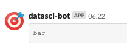

## dummy slide

<!--javascript to remove dummy slide-->
<script>
document.getElementById("dummy-slide").remove();
</script>

<!--end dummy slide-->
</section>

<section>
<section class="titleslide slide level1">
<h1>$ whoami</h1>

<a href="https://system1.com" target="_new">
 
</a>

## $ whoami
<a href="https://system1.com/research" target="_new">
  
</a>

## $ whoami
<a href="https://system1.com/open-source" target="_new">
 
</a>
</section></section>

<section>
<section class="titleslide slide level1">
<h1>Welcome to prod!</h1>


## What is "production"?

* 2006: <b>calling R scripts from PHP</b> (both reading from MySQL) to generate custom plots on surveys in a homepage for interactive use
* 2008: <b>automated/batch R scripts</b> to generate thousands of pages of crosstables, ANOVA and plots from SPSS with `pdflatex`
* 2011: <b>web application</b> combining Ruby on Rails, `pandoc` and RApache providing reports in plain English for survey analysis (NoSQL databases, vertical scaling, <b>security</b>, central error tracking etc)
* 2012: plain RApache <b>web application</b> for NLP and network analysis
* 2015: standardizing the data infrastructure of a fintech startup to use R both in bath jobs and <b>stream processing</b> (ETL, reporting, fraud detection, daily operations, customer communication etc)
* 2017: redesign, monitor and scale the DS infrastructure of an adtech startup for <b>batch training and live scoring</b>

## What is "production"?

Using in R in a non-interactive way:

* R scripts are scheduled to run <b>without manual intervention</b> (eg CRON or upstream job trigger, API request)
* need for a standard, eg <b>containerized environment</b> (eg R and package versions, OS packages, `.Rprofile` etc)
* <b>security</b>! (safeguarded production environment, SQL injection, AppArmor, encrypted credentials etc)
* the output of the jobs are recorded and <b>monitored</b> (eg `error` handler for ErrBit, CloudWatch logs or Splunk etc), alerts and notifications
* if an error occurs, usually there is no other way to figure out what happened then looking at the recorded job output, so better <b>log</b> than sorry

</section></section>
<section>
<section class="titleslide slide level1">
  <h2>Motivation</h2>
  <video width="60%" controls>
    <source src="https://video.twimg.com/tweet_video/CXSk_PVUEAAQQg9.mp4" type="video/mp4">
  </video>
  

## Motivation

<div style="font-size: 1.25em;">
```r
$ Rscript super_important_business_stuff.R
```
</div>

<div class="fragment" style="font-size: 1.25em;">
```r
Error in l[[x]] : subscript out of bounds
Calls: g -> f
Execution halted
```
</div>

<div class="fragment" style="font-size: 1.25em;">
```r
Error in .subset2(x, i, exact = exact) : subscript out of bounds
Execution halted
```
</div>

## Motivation

<div style="font-size: 1.25em;">

```r
for (i in 1:100) {
    ## do something slow
    print(i)
}
```

</div>
<div class="fragment" style="font-size: 1.25em;">

```r
N <- 42
for (i in 1:N) {
    ## do something slow
    print(paste(
        Sys.time(), '|',
        i, 'out of', N,
        '=', round(i / N * 100), '%'))
    flush.console()
}
```
</div>


## Motivation

<div style="font-size: 1.25em;">

```sh
[1] "2019-09-15 00:05:34 | 1 out of 42 = 2 %"
[1] "2019-09-15 00:05:35 | 2 out of 42 = 5 %"
[1] "2019-09-15 00:05:35 | 3 out of 42 = 7 %"
[1] "2019-09-15 00:05:36 | 4 out of 42 = 10 %"
[1] "2019-09-15 00:05:36 | 5 out of 42 = 12 %"
[1] "2019-09-15 00:05:37 | 6 out of 42 = 14 %"
[1] "2019-09-15 00:05:37 | 7 out of 42 = 17 %"
[1] "2019-09-15 00:05:38 | 8 out of 42 = 19 %"
[1] "2019-09-15 00:05:38 | 9 out of 42 = 21 %"
[1] "2019-09-15 00:05:39 | 10 out of 42 = 24 %"
[1] "2019-09-15 00:05:39 | 11 out of 42 = 26 %"
[1] "2019-09-15 00:05:40 | 12 out of 42 = 29 %"
[1] "2019-09-15 00:05:40 | 13 out of 42 = 31 %"
[1] "2019-09-15 00:05:41 | 14 out of 42 = 33 %"
[1] "2019-09-15 00:05:41 | 15 out of 42 = 36 %"
[1] "2019-09-15 00:05:42 | 16 out of 42 = 38 %"
[1] "2019-09-15 00:05:42 | 17 out of 42 = 40 %"
Error in .subset2(x, i, exact = exact) : subscript out of bounds
Execution halted
```

</div>


## Motivation

<div style="font-size: 1.1em;">

```r
sink('/var/log/foobar.log', append = TRUE, split = TRUE)
N <- 42
for (i in 1:N) {
    ## do something slow
    print(paste(Sys.time(), '|', i, 'out of', N, '=', round(i / N * 100), '%'))
}
```

</div>
<div class="fragment" style="font-size: 1.1em;">

```r
logfile <- '/var/log/foobar.log'
for (i in 1:N) {
    ## do something slow
    cat(
       paste(Sys.time(), '|', i, 'out of', N, '=', round(i / N * 100), '%'),
       file = logfile, append = TRUE)
}
```

</div>
<div class="fragment" style="font-size: 1.1em;">

```r
log <- function(message, logfile = '/var/log/foobar.log') {
    cat(paste(Sys.time(), '|', message),
        file = logfile, append = TRUE)
}
```
</div>

## Motivation

<div style="font-size: 1.25em;">
```r
mclapply(1:N, function(n) {
    ## do something slow
    log(paste(i, 'out of', N, '=', round(i / N * 100), '%'))
}
[1] "2019-09-15 00:05:34 | 1 out of 42 = 2 %"
[1] "2019-09-15 00:05:35 | 2 out of 42 = 5 %"
[1] "2019-09-15 00:05:39 | 10 out of 42 = 24 %"
[1] "2019-09-15 00:05:35 | 3 out of 42 = 7 %"
[1] "2019-09-15 00:05:39 | 11 out of 42 = 26 %"
[1] "2019-09-15 00:05:36 | 4 out of 42 = 10 %"
[1] "2019-09-15 00:05:37 | 7 out of 42 = 17 %"
[1] "2019-09-15 00:05:38 | 8 out of 42 = 19 %"
[1] "2019-09-15 00:05:40 | 12 out of 42 = 29 %"[1] "2019-09-15 00:05:36 | 5 out of 42 = 12 %"
[1] "2019-09-15 00:05:37 | 16 out of 42 = 19 %"
[1] "2019-09-15 00:05:38 | 13 out of 42 = 31 %"
[1] "2019-09-15 00:05:37 | 19 out of 42 = 45 %"
[1] "2019-09-15 00:05:38 | 22 out of 42 = 52 %"
[1] "2019-09-15 00:05:37 | 28 out of 42 = 67 %"
[1] "2019-09-15 00:05:38 | 21 out of 42 = 50 %"
[1] "2019-09-15 00:05:37 | 26 out of 42 = 62 %"
[1] "2019-09-15 00:05:38 | 24 out of 42 = 57 %"
Error in .subset2(x, i, exact = exact) : subscript out of bounds
Execution halted
```
</div>

</section></section>
<section>
<section class="titleslide slide level1">
<h1>Other logging packages</h1>


Source: <a href="https://thecodinglove.com/when-my-co-worker-wants-to-simplify-code-that-took" target="_new">When my co-worker wants to simplify code ...</a>

## Logging packages on CRAN

\scriptsize

```r
> library(data.table)
> packages <- data.table(available.packages())
> ## avoid analog, logit, (archeo|bio|genea|hydro|topo|...)logy
> packages[grepl('(?<!ana)log(?![it|y])', Package, perl = TRUE), Package]

 [1] "adjustedcranlogs"     "bayesloglin"          "blogdown"
 [4] "CommunityCorrelogram" "cranlogs"             "efflog"
 [7] "eMLEloglin"           "futile.logger"        "gemlog"
[10] "gglogo"               "ggseqlogo"            "homologene"
[13] "lifelogr"             "log4r"                "logbin"
[16] "logconcens"           "logcondens"           "logcondens.mode"
[19] "logcondiscr"          "logger"               "logging"
[22] "loggit"               "loggle"               "logKDE"
[25] "loglognorm"           "logmult"              "lognorm"
[28] "logNormReg"           "logOfGamma"           "logspline"
[31] "lolog"                "luzlogr"              "md.log"
[34] "mdir.logrank"         "mpmcorrelogram"       "PhylogeneticEM"
[37] "phylogram"            "plogr"                "poilog"
[40] "rChoiceDialogs"       "reactlog"             "rmetalog"
[43] "robustloggamma"       "rsyslog"              "shinylogs"
[46] "ssrm.logmer"          "svDialogs"            "svDialogstcltk"
[49] "tabulog"              "tidylog"              "wavScalogram"
```

---


---


</section></section>
<section>
<section class="titleslide slide level1">
<h1>logger: a lightweight, modern and flexible logging utility for R</h1>

```r
library(logger)
log_info('Script starting up...')
#> INFO [2019-04-04 04:25:17] Script starting up...
```

<div class="fragment">
```r
log_info('The mtcars dataset has {nrow(mtcars)} rows!')
#> INFO [2019-04-04 04:25:17] The mtcars dataset has 32 rows!
```

```r
log_info('Hello, {name}!', name = 'world')
#> INFO [2019-09-19 04:58:13] Hello, world!
```
</div>

## logger: a collectiong of helper functions for logging

```r
log_threshold(TRACE)
log_eval(nrow(mtcars), level = TRACE)
#> TRACE [2019-04-04 04:25:17] 'nrow(mtcars)' => '32L'
```

<div class="fragment">
```r
log_warnings()
chisq.test(table(mtcars$gear, mtcars$am))
#> WARN [2020-01-27 12:32:04] Chi-squared approximation may be incorrect
#> 
#> 	Pearson's Chi-squared test
#> 
#> data:  table(mtcars$gear, mtcars$am)
#> X-squared = 20.945, df = 2, p-value = 2.831e-05
#> 
#> Warning message:
#> In chisq.test(table(mtcars$gear, mtcars$am)) :
#>   Chi-squared approximation may be incorrect
```
</div>

## logger: ready for production

`cat demo.R`

```r
library(logger)
pkgs <- available.packages()
log_info('There are {nrow(pkgs)} R packages hosted on CRAN!')
for (letter in letters) {
    lpkgs <- sum(grepl(letter, pkgs[, 'Package'], ignore.case = TRUE))
    log_level(if (lpkgs < 5000) TRACE else DEBUG,
              '{lpkgs} R packages including the {shQuote(letter)} letter')
}
```

<div class="fragment">

`Rscript demo.R`

```apache
INFO [2018-11-20 22:49:37] There are 13433 R packages hosted on CRAN!
DEBUG [2018-11-20 22:49:38] 6300 R packages including the 'a' letter
DEBUG [2018-11-20 22:49:38] 6772 R packages including the 'e' letter
DEBUG [2018-11-20 22:49:38] 5412 R packages including the 'i' letter
DEBUG [2018-11-20 22:49:38] 7014 R packages including the 'r' letter
DEBUG [2018-11-20 22:49:38] 6402 R packages including the 's' letter
DEBUG [2018-11-20 22:49:38] 5864 R packages including the 't' letter
```

</div>

## Colorized output

```r
library(logger)
log_layout(layout_glue_colors)
log_threshold(TRACE)
log_info('Starting the script...')
log_debug('This is the second log line')
log_trace('Note that the 2nd line is being placed right after the 1st one.')
log_success('Doing pretty well so far!')
log_warn('But beware, as some errors might come :/')
log_error('This is a problem')
log_debug('Note that getting an error is usually bad')
log_error('This is another problem')
log_fatal('The last problem')
```

<div class="fragment">
  
</div>

</section></section>
<section>
<section class="titleslide slide level1">
<h1>The Anatomy of a Log Request</h1>


## The Anatomy of a Log Request

```r
library(logger)
```

```r
log_threshold(DEBUG)
log_formatter(formatter_glue)
log_layout(layout_simple)
log_appender(appender_console)
```

<div class="fragment">
```r
name <- 'world'
log_info('Hello, {name}!')
```
</div>

<div class="fragment">
```r
#> INFO [2020-01-27 17:45:26] Hello, world!
```
</div>

## Log Levels

```r
INFO
#> [1] 400
#> attr(,"level")
#> [1] "INFO"
#> attr(,"class")
#> [1] "loglevel" "integer"

TRACE
#> [1] 600
#> attr(,"level")
#> [1] "TRACE"
#> attr(,"class")
#> [1] "loglevel" "integer"
```

<div class="fragment">
```r
INFO <= TRACE
#> [1] TRUE
```
</div>

<div class="fragment">
```r
log_threshold(INFO)

log_trace('Hello, {name}!')
log_info('Hello, {name}!')
#> INFO [2019-09-18 00:05:32] Hello, world!

log_threshold(ERROR)
#> log_info('Hello, {name}!')
```
</div>

## Log Message Formatters

```r
formatter_glue('Hello, {name}!')
#> [1] "Hello, world!"
```

<div class="fragment">
```r
formatter_sprintf('Hello, %s!', name)
#> [1] "Hello, world!"
```
</div>

<div class="fragment">

* `formatter_paste`
* `formatter_sprintf`
* `formatter_glue`
* `formatter_glue_or_sprintf`
* `formatter_logging`

</div>


## Log Record Layout

```r
layout_simple(level = INFO, msg = 'Hello, world!')
#> [1] "INFO [2019-09-18 00:16:34] Hello, world"
```

<div class="fragment">
```r
example_layout <- layout_glue_generator(
    format = '{node}/{pid}/{ns}/{ans}/{topenv}/{fn} {time} {level}: {msg}')
example_layout(INFO, 'Hello, world!')
#> nevermind/3601/NA/global/R_GlobalEnv/NULL 2019-09-18 00:18:11 INFO: Hello, world!
```
</div>

<div class="fragment">
```r
logger.tester::logger_info_tester_function('Hello, world!')
#> nevermind/3601/logger.tester/global/logger.tester/logger.tester::logger_info_tester_function 2019-09-18 00:25:15 INFO: Hello, world! 42
```
</div>

<div class="fragment">
```r
layout_json()(level = INFO, msg = 'Hello, world!')
#> {"time":"2019-09-18 00:19:34","level":"INFO","ns":null,"ans":"global",
#>  "topenv":"R_GlobalEnv","fn":"cat","node":"nevermind","arch":"x86_64",
#>  "os_name":"Linux","os_release":"4.15.0-20-generic",
#>  "os_version":"#21-Ubuntu SMP Tue Apr 24 06:16:15 UTC 2018",
#>  "pid":3601,"user":"daroczig","msg":"Hello, world!"}
```
</div>

## Log Record Destination

* `appender_console` / `appender_stderr`
* `appender_stdout`
* `appender_file` (basic log rotating coming soon)
* `appender_tee`

<div class="fragment" style="text-align: left;padding-left: 15%; padding-top: 20px;">
* `appender_slack`
* `appender_telegram`
* `appender_pushbullet`
</div>

<div class="fragment" style="text-align: left;padding-left: 15%; padding-top: 20px;">
* `appender_syslog`
* `appender_kinesis`
* `appender_insert` (DB insert via `dbr` coming soon)
</div>

<div class="fragment" style="text-align: left;padding-left: 15%; padding-top: 20px;">
* `appender_async`
</div>

## Async Log Record Destinations: Why?

```r
appender_file_slow <- function(file) {
    force(file)
    function(lines) {
        Sys.sleep(1)
        cat(lines, sep = '\n', file = file, append = TRUE)
    }
}
log_appender(appender_file_slow(tempfile()))
system.time(for (i in 1:25) log_info(i))
```

<div class="fragment">
```r
#>    user  system elapsed
#>   0.057   0.002  25.083
```
</div>

## Async Log Record Destinations: How?

* create a local, disk-based storage for the message queue via `txtq`
* start a background process for the async execution of the message queue with `callr`
* loads minimum required packages in the background process
* connects to the message queue from the background process
* pass actual `appender` function to the background process (serialized to disk)
* pass parameters of the async appender to the background process (eg batch size)
* start infinite loop processing log records
* check if background process still works ...

## Async Log Record Destinations: Setup

Optionally log what's happening in the background:

```r
log_threshold(TRACE, namespace = 'async_logger')
log_appender(appender_console, namespace = 'async_logger')
```

Start the async appender in a background process:

<div class="fragment">
```r
t <- tempfile()
log_info('Logging in the background to {t}')
#> TRACE [2019-09-18 02:57:11] Logging in the background to /tmp/RtmpLW4bY4/file63ff7f4617d4

my_appender <- appender_async(appender_file_slow(file = t))
#> TRACE [2019-09-18 02:57:11] Async writer storage: /tmp/RtmpLW4bY4/file63ff6bf714c2
#> TRACE [2019-09-18 02:57:11] Async writer PID: 29378
#> TRACE [2019-09-18 02:57:11] Async appender cached at: /tmp/RtmpLW4bY4/file63ff7a2ebfc5
```
</div>

## Async Log Record Destinations: Usage

```r
log_appender(my_appender)
log_info('Was this slow?')
system.time(for (i in 1:25) log_info(i))
```

<div class="fragment">
```r
#>   user  system elapsed
#>   0.02    0.00    0.02
```

<div class="fragment">
```r
Sys.sleep(1)
readLines(t)
#> [1] "INFO [2019-09-18 02:57:12] Was this slow?"
```
</div>

<div class="fragment">
```r
Sys.sleep(5)
readLines(t)
#> [1] "INFO [2019-09-18 02:57:12] Was this slow?"
#> [2] "INFO [2019-09-18 02:57:12] 1"
#> [3] "INFO [2019-09-18 02:57:12] 2"
#> [4] "INFO [2019-09-18 02:57:12] 3"
#> [5] "INFO [2019-09-18 02:57:12] 4"
#> [6] "INFO [2019-09-18 02:57:12] 5"
```
</div>

## Async Log Record Destinations: Debug

```r
attr(my_appender, 'async_writer_queue')$count()
#> [1] 0

attr(my_appender, 'async_writer_queue')$log()
#>               title                                   message                                 time
#> 1  1568768232.15263 INFO [2019-09-18 02:57:12] Was this slow? 2019-09-18 02:57:12.152517 +0200 GMT
#> 2  1568768232.22928              INFO [2019-09-18 02:57:12] 1 2019-09-18 02:57:12.229222 +0200 GMT
#> 3  1568768232.23001              INFO [2019-09-18 02:57:12] 2 2019-09-18 02:57:12.229957 +0200 GMT
#> 4   1568768232.2307              INFO [2019-09-18 02:57:12] 3 2019-09-18 02:57:12.230646 +0200 GMT
#> 5  1568768232.23142              INFO [2019-09-18 02:57:12] 4 2019-09-18 02:57:12.231366 +0200 GMT
...

attr(my_appender, 'async_writer_process')$get_pid()
#> [1] 29378

attr(my_appender, 'async_writer_process')$get_state()
#> [1] "busy"

attr(my_appender, 'async_writer_process')$poll_process(1)
#> [1] "timeout"

attr(my_appender, 'async_writer_process')$read()
#> NULL

attr(my_appender, 'async_writer_process')$is_alive()
#> [1] TRUE
```

## A *logger* Definition

* log threshold
* log message formatter
* log record layout
* log record destination(s)

## A *logger* Definition {data-transition="none"}

* log threshold(s)
* log message formatter(s)
* log record layout(s)
* log record destination(s)

## Namespaces: What Goes Where?

```r
log_appender(appender_stderr)
log_threshold(INFO)

my_appender <- appender_async(appender_slack(channel = '#foobar', token = '...'))
log_appender(my_appender, namespace = 'slack')
log_threshold(WARN, namespace = 'slack')
```

<div class="fragment">
```r
log_info('foo')
#> INFO [2019-09-19 06:15:22] foo

log_error('bar', namespace = 'slack')
```


</div>

## Namespaces: R Packages


R packages using `logger` automatically gets their own namespace, so eg `dbr` using `logger` can be silenced by

```r
log_threshold(FATAL, namespace = 'dbr')
```

## Namespaces: Stacking

```r
log_appender(appender_stderr)
log_threshold(INFO)

log_appender(appender_file(file = '/var/log/myapp.log'), index = 2)
log_threshold(TRACE, index = 2)

my_appender <- appender_async(appender_slack(channel = '#foobar', token = '...'))
log_appender(my_appender, index = 3)
log_threshold(ERROR, index = 3)
```

<div class="fragment">
```r
log_info('foo')
#> INFO [2019-09-19 06:15:22] foo
log_debug('bar')
```

<div class="fragment">
```r
readLines('/var/log/yapp.log')
#> [1] "INFO [2019-09-19 06:15:22] foo"  "DEBUG [2019-09-19 06:15:22] bar"
```
</div>

<div class="fragment">
Slack: 🙊
</div>

</section></section>
<section>
<section class="titleslide slide level1">
  <h2>Helper functions</h2>

  <video width="75%" controls autoplay muted loop>
    <source src="https://ljdchost.com/039/Z7xskkR.webm" type="video/webm">
  </video>

Source: <a href="https://thecodinglove.com/when-we-ship-a-quickfix-in-a-hurry" target="_new">When we ship a quickfix in a hurry</a>


## Helper functions

```r
f <- sqrt
g <- mean
x <- 1:31
log_eval(f(g(x)), level = INFO)
#> INFO [2019-09-19 04:38:17] 'f(g(x))' => '4'
#> [1] 4
```

<div class="fragment">
```r
log_failure('foobar')
#> [1] "foobar"

log_failure(foobar)
#> ERROR [2019-09-19 04:39:27] object 'foobar' not found
#> Error in doTryCatch(return(expr), name, parentenv, handler) :
#>   object 'foobar' not found
```
</div>

## Helper functions: tic-toc logging

```r
log_tictoc('warming up')
#> INFO [2019-09-19 04:38:56] global timer tic 0 secs -- warming up
```

<div class="fragment">
```r
Sys.sleep(1.2)
log_tictoc('running')
#> INFO [2019-09-19 04:38:57] global timer toc 1.21 secs -- running
```
</div>

<div class="fragment">
```r
Sys.sleep(0.1)
log_tictoc('running')
#> INFO [2019-09-19 04:38:59] global timer toc 1.31 secs -- running
```
</div>

<div class="fragment">
```r
Sys.sleep(runif(1))
log_tictoc('and running')
#> INFO [2019-09-19 04:39:00] global timer toc 1.43 secs -- and running
```
</div>

## Helper functions: auto-capture messages

```r
log_messages()
message('hi there')
#> hi there
#> INFO [2019-09-19 05:41:29] hi there
```

<div class="fragment">
```r
log_warnings()
for (i in 1:5) {
    Sys.sleep(runif(1))
    suppressWarnings(warning(i))
}
#> WARN [2019-09-19 05:41:32] 1
#> WARN [2019-09-19 05:41:33] 2
#> WARN [2019-09-19 05:41:33] 3
#> WARN [2019-09-19 05:41:34] 4
#> WARN [2019-09-19 05:41:34] 5
```
</div>

<div class="fragment">
```r
log_errors()
stop('foobar')
#> ERROR [2019-09-19 05:41:37] foobar
#> Error: foobar
```
</div>

## Helper functions: Shiny apps

```r
library(shiny)
ui <- bootstrapPage(
    numericInput('mean', 'mean', 0),
    numericInput('sd', 'sd', 1),
    textInput('title', 'title', 'title'),
    plotOutput('plot')
)
server <- function(input, output) {
    logger::log_shiny_input_changes(input)
    output$plot <- renderPlot({
        hist(rnorm(1e3, input$mean, input$sd), main = input$title)
    })
}
shinyApp(ui = ui, server = server)
```

## Helper functions: Shiny apps

```shell
Listening on http://127.0.0.1:8080
INFO [2019-07-11 16:59:17] Default Shiny inputs initialized: {"mean":0,"title":"title","sd":1}
INFO [2019-07-11 16:59:26] Shiny input change detected on mean: 0 -> 1
INFO [2019-07-11 16:59:27] Shiny input change detected on mean: 1 -> 2
INFO [2019-07-11 16:59:27] Shiny input change detected on mean: 2 -> 3
INFO [2019-07-11 16:59:27] Shiny input change detected on mean: 3 -> 4
INFO [2019-07-11 16:59:27] Shiny input change detected on mean: 4 -> 5
INFO [2019-07-11 16:59:27] Shiny input change detected on mean: 5 -> 6
INFO [2019-07-11 16:59:27] Shiny input change detected on mean: 6 -> 7
INFO [2019-07-11 16:59:29] Shiny input change detected on sd: 1 -> 2
INFO [2019-07-11 16:59:29] Shiny input change detected on sd: 2 -> 3
INFO [2019-07-11 16:59:29] Shiny input change detected on sd: 3 -> 4
INFO [2019-07-11 16:59:29] Shiny input change detected on sd: 4 -> 5
INFO [2019-07-11 16:59:29] Shiny input change detected on sd: 5 -> 6
INFO [2019-07-11 16:59:29] Shiny input change detected on sd: 6 -> 7
INFO [2019-07-11 16:59:34] Shiny input change detected on title: title -> sfdsadsads
```

</section></section>
<section>
<section class="titleslide slide level1">
  <h2>Using *logger* in R packages</h2>


## Using *logger* in *botor*

```r
library(botor)
my_mtcars <- s3_read('s3://botor/example-data/mtcars.csv', read.csv)
#> DEBUG [2019-09-19 04:46:57] Downloaded 1303 bytes from s3://botor/example-data/mtcars.csv
#> and saved at '/tmp/RtmpLW4bY4/file63ff42ed2fe1'
```

<div class="fragment">
```r
log_threshold(TRACE, namespace = 'botor')
my_mtcars <- s3_read('s3://botor/example-data/mtcars.csv.gz',
                     read.csv, extract = 'gzip')
#> TRACE [2019-09-19 04:48:02] Downloading s3://botor/example-data/mtcars.csv.gz to
#> '/tmp/RtmpLW4bY4/file63ff17e137e9' ...
#> DEBUG [2019-09-19 04:48:03] Downloaded 567 bytes from s3://botor/example-data/mtcars.csv.gz
#> and saved at '/tmp/RtmpLW4bY4/file63ff17e137e9'
#> TRACE [2019-09-19 04:48:03] Decompressed /tmp/RtmpLW4bY4/file63ff17e137e9 via gzip
#> from 567 to 1303 bytes
#> TRACE [2019-09-19 04:48:03] Deleted /tmp/RtmpLW4bY4/file63ff17e137e9
```
</div>

## Not ... using *logger* in *botor*

```r
log_threshold(ERROR, namespace = 'botor')
my_mtcars <- s3_read('s3://botor/example-data/mtcars.csv.gz',
                     read.csv, extract = 'gzip')
```

<div class="fragment">
```r
my_mtcars <- with_log_threshold(
    expressions = s3_read('s3://botor/example-data/mtcars.csv.gz',
                          read.csv, extract = 'gzip'),
    threshold = ERROR,
    namespace = 'botor')
```
</div>

## Why ... using *dbr*

```r
library(DBI)
con <- dbConnect(
    RMySQL::MySQL(),
    dbname = "shinydemo",
    host = "shiny-demo.csa7qlmguqrf.us-east-1.rds.amazonaws.com",
    username = "guest",
    password = "guest")

query <- dbSendQuery(
    con,
    "SELECT Continent, COUNT(DISTINCT(Region)) FROM Country GROUP BY Continent")
res <- dbFetch(query)
dbClearResult(query)

dbDisconnect(con)
```

Spot the issues in the above code block!

## Why ... using *dbr*

<blockquote cite="Andrew Hoffman">
  "When I woke up the next morning, I had four emails and a missed phone call from Amazon AWS -- something about 140 servers running on my AWS account, mining Bitcoin." -- Andrew Hoffman
</blockquote>  

<div class="fragment">

```sql
SELECT
  TO_HEX(CODE_POINTS_TO_BYTES([0xac, num2, num3, num4])) AS nonce
FROM
  UNNEST(GENERATE_ARRAY(0, 255)) num2,
  UNNEST(GENERATE_ARRAY(0, 255)) num3,
  UNNEST(GENERATE_ARRAY(0, 255)) num4
WHERE
TO_HEX(REVERSE(SHA256(SHA256(CONCAT(FROM_HEX(
  '000000204a4ef98461ee26898076e6a2cfc7c764d02b5f8d670832000000000000000000f99f5c4d5025979fcb33d245536a55b628d4564c075c0210cbbc941ad79fdbc5e491b55a494a5117'), CODE_POINTS_TO_BYTES([0xac, num2, num3, num4]) ))))) LIKE '000000000000000000%'
```

Source: [How to mine Bitcoin on Google’s BigQuery](https://medium.com/@urish/thank-you-google-how-to-mine-bitcoin-on-googles-bigquery-1c8e17b04e62)

</div>

## Using *logger* in *dbr*

```yaml
sqlite:
  drv: !expr RSQLite::SQLite()
  dbname: !expr tempfile()
```

<div class="fragment">
```r
library(dbr)
str(db_query('SELECT 42', 'sqlite'))

#> INFO [2018-07-11 17:07:12] Connecting to sqlite
#> INFO [2018-07-11 17:07:12] Executing:**********
#> INFO [2018-07-11 17:07:12] SELECT 42
#> INFO [2018-07-11 17:07:12] ********************
#> INFO [2018-07-11 17:07:12] Finished in 0.0007429 secs returning 1 rows
#> INFO [2018-07-11 17:07:12] Closing connection to sqlite

#> 'data.frame':	1 obs. of  1 variable:
#>  $ 42: int 42
#>  - attr(*, "when")= POSIXct, format: "2018-07-11 17:07:12"
#>  - attr(*, "db")= chr "sqlite"
#>  - attr(*, "time_to_exec")=Class 'difftime'  atomic [1:1] 0.000743
#>   .. ..- attr(*, "units")= chr "secs"
#>  - attr(*, "statement")= chr "SELECT 42"
```
</div>

## Using *logger* in *dbr*

```yaml
default:
  shinydemo:
    drv: !expr RMySQL::MySQL()
    host: shiny-demo.csa7qlmguqrf.us-east-1.rds.amazonaws.com
    username: guest
    password: guest
    dbname: shinydemo
```

<div class="fragment">
```yaml
shinydemo:
  drv: !expr RMySQL::MySQL()
  host: !kms |
    AQICAHiMkU2ZNbL+kRcQoM3wGpuLb8HbIKjM9VcEGt72rZV2SAEXX7aTXvtsf91BzgoiiIDh
    AAAAlDCBkQYJKoZIhvcNAQcGoIGDMIGAAgEAMHsGCSqGSIb3DQEHATAeBglghkgBZQMEAS4w
    EQQMgVoMPjgAi+S7i7cvAgEQgE5X4dnyt/Tl0+PiX/yjzdC2wYl+tWzvHnApAhIahQroK+VJ
    8OQEQse/s/VE6n2gHPuXe4c/9lK9Od6e1aR8+YZCflyOA5F2sWFz6+hU5XI=
  username: !kms |
    AQICAHiMkU2ZNbL+kRcQoM3wGpuLb8HbIKjM9VcEGt72rZV2SAE6IQVMFPyj9JBP7cEgf9oT
    AAAAYzBhBgkqhkiG9w0BBwagVDBSAgEAME0GCSqGSIb3DQEHATAeBglghkgBZQMEAS4wEQQM
    Q8zMzSSMTX0UzT0dAgEQgCBlwaYQyO29zKbtIBuQtSHBWxqgyu49/lUQKZn8CCwmyQ==
  password: !kms |
    AQICAHiMkU2ZNbL+kRcQoM3wGpuLb8HbIKjM9VcEGt72rZV2SAE6IQVMFPyj9JBP7cEgf9oT
    AAAAYzBhBgkqhkiG9w0BBwagVDBSAgEAME0GCSqGSIb3DQEHATAeBglghkgBZQMEAS4wEQQM
    Q8zMzSSMTX0UzT0dAgEQgCBlwaYQyO29zKbtIBuQtSHBWxqgyu49/lUQKZn8CCwmyQ==
  dbname: shinydemo
```
</div>

## Using *logger* in *dbr*

```r
db_query(
    sql = "SELECT Continent, COUNT(DISTINCT(Region)) FROM Country GROUP BY Continent",
    db = 'shinydemo')

#> INFO [2019-09-19 05:02:30] Looking up config for shinydemo

#> INFO [2019-09-19 05:02:30] Decrypting string via KMS ...
#> INFO [2019-09-19 05:02:30] Decrypting string via KMS ...
#> INFO [2019-09-19 05:02:31] Decrypting string via KMS ...

#> INFO [2019-09-19 05:02:31] Connecting to shinydemo
#> INFO [2019-09-19 05:02:32] Executing:**********
#> INFO [2019-09-19 05:02:32] SELECT Continent, COUNT(DISTINCT(Region)) FROM Country GROUP BY Continent
#> INFO [2019-09-19 05:02:32] ********************
#> INFO [2019-09-19 05:02:32] Finished in 0.2213 secs returning 7 rows
#> INFO [2019-09-19 05:02:32] Closing connection to shinydemo
#>        Continent COUNT(DISTINCT(Region))
#> 1:          Asia                       4
#> 2:        Europe                       6
#> 3: North America                       3
#> 4:        Africa                       5
#> 5:       Oceania                       5
#> 6:    Antarctica                       1
#> 7: South America                       1
```

## Using *logger* in parallel processes calling *dbr*


```r
> system.time(db_config('shinydemo'))
   user  system elapsed 
  3.359   0.092   5.236 
```

<div class="fragment">
```r
> system.time(db_config('shinydemo'))
   user  system elapsed 
  0.001   0.000   0.001 
```
</div>

<div class="fragment">
It's not caching the connection this time, only the credentials.
</div>

<div class="fragment">
```r
> db_config_invalidate_cache()
INFO [2018-07-12 03:03:38] Invalidating cache on already loaded DB config(s)
```
</div> 

## Using *logger* in parallel processes calling *dbr*

```r
> parallel::mclapply(1:16, function(i) db_query("SELECT 42", "sqlite"), mc.cores = 8)
INFO [2018-07-12 03:05:04] Connecting to sqlite 
INFO [2018-07-12 03:05:04] Executing:**********
INFO [2018-07-12 03:05:04] SELECT 42
INFO [2018-07-12 03:05:04] Connecting to sqlite 
INFO [2018-07-12 03:05:04] ********************
INFO [2018-07-12 03:05:04] Executing:**********
INFO [2018-07-12 03:05:04] Finished in 0.001053 secs returning 1 rows
INFO [2018-07-12 03:05:04] SELECT 42
INFO [2018-07-12 03:05:04] Closing connection to sqlite
INFO [2018-07-12 03:05:04] ********************
INFO [2018-07-12 03:05:04] Connecting to sqlite 
INFO [2018-07-12 03:05:04] Connecting to sqlite 
INFO [2018-07-12 03:05:04] Executing:**********
INFO [2018-07-12 03:05:04] Finished in 0.005117 secs returning 1 rows
INFO [2018-07-12 03:05:04] SELECT 42
INFO [2018-07-12 03:05:04] Closing connection to sqlite
INFO [2018-07-12 03:05:04] ********************
INFO [2018-07-12 03:05:04] Connecting to sqlite 
INFO [2018-07-12 03:05:04] Executing:**********
INFO [2018-07-12 03:05:04] Connecting to sqlite 
INFO [2018-07-12 03:05:04] Finished in 0.003497 secs returning 1 rows
INFO [2018-07-12 03:05:04] SELECT 42
INFO [2018-07-12 03:05:04] ********************
INFO [2018-07-12 03:05:04] Executing:**********
INFO [2018-07-12 03:05:04] Connecting to sqlite 
INFO [2018-07-12 03:05:04] Closing connection to sqlite
INFO [2018-07-12 03:05:04] SELECT 42
INFO [2018-07-12 03:05:04] Executing:**********
INFO [2018-07-12 03:05:04] ********************
INFO [2018-07-12 03:05:04] Executing:**********
INFO [2018-07-12 03:05:04] SELECT 42
INFO [2018-07-12 03:05:04] Finished in 0.0008972 secs returning 1 rows
INFO [2018-07-12 03:05:04] SELECT 42
INFO [2018-07-12 03:05:04] Finished in 0.00947 secs returning 1 rows
INFO [2018-07-12 03:05:04] ********************
INFO [2018-07-12 03:05:04] ********************
INFO [2018-07-12 03:05:04] Finished in 0.001237 secs returning 1 rows
INFO [2018-07-12 03:05:04] Connecting to sqlite 
INFO [2018-07-12 03:05:04] Closing connection to sqlite
INFO [2018-07-12 03:05:04] Finished in 0.001038 secs returning 1 rows
INFO [2018-07-12 03:05:04] Connecting to sqlite 
INFO [2018-07-12 03:05:04] Closing connection to sqlite
INFO [2018-07-12 03:05:04] Closing connection to sqlite
INFO [2018-07-12 03:05:04] Connecting to sqlite 
INFO [2018-07-12 03:05:04] Connecting to sqlite 
INFO [2018-07-12 03:05:04] Connecting to sqlite 
INFO [2018-07-12 03:05:04] Executing:**********
INFO [2018-07-12 03:05:05] SELECT 42
INFO [2018-07-12 03:05:05] Executing:**********
INFO [2018-07-12 03:05:05] Executing:**********
INFO [2018-07-12 03:05:05] ********************
INFO [2018-07-12 03:05:05] Closing connection to sqlite
INFO [2018-07-12 03:05:05] Executing:**********
INFO [2018-07-12 03:05:05] Connecting to sqlite 
INFO [2018-07-12 03:05:05] SELECT 42
INFO [2018-07-12 03:05:05] SELECT 42
INFO [2018-07-12 03:05:05] Finished in 0.0009949 secs returning 1 rows
INFO [2018-07-12 03:05:05] ********************
INFO [2018-07-12 03:05:05] Executing:**********
INFO [2018-07-12 03:05:05] SELECT 42
INFO [2018-07-12 03:05:05] SELECT 42
INFO [2018-07-12 03:05:05] Closing connection to sqlite
INFO [2018-07-12 03:05:05] Executing:**********
INFO [2018-07-12 03:05:05] ********************
INFO [2018-07-12 03:05:05] ********************
INFO [2018-07-12 03:05:05] Finished in 0.001511 secs returning 1 rows
INFO [2018-07-12 03:05:05] Closing connection to sqlite
INFO [2018-07-12 03:05:05] ********************
INFO [2018-07-12 03:05:05] SELECT 42
INFO [2018-07-12 03:05:05] Connecting to sqlite 
INFO [2018-07-12 03:05:05] ********************
INFO [2018-07-12 03:05:05] Finished in 0.001259 secs returning 1 rows
INFO [2018-07-12 03:05:05] Executing:**********
INFO [2018-07-12 03:05:05] Closing connection to sqlite
INFO [2018-07-12 03:05:05] SELECT 42
INFO [2018-07-12 03:05:05] Finished in 0.001187 secs returning 1 rows
INFO [2018-07-12 03:05:05] ********************
INFO [2018-07-12 03:05:05] Finished in 0.03187 secs returning 1 rows
INFO [2018-07-12 03:05:05] Finished in 0.009078 secs returning 1 rows
INFO [2018-07-12 03:05:05] Finished in 0.0009627 secs returning 1 rows
INFO [2018-07-12 03:05:05] Closing connection to sqlite
INFO [2018-07-12 03:05:05] Closing connection to sqlite
INFO [2018-07-12 03:05:05] Closing connection to sqlite
INFO [2018-07-12 03:05:05] Connecting to sqlite 
INFO [2018-07-12 03:05:05] Closing connection to sqlite
INFO [2018-07-12 03:05:05] Connecting to sqlite 
INFO [2018-07-12 03:05:05] Executing:**********
INFO [2018-07-12 03:05:05] Executing:**********
INFO [2018-07-12 03:05:05] SELECT 42
INFO [2018-07-12 03:05:05] SELECT 42
INFO [2018-07-12 03:05:05] ********************
INFO [2018-07-12 03:05:05] ********************
INFO [2018-07-12 03:05:05] Finished in 0.0007973 secs returning 1 rows
INFO [2018-07-12 03:05:05] Finished in 0.0007989 secs returning 1 rows
INFO [2018-07-12 03:05:05] Closing connection to sqlite
INFO [2018-07-12 03:05:05] Closing connection to sqlite
```

</section></section>
<section>
<section class="titleslide slide level1">
  <h2>References</h2>
  
  Slides: https://daroczig.github.io

<div class="fragment">
  Thanks to System1 for the support while working on these packages:

* https://daroczig.github.io/logger
* https://daroczig.github.io/botor
* https://daroczig.github.io/dbr

<a href="https://system1.com/open-source" target="_new">
  
</a>
</div>

</section></section>
<section>
<section class="titleslide slide level1">

  <h2>
    Thanks everyone! 
   <span class="fragment" data-fragment-index="1">Happy logging!</span>
  </h2>

  <div class="fragment" data-fragment-index="1">
  Follow me on Twitter or GitHub: <a href="https://twitter.com/daroczig">@daroczig</a>

  <video width="67%" controls autoplay muted loop>
    <source src="https://ljdchost.com/010/ab2UUrD.webm" type="video/webm">
  </video>
 
  Source: 
  <a href="https://thecodinglove.com/when-i-desperatly-search-in-the-logs-why-the-app" target="_new">
     When I desperatly search in the logs why the app crashed
  </a>
 
 </div>
 
</section></section>


