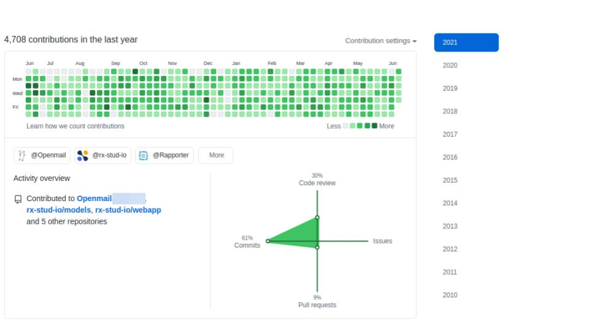
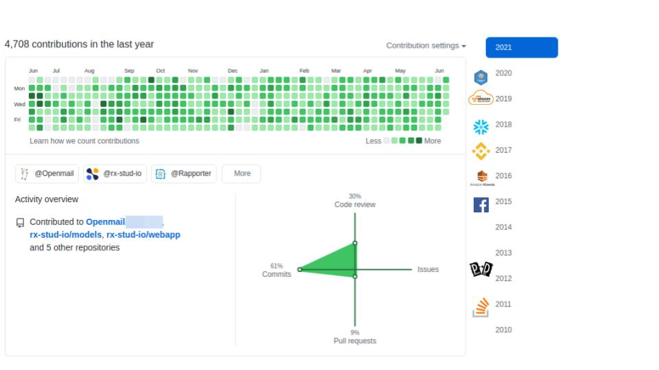
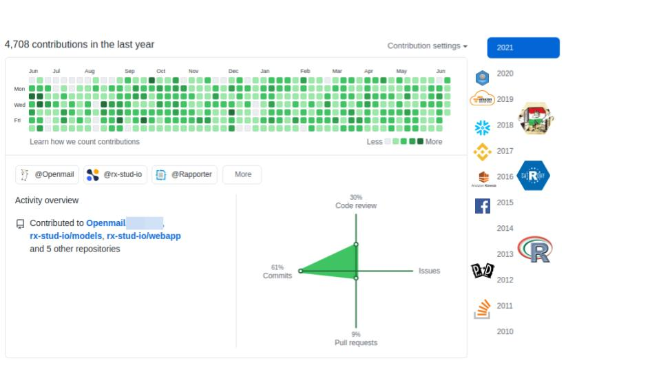
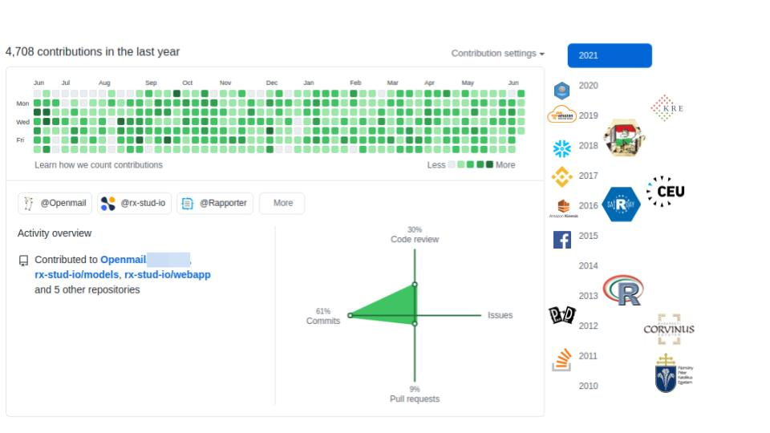
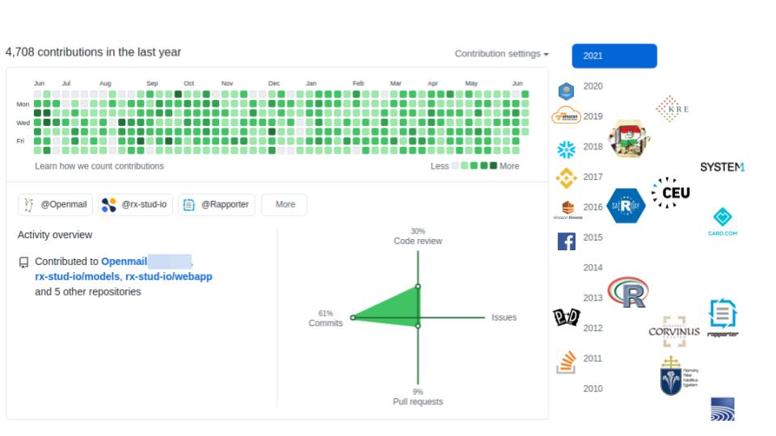
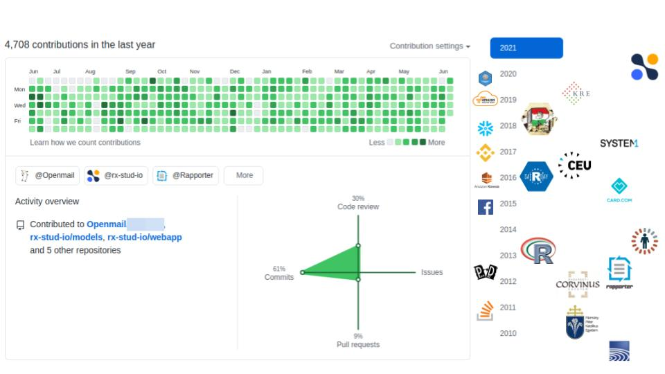

## dummy slide

<!-- https://www.conftool.org/user2021/index.php?page=browseSessions&form_session=24#paperID201 -->

<!--javascript to remove dummy slide-->

<!--end dummy slide-->
</section>

<section>
<section class="titleslide slide level1" data-transition="none">
<h2>&#62; whoami()</h2>

## > whoami() {data-transition="none"}

## > whoami() {data-transition="none"}

## > whoami() {data-transition="none"}

## > whoami() {data-transition="none"}

## > whoami() {data-transition="none"}

</section></section>

<section>
<section class="titleslide slide level1" >
<h2>&#62; whoarewe()</h2>

## > demo() {data-transition="none"}

## > demo() {data-transition="none"}

## > demo() {data-transition="none"}

## > demo() {data-transition="none"}

## > demo() {data-transition="none"}

## > demo() {data-transition="none"}

## > demo() {data-transition="none"}

## > demo() {data-transition="none"}

## > demo() {data-transition="none"}

</section></section>

<section>
<section class="titleslide slide level1">
<h2>&#62; Sys.setenv("env" = "prod")</h2>

## > example(production)

* 2006: <b>calling R scripts from PHP</b> (both reading from MySQL) to generate custom plots embedded in a homepage
* 2008: <b>automated/batch R scripts</b> to generate thousands of pages of crosstables, ANOVA and plots from SPSS with `pdflatex`
* 2011: Ruby on Rails <b>web application</b> calling `RApache` and `pandoc` to generate reports in plain English (NoSQL databases, vertical scaling, <b>security</b>, central error tracking etc)
* 2012: plain RApache <b>web application</b> for NLP and network analysis
* 2015: standardizing the data infrastructure of a fintech startup to use R both in bath jobs and <b>stream processing</b> (ETL, reporting, fraud detection, daily operations, customer communication etc)
* 2017: redesign, monitor and scale the DS infrastructure of an adtech startup for <b>batch training and live scoring</b>

## > production <<- list(...)

Using in R in a non-interactive way:

* R scripts are scheduled to run <b>without manual intervention</b> (eg CRON or upstream job trigger, API request)
* need for a standard, eg <b>containerized environment</b> (eg R and package versions, OS packages, `.Rprofile` etc)
* <b>security</b>! (safeguarded production environment, SQL injection, AppArmor, encrypted credentials etc)
* the output of the jobs are recorded and <b>monitored</b> (eg `error` handler for ErrBit, CloudWatch logs or Splunk etc), alerts and notifications
* if an error occurs, usually there is no other way to figure out what happened then looking at the recorded job output, so better <b>log</b> than sorry

</section></section>
<section>
<section class="titleslide slide level1">
  <h2>&#62; is.compliant()</h2>
  <video width="60%" controls>
    <source src="https://video.twimg.com/tweet_video/CXSk_PVUEAAQQg9.mp4" type="video/mp4">
  </video>
  

## TODO

</section></section>
<section>
<section class="titleslide slide level1">
<h2>&#62; Sys.setlocale('LC_ALL', 'hu_HU')</h2>

Source: <a href="https://thecodinglove.com/when-my-co-worker-wants-to-simplify-code-that-took" target="_new">When my co-worker wants to simplify code ...</a>

## TODO

</section></section>
<section data-transition="none">
<section class="titleslide slide level1" data-transition="none">
    <!-- https://carbon.now.sh/?bg=rgba%28255%2C255%2C255%2C1%29&t=nord&wt=none&l=r&ds=false&dsyoff=20px&dsblur=68px&wc=true&wa=true&pv=56px&ph=56px&ln=false&fl=1&fm=Hack&fs=18px&lh=161%25&si=false&es=2x&wm=false&code=%253E%2520q%28save%2520%253D%2520%27ask%27%29%250AProcess%2520R%2520finished%2520at%2520Fri%2520Jul%25209%252016%253A25%253A00%25202021%250A%250A%253E%2520follow%28%27%2540daroczig%27%29%250A%253E%2520visit%28%27https%253A%252F%252Frx.studio%27%29%250A%253E%2520register%28%27htts%253A%252F%252Fapp.rx.studio%27%29%250A%253E%2520email%28%27daroczig%2540rx.studio%27%29 -->
  
</section>

<section data-transition="none">
  <section class="titleslide slide level1" data-transition="none">
  
  </section>

</section></section>

