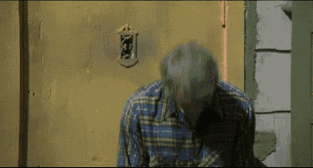
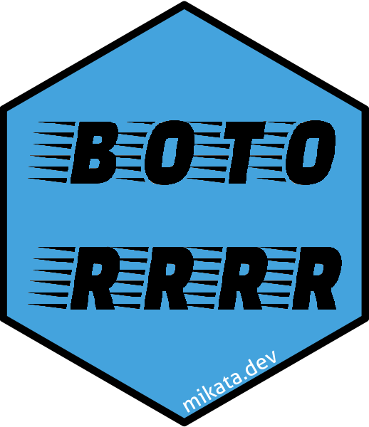

## dummy slide

<!-- https://www.conftool.org/user2021/index.php?page=browseSessions&form_session=24#paperID201 -->

<!--javascript to remove dummy slide-->
<script>
document.getElementById("dummy-slide").remove();
</script>

<!--end dummy slide-->
</section>

<section>
<section class="titleslide slide level1" data-transition="none">
<h2>&#62; whoami()</h2>

## > whoami() {data-transition="none"}


## > whoami() {data-transition="none"}


## > whoami() {data-transition="none"}


## > whoami() {data-transition="none"}


## > whoami() {data-transition="none"}


</section></section>

<section>
<section class="titleslide slide level1" >
<h2>&#62; whoarewe()</h2>

<!-- Model-Informed Precision Dosing -->
<!-- https://app.rx.studio/simulation/report/a43f8af2-d80b-11eb-b9e6-0242ac110004/result -->

<a href="https://rx.studio" title="Rx Studio homepage" target="_new">
  
</a>

## > demo() {data-transition="none"}

<a href="https://app.rx.studio" title="Rx Studio application" target="_new">
  
</a>

## > demo() {data-transition="none"}

<a href="https://app.rx.studio" title="Rx Studio application" target="_new">
  
</a>

## > demo() {data-transition="none"}

<a href="https://app.rx.studio" title="Rx Studio application" target="_new">
  
</a>

## > demo() {data-transition="none"}

<a href="https://app.rx.studio" title="Rx Studio application" target="_new">
  
</a>

## > demo() {data-transition="none"}

<a href="https://app.rx.studio" title="Rx Studio application" target="_new">
  
</a>

## > demo() {data-transition="none"}

<a href="https://app.rx.studio" title="Rx Studio application" target="_new">
  
</a>

## > demo() {data-transition="none"}

<a href="https://app.rx.studio" title="Rx Studio application" target="_new">
  
</a>

## > demo() {data-transition="none"}

<a href="https://app.rx.studio" title="Rx Studio application" target="_new">
  
</a>

## > demo() {data-transition="none"}

<a href="https://app.rx.studio" title="Rx Studio application" target="_new">
  
</a>


</section></section>

<section>
<section class="titleslide slide level1" data-transition="none">
<h2>&#62; Sys.setenv(env = \"prod\")</h2>

## > Sys.setenv(env = \"prod\") {data-transition="none"}

  <!-- <video width="60%" autoplay muted loop> -->
  <!--   <source src="img/describe.webm" type="video/webm"> -->
  <!-- </video> -->

  <!--  -->
  

  <!-- Source: -->
  <!-- <a href="https://thecodinglove.com/when-i-describe-our-network-infrastructure" target="_new"> -->
  <!--   the_coding_love -- Describing our network infrastructure -->
  <!-- </a> -->

## > ??production {data-transition="slide-in none-out"}

## > ??production {data-transition="none"}

* 2006: <b>Calling R scripts from PHP</b> (both reading from MySQL) to generate custom plots embedded in a homepage
* 2008: <b>Automated/batch R scripts</b> to generate thousands of pages of crosstables, ANOVA and plots from SPSS with `pdflatex`
* 2011: Ruby on Rails <b>web application</b> with `RApache` and `pandoc` to report in plain English (NoSQL databases, scaling, <b>security</b>, central error tracking etc)
* 2012: Plain RApache <b>web application</b> for NLP and network analysis
* 2015: Standardizing the data infrastructure of a fintech startup to use R for reporting, batch jobs, and <b>stream processing</b>
* 2017: Redesign, monitor and scale the DS infrastructure of an adtech startup for <b>batch training and live scoring</b>

## > production <<- list(...)

Using in R in a non-interactive way:

* Running R <b>without manual intervention</b> (e.g. scheduled via CRON, triggered via upstream job trigger or API request)
* Need for a standard, e.g. <b>containerized environment</b> (pinned R and package versions, OS packages, `.Rprofile` etc)
* <b>Security</b>! (e.g. safeguarded production environment, encrypted credentials, aware of Little Bobby Tables, AppArmor etc)
* Job output is informative (logging), recorded (logging) and <b>monitored</b> (e.g. `error` handler for ErrBit, CloudWatch logs or Splunk etc), alerts and notifications

## > plot(production)


</section></section>
<section>
<section class="titleslide slide level1" data-transition="slide-in none-out">
  <h2>&#62; is.compliant()</h2>

## > is.compliant() {data-transition="none"}


  

  Source:
  <a href="https://thecodinglove.com/when-the-library-has-a-very-good-documentation" target="_new">
    the_coding_love -- When the library has good documentation
  </a>

## > is.compliant() {data-transition="none"}

  

  Source:
  <a href="https://devopsreactions.tumblr.com/post/50566447542/another-pci-dss-audit" target="_new">
    DevOps Reactions -- Another PCI DSS audit
  </a>

## > history() {data-transition="slide-in none-out"}

* R Foundation -- [R: Regulatory Compliance and Validation Issues A Guidance Document for the Use of R in Regulated Clinical Trial Environments](https://www.r-project.org/doc/R-FDA.pdf)

## > history() {data-transition="none"}

* R Foundation -- [R: Regulatory Compliance and Validation Issues A Guidance Document for the Use of R in Regulated Clinical Trial Environments](https://www.r-project.org/doc/R-FDA.pdf)

> Establishing documented evidence which provides a high degree of assurance that a specific process will consistently produce a product meeting its predetermined specifications and quality attributes. (FDA Glossary of Computer System Software Development Terminology)

## > history() {data-transition="none"}

* R Foundation -- [R: Regulatory Compliance and Validation Issues A Guidance Document for the Use of R in Regulated Clinical Trial Environments](https://www.r-project.org/doc/R-FDA.pdf)

> Establishing documented evidence which provides a high degree of assurance that a specific process will consistently produce a product meeting its predetermined specifications and quality attributes. (FDA Glossary of Computer System Software Development Terminology)

* Mango Solutions -- [ValidR](https://www.mango-solutions.com/products/validr/)

## > history() {data-transition="none"}

* R Foundation -- [R: Regulatory Compliance and Validation Issues A Guidance Document for the Use of R in Regulated Clinical Trial Environments](https://www.r-project.org/doc/R-FDA.pdf)

> Establishing documented evidence which provides a high degree of assurance that a specific process will consistently produce a product meeting its predetermined specifications and quality attributes. (FDA Glossary of Computer System Software Development Terminology)

* Mango Solutions -- [ValidR](https://www.mango-solutions.com/products/validr/)
* R Consortium -- [R Validation Hub](https://www.pharmar.org/r/)

## > str(audit) {data-transition="slide-in none-out"}

```r
List of 1+
 $ use_common_sense: TRUE
 ...
```

## > str(audit) {data-transition="none"}

```r
List of 2+
 $ use_common_sense: TRUE
 $ policies: function(...) search(...)
 ...
```

## > str(audit) {data-transition="none"}

```r
List of 2+
 $ use_common_sense: TRUE
 $ policies: function(...) search(...) |> get
 ...
```

## > str(audit) {data-transition="none"}

```r
List of 2+
 $ use_common_sense: TRUE
 $ policies: function(...) search(...) |> get |> apply
 ...
```

## > str(audit) {data-transition="none"}

```r
List of 2+
 $ use_common_sense: TRUE
 $ policies: function(...) search(...) |> get |> apply |> assert
 ...
```

## > str(audit) {data-transition="none"}

```r
List of 3+
 $ use_common_sense: TRUE
 $ policies: function(...) search(...) |> get |> apply |> assert
 $ data_management: List of 3+
  ..$ encrypt: List of 2
  .. ..$ in_transit: TRUE
  .. ..$ at_rest: TRUE
  ..$ document: TRUE
  ..$ PHI: identify()
  .. ..
 ...
```

## > str(audit) {data-transition="none"}

```r
List of 4+
 $ use_common_sense: TRUE
 $ policies: function(...) search(...) |> get |> apply |> assert
 $ data_management: List of 3+
  ..$ encrypt: List of 2
  .. ..$ in_transit: TRUE
  .. ..$ at_rest: TRUE
  ..$ document: TRUE
  ..$ PHI: identify()
  .. ..
  $ vendor_management: List of 3+
  ..$ cannot_live_without: TRUE
  ..$ security_assessment: TRUE
  ..$ BAA: TRUE
  .. ..
 ...
```

## > str(audit) {data-transition="none"}

```r
List of 5+
 $ use_common_sense: TRUE
 $ policies: function(...) search(...) |> get |> apply |> assert
 $ data_management: List of 3+
  ..$ encrypt: List of 2
  .. ..$ in_transit: TRUE
  .. ..$ at_rest: TRUE
  ..$ document: TRUE
  ..$ PHI: identify()
  .. ..
  $ vendor_management: List of 3+
  ..$ cannot_live_without: TRUE
  ..$ security_assessment: TRUE
  ..$ BAA: TRUE
  .. ..
 $ code_review: TRUE
 ...
```

## > str(audit) {data-transition="none"}

```r
List of Inf
 $ use_common_sense: TRUE
 $ policies: function(...) search(...) |> get |> apply |> assert
 $ data_management: List of 3+
  ..$ encrypt: List of 2
  .. ..$ in_transit: TRUE
  .. ..$ at_rest: TRUE
  ..$ document: TRUE
  ..$ PHI: identify()
  .. ..
  $ vendor_management: List of 3+
  ..$ cannot_live_without: TRUE
  ..$ security_assessment: TRUE
  ..$ BAA: TRUE
  .. ..
 $ code_review: TRUE
 $ unit_tests: TRUE
 $ integration_tests: TRUE
 $ code_coverage_tests: TRUE
 ...
```

</section></section>
<section>
<section class="titleslide slide level1">


Source:
<a href="https://twitter.com/romain_francois/status/1410886001539567616" target="_new">
  twitter.com/romain_francois/status/1410886001539567616
</a>

## > readLines(\'frontend/es.po\', n=25)

```
# Copyright (C) 2020-2021 Rx Studio Inc.
msgid ""
msgstr ""
"Project-Id-Version: rx.studio.webapp 1.0\n"
"POT-Creation-Date: 2020-12-06 00:40\n"
"PO-Revision-Date: 2021-05-26 01:40:46\n"
"Last-Translator: Rx Studio <support@rx.studio>\n"
"Language-Team: Rx Studio <support@rx.studio>\n"
"Language: es\n"
"MIME-Version: 1.0\n"
"Content-Type: text/plain; charset=UTF-8\n"
"Content-Transfer-Encoding: 8bit\n"

msgctxt "account_verify.new_password"
msgid "New Password"
msgstr "Contraseña nueva"

#. User status meaning the user has subscribed to product updates/email newsletter.
msgctxt "common.subscribed"
msgid "Subscribed"
msgstr "Suscrito"
```

## > readLines(\'backend/pt.po\', n=25)

```
# Copyright (C) 2020-2021 Rx Studio Inc.
msgid ""
msgstr ""
"Project-Id-Version: rx.studio.models 1.0\n"
"POT-Creation-Date: 2020-12-06 00:40\n"
"PO-Revision-Date: 2021-06-22 03:45:21\n"
"Last-Translator: Rx Studio <support@rx.studio>\n"
"Language-Team: Rx Studio <support@rx.studio>\n"
"Language: pt\n"
"MIME-Version: 1.0\n"
"Content-Type: text/plain; charset=UTF-8\n"
"Content-Transfer-Encoding: 8bit\n"

msgid "Total maximum concentration"
msgstr "Concentração máxima total"

#. Drug name, only translate if has a local name or version in your language.
msgid "Cefepime"
msgstr "Cefepima"

#. The f prefix refers to free, so a shorthand for Free AUC to MIC ratio.
msgid "fAUC/MIC"
msgstr "fASC/CIM"
```

## > translate

```r
function(text, language = translate_get_language()) {

    if (!language %in% translation_languages()) {
        stop(paste('Unknown language:', shQuote(language)))
    }

    if (language == 'en') {
        translation <- text
    } else {
        translation <- translations[[language]][[text, exact = TRUE]]
    }

    if (is.null(translation) || translation == '') {
        stop(paste('Missing translation of', shQuote(text),
                   'in language', shQuote(language)))
    }

    translation

}
<environment: namespace:rx.studio>
```

## > translation_read

```r
function(language, folder = system.file('i18n', package = 'rx.studio')) {

    po <- readLines(file.path(folder, paste(language, 'po', sep = '.')))

    getlines <- function(prefix) {
        sub(paste0('^', prefix, ' "(.*)"$'), '\\1',
            grep(paste0('^', prefix, ' '), po, value = TRUE))
    }

    msgids <- getlines('msgid')[-1]
    msgstrs <- getlines('msgstr')[-1]

    if (language == 'en') {
        msgstrs <- msgids
    }

    as.list(setNames(msgstrs, msgids))

}
<environment: namespace:rx.studio>
```

## > .onLoad <- function(lib, pkg) {

```r
translations <- list2env(list(default = 'en'), parent = emptyenv())

#' List supported translations
#' @return character vector of language codes
#' @export
translation_languages <- function() {
    files <- list.files(system.file('i18n', package = 'rx.studio'), pattern = '.po$')
    assign('languages', sub('.po', '', basename(files)), envir = translations)
    translations$languages
}

#' Cache all translations
#' @return variables in the \code{translations} environment of the package
#' @export
translations_read <- function() {
    for (language in translation_languages()) {
        assign(language,
               as.environment(translation_read(language)),
               envir = translations)
    }
}
```

## > translations_generate

```r
## based on tools::xgettext
find_strings <- function(e) {
    if (is.call(e) && is.name(e[[1L]]) && (as.character(e[[1L]]) == 'translatable')) {
        ## extract text to be translated and comment to be passed to the translator
        text <- eval(e[[2]])
        if (!is.null(text) && test_string(text)) {
            log_trace(skip_formatter(paste('Text to translate:', as.character(text))))
            comment <- ifelse(length(e) > 2, eval(e[[3]]), NA_character_)
            strings <<- c(strings, list(list(text = text, comment = comment)))
        }
    } else {
        if (is.recursive(e)) {
            for (i in seq_along(e)) {
                Recall(e[[i]])
            }
        }
    }
}

## extract terms from package source, templats, reports etc.
lapply(list.files(pattern = '.R$', full.names = TRUE), find_strings)
```

## > translations_read() |> summary()

```shell
$ pocount ~/projects/rx.studio-webapp/src/assets/i18n/po/es.po \
          ~/projects/rx.studio-models/inst/i18n/es.po

Type               Strings      Words (source)    Words (translation)
Translated:     383 (100%)       2498 (100%)            2979
Untranslated:     0 (  0%)          0 (  0%)             n/a
Total:          383              2498                   2979

Type               Strings      Words (source)    Words (translation)
Translated:     246 (100%)       1234 (100%)            1360
Untranslated:     0 (  0%)          0 (  0%)             n/a
Total:          246              1234                   1360

Processing file : TOTAL:
Type               Strings      Words (source)    Words (translation)
Translated:     629 (100%)       3732 (100%)            4339
Untranslated:     0 (  0%)          0 (  0%)             n/a
Total:          629              3732                   4339

File count:       2
```

## > testthat::test_package()

  

  Source:
  <a href="https://thecodinglove.com/when-i-want-to-commit-and-jenkins-is-not-ok-with-it" target="_new"
     style="font-size: 80%;">
    the_coding_love -- When I want to commit and Jenkins is not OK with it
  </a>


## > testthat::test_package()

```yaml
on: pull_request

name: Repository tools
jobs:
  all-translated:
    runs-on: ubuntu-latest
    steps:
      - uses: actions/checkout@v2
      - uses: aws-actions/configure-aws-credentials@v1
      - uses: aws-actions/amazon-ecr-login@v1
      - name: Pull prod Docker image from Amazon ECR
        run: docker pull $ECR_REGISTRY/r-api-base
      - name: Build test Docker image locally
        run: docker build --file inst/docker/r-api/Dockerfile -t test .
      - name: all translation terms extracted
        run: library(rx.studio); assert_translatable_extracted('/R')
        shell: docker run --rm --init -v /home:/home -w /R test Rscript {0}
      - name: all English terms are translated
        run: quit(save='no', status=sum(as.data.frame(testthat::test_file('inst/tests/testthat/test-translate.R'))$failed))
        shell: docker run --rm --init -v /home:/home -w /R test Rscript {0}
```

</section></section>


<section>
<section class="titleslide slide level1">
<h2>&#62; sessionInfo()</h2>

<div class="cols">
  <div class="col"></div>
  <div class="col"></div>
</div>

## > library(logger)

```r
library(logger)
log_threshold(DEBUG)
log_info('Script starting up...')
#> INFO [2018-20-11 22:49:36] Script starting up...

pkgs <- available.packages()
log_info('There are {nrow(pkgs)} R packages hosted on CRAN!')
#> INFO [2018-20-11 22:49:37] There are 13433 R packages hosted on CRAN!

for (letter in letters) {
    lpkgs <- sum(grepl(letter, pkgs[, 'Package'], ignore.case = TRUE))
    log_level(if (lpkgs < 5000) TRACE else DEBUG,
              '{lpkgs} R packages including the {shQuote(letter)} letter')
}
#> DEBUG [2018-20-11 22:49:38] 6300 R packages including the 'a' letter
#> DEBUG [2018-20-11 22:49:38] 6772 R packages including the 'e' letter
#> DEBUG [2018-20-11 22:49:38] 5412 R packages including the 'i' letter
#> DEBUG [2018-20-11 22:49:38] 7014 R packages including the 'r' letter
#> DEBUG [2018-20-11 22:49:38] 6402 R packages including the 's' letter
#> DEBUG [2018-20-11 22:49:38] 5864 R packages including the 't' letter
```

## > library(logger)


## > library(logger) {data-transition="slide-in none-out"}

<div class="cols">
  <div class="col"></div>
  <div class="col"></div>
</div>

## > library(logger) {data-transition="none"}

<div class="cols">
  <div class="col"></div>
  <div class="col"></div>
</div>

</section></section>

<section>
<section class="titleslide slide level1">
<h2>&#62; news()</h2>

  <video width="70%" autoplay muted loop>
    <source src="img/homer-reading.webm" type="video/webm">
  </video>

  Source:
  <a href="https://thecodinglove.com/when-i-receive-a-pull-request-with-dozens-of-commits" target="_new"
     style="font-size: 80%;">
    the_coding_love -- When I receive a pull request with dozens of commits
  </a>

## > news()

```r
#' List of changes affecting simulation outputs
#'
#' Each item is a \code{list} with the below required fields:
#' \itemize{
#'   \item \code{release} semver change that can be \code{init}, \code{patch}, \code{minor} or \code{major}
#'   \item \code{date} date of change
#'   \item \code{scope} list of affected drugs, methods and targets
#'   \item \code{description} One-line description of the change.
#' }
#' @keywords internal
CHANGELOG <- list(
  list(
    release = 'init',
    date = as.Date('2020-09-05'),
    scope = list(drugs = c('cefepime'), methods = c('cfr', 'pta', 'emp', 'bay'), targets = c('fcmin_mic_ratio', 'ftime_above_mic'))),
  list(
    release = 'major',
    date = as.Date('2020-09-07'),
    scope = list(drugs = c('cefepime'), methods = c('pta'), targets = c('fcmin_mic_ratio', 'ftime_above_mic')),
    description = 'Enable multiple dosing regimens.'),
  ...
```

## > news()


</section></section>

<section>
<section class="titleslide slide level1">
<h2>&#62; do.call(evaluate_simulation, ...)</h2>

```r
#* @filter language
function(res, req) {
    log_trace(step = 'Start of language filter')
    req$language <- req$HEADERS['accept-language']
    if (is.na(req$language)) {
        req$language <- 'en'
    }
    tryCatch(
        translate_set_language(req$language),
        error = function(e) {
            log_error(
                event = 'invalid language',
                request_id = req$request_id,
                language = req$language)
        }
    )
    log_trace(step = 'End of language filter')
    plumber::forward()
}
```

## > do.call(evaluate_simulation, ...)

```r
# ...

id_token <- sub('^Bearer ', '', req$HTTP_AUTHORIZATION)

firebase_admin <- reticulate::import(module = 'firebase_admin')
app <- firebase_admin$initialize_app()
on.exit(firebase_admin$delete_app(app))

user <- firebase_admin$auth$verify_id_token(id_token)

log_debug(
    event = 'authenticated',
    client_id = req$client_id,
    user_uid = user$user_uid,
    user_oid = user$user_oid,
    user_subscription_plan = user$user_subscription_plan,
    user_allow_phi = user$user_allow_phi,
    language = headers[['accept-language']])

# ...
```

## > do.call(evaluate_simulation, ...)

```r
template <- read_template(path)
env <- validate_template_inputs(template, ...)

## capture stderr in forked process
fork_std_err_con <- rawConnection(raw(0), 'r+')
on.exit(try(close(fork_std_err_con), silent = TRUE), add = TRUE)

log_trace(step = 'Evaluating template')
report <- tryCatch(suppressMessages(suppressWarnings(
    eval_safe(
        Pandoc.brew(text = template$body, envir = env, output = '/dev/null'),
        std_err = fork_std_err_con))),
    error = function(e) {
        msg <- paste(rawToChar(rawConnectionValue(fork_std_err_con)), collapse = '')
        if (length(msg) == 0 || msg == '') {
            msg <- e$message
        }
        stop(msg)
    })

s3_upload_file(tarfile, file.path(CONSTANTS$infra$s3$buckets$simulations, env$request_id))
```

## > read_template(\'vanco-bay-auc-mic\')

```
<!--head
meta:
  drug: !ref vancomycin
  method: !ref bayesian
  target: !ref auc_mic_ratio
  references: !ref
    - goti_2018
    - soetaert_2010
    - lodise_2009
    - buelga_2005
    - rybak_2020
inputs:
- !expr generate_input(type = 'PATID')
- !expr generate_input(type = 'AGE')
- !expr generate_input(type = 'MODEL',
    labels = c(
      translatable('Goti et al. (2018) - Patients NOT undergoing hemodialysis'),
      translatable('Goti et al. (2018) - Patients undergoing hemodialysis'),
      translatable('Buelga et al. (2005) - Patients with hematological malignancies'),
      translatable('Buelga et al. (2005) - AML patients, Model 1'),
      translatable('Buelga et al. (2005) - AML patients, Model 2')),
    default = 'Goti et al. (2018) - Patients NOT undergoing hemodialysis')
...
```

## > generate_input(type = \'PATID\')

```r
$type
[1] "string"

$id
[1] "PATID"

$label
[1] "Patient Identifier"

$description
[1] "User-provided free text (such as patient id, name or alias) to identify related simulations."

$fieldset
[1] "Patient Information"

$default
[1] "Anonymous"

$phi
[1] TRUE
```

## > generate_input(type = \'MODEL\')

```r
$type
[1] "enum"

$length
[1] 1

$id
[1] "MODEL"

$label
[1] "Model for population of interest"

$description
[1] "Pharmacokinetic model to be used for specific patient type during simulations"

$fieldset
[1] "Model Parameters"

$labels
[1] "General Ward" "ICU"
```

## > ??assert_factor_level

```r
#' Make it easy to reference a factor's possible level and fail on not existing label
#' @export
#' @examples
#' MODEL <- factor(levels = c('ICU', 'General Ward'))
#'
#' MODEL$ICU
#' # [1] ICU
#'
#' MODEL$foobar
#' # Error: Unkonwn category of 'MODEL', should be one of 'ICU', 'General Ward'
`$.factor` <- function(object, key) {
    if (!key %in% levels(object)) {
        stop(sprintf(
            'Unknown category of %s, should be one of %s',
            shQuote(deparse(substitute(object))),
            paste(shQuote(levels(object)), collapse = ', ')
        ))
    }
    key
}
```

## > read_template(\'vanco-bay-auc-mic\')

```
<% ## Process data

z <- initialize_model_parameters()
z <- systematize_historical_data(z)
z <- assess_patient_parameters(z)
z <- simulate_pk_parameters(z)
z <- run_calculations(z)

%>

<% ## Output %>

<% for (id in z$output_ids) { %>
  <%= display_results(z, id) %>
<% } %>

<%= log_results(z) %>
```

## > CONSTANTS

```r
list2env(methods = list(
    'bayesian' = list(
        id = 'bay',
        title = translatable( 'Bayesian adaptive dosing', 'OK to leave untranslated if there is no standard translation in the local scientific language.'), # nolint
        description = translatable('Estimate the pharmacokinetic parameters of the patient from past concentrations and creatinine levels with Bayesian inverse modeling, then use that information to predict the steady state concentrations for multiple dosing regimens and select the optimal one, with regard to the target pharmacodynamic index.', 'Helper text shown in web app to users describing what the Bayesian adaptive dosing method does.'), # nolint
        output_ids = c(
            'plot_simconc_ss',
            'excerpt_separator',
            'display_messages',
            'table_patient_params',
            'table_model_params',
            'plot_target_param_ss',
            'plot_regimens_aucpermic',
            'plot_regimens_pctabovemic',
            'plot_regimens_cmin_cmax',
            'plot_regimens_toxicity',
            'table_pk_params'
        )
    )
)
```

## > ??calc

```r
#' Calculate Lean Body Weight (LBW)
#'
#' @param sex SEX input
#' @inheritParams calc_bmi
#' @return LBW (kg)
#' @references Janmahasatian, Sarayut et al. "Quantification of lean bodyweight."
#' Clinical pharmacokinetics vol. 44,10 (2005): 1051-65. \url{https://doi.org/10.2165/00003088-200544100-00004}
#' @export
#' @importFrom data.table fcase
calc_lbw <- function(sex, height, weight) {
    # check args
    assert_sex(sex)
    # main
    mweight <- 9270 * weight
    bmi <- calc_bmi(height, weight)
    # return
    fcase(
        sex == sex$Male,   mweight / (6680 + 216 * bmi),
        sex == sex$Female, mweight / (8780 + 244 * bmi)
    )
}
```

## > ??calc

```r
#' Calculate 24 hour AUC (via trapezoidal rule), Cmin (as last concentration) and Cmax
#' for a single dosing interval (i.e. a single dose at the beginning of the interval)
#'
#' @param d data.table with concentration data
#' @return data.table with AUC, Cmin & Cmax
#' @export
#' @importFrom checkmate assert_data_table assert_names
#' @importFrom data.table data.table := .N
#' @examples
#' calc_auc_cmin_cmax(data.table::data.table(N = c(rep(1, 10), rep(2, 10)), y = 1:20))
calc_auc_cmin_cmax <- function(d) {
    # silence "no visible global function/variable definition" R CMD check
    `.` <- y <- N <- NULL
    # check args
    assert_data_table(d, any.missing = FALSE)
    dvars <- c("N", "y")
    assert_names(names(d), must.include = dvars)
    # return
    d[, .(auc = (sum(y) - (y[1] + y[.N]) / 2) * 24 / max(.N - 1, 1), cmin = y[.N], cmax = max(y)), by = N]
}
```

</section></section>

<section>
<section class="titleslide slide level1">
<h2>&#62; licence()</h2>

<a href="https://rx.studio/licensing/" target="_new" title="Rx Studio licensing">
  
</a>

</section></section>

<section>
<section class="titleslide slide level1">
<h2>&#62; contributors()</h2>


## > library(rx.studio) {data-transition="slide-in none-out"}

```
<!--head
meta:
  drug: ~
  method: ~
  target: ~
  title: Calculate corrected weight for CrCl estimation
  description: |
    Using the Cockcroft-Gault 40% Obesity Adjustment for patients who are
    greater than 30% of their ideal body weight.
  packages:
  - rx.studio
  examples:
  - list(HEIGHT = 174, WEIGHT = 72, SEX = 'Male')
inputs:
- !expr generate_input(type = 'HEIGHT')
- !expr generate_input(type = 'WEIGHT')
- !expr generate_input(type = 'SEX')
head-->

<%=
calc_cweight(HEIGHT, WEIGHT, SEX, adjthr = 1.3)
%>
```

## > library(rx.studio) {data-transition="none"}

<div class="cols">
  <div class="col">
```
<!--head
meta:
  drug: ~
  method: ~
  target: ~
  title: Calculate corrected weight for CrCl estimation
  description: |
    Using the Cockcroft-Gault 40% Obesity Adjustment for patients who are
    greater than 30% of their ideal body weight.
  packages:
  - rx.studio
  examples:
  - list(HEIGHT = 174, WEIGHT = 72, SEX = 'Male')
inputs:
- !expr generate_input(type = 'HEIGHT')
- !expr generate_input(type = 'WEIGHT')
- !expr generate_input(type = 'SEX')
head-->

<%=
calc_cweight(HEIGHT, WEIGHT, SEX, adjthr = 1.3)
%>
```
</div>

<div class="col"></div>
</div>

</section></section>

<section data-transition="none">
<section class="titleslide slide level1" data-transition="none">
    <!-- https://carbon.now.sh/?bg=rgba%28255%2C255%2C255%2C1%29&t=nord&wt=none&l=r&ds=false&dsyoff=20px&dsblur=68px&wc=true&wa=true&pv=56px&ph=56px&ln=false&fl=1&fm=Hack&fs=18px&lh=161%25&si=false&es=2x&wm=false&code=%253E%2520q%28save%2520%253D%2520%27ask%27%29%250AProcess%2520R%2520finished%2520at%2520Fri%2520Jul%25209%252016%253A25%253A00%25202021%250A%250A%253E%2520follow%28%27%2540daroczig%27%29%250A%253E%2520visit%28%27https%253A%252F%252Frx.studio%27%29%250A%253E%2520register%28%27htts%253A%252F%252Fapp.rx.studio%27%29%250A%253E%2520email%28%27daroczig%2540rx.studio%27%29 -->
  
</section>

<section data-transition="none">
  <section class="titleslide slide level1" data-transition="none">
  
  </section>

</section></section>


