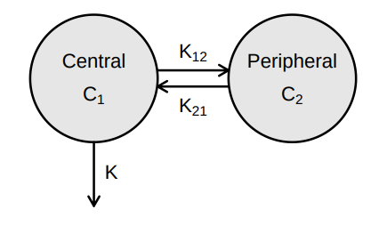
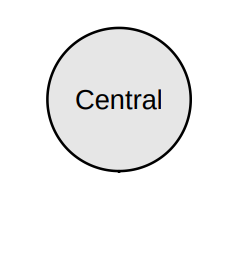
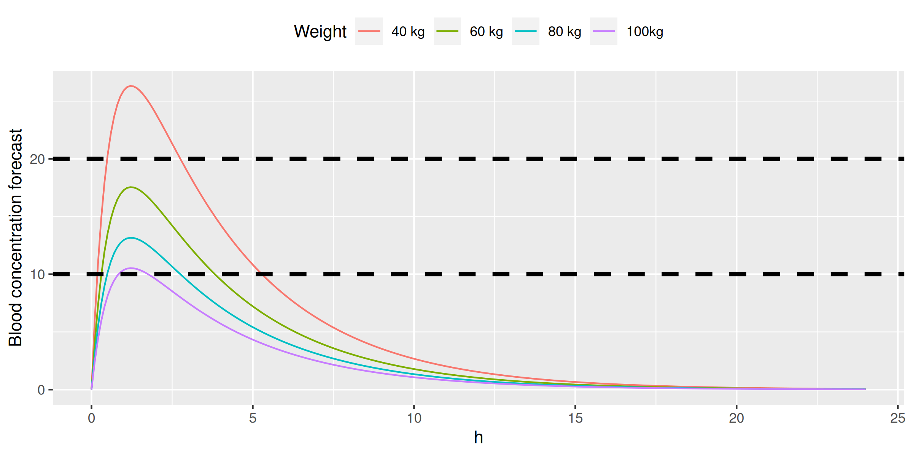
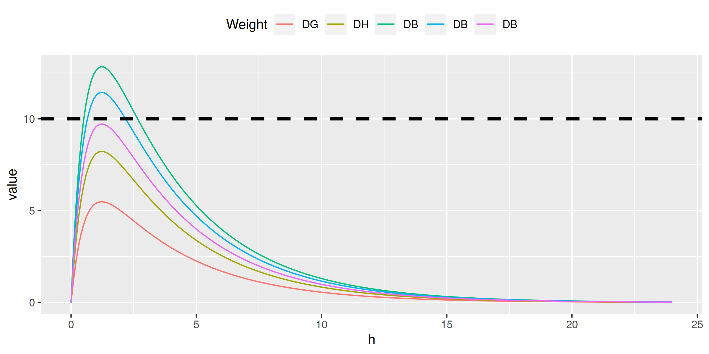
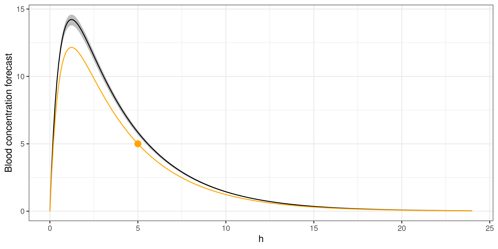
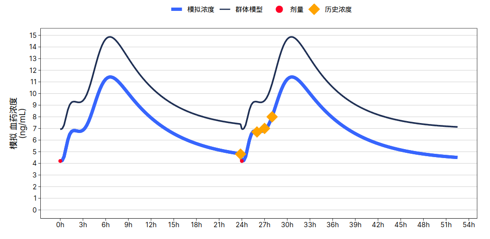
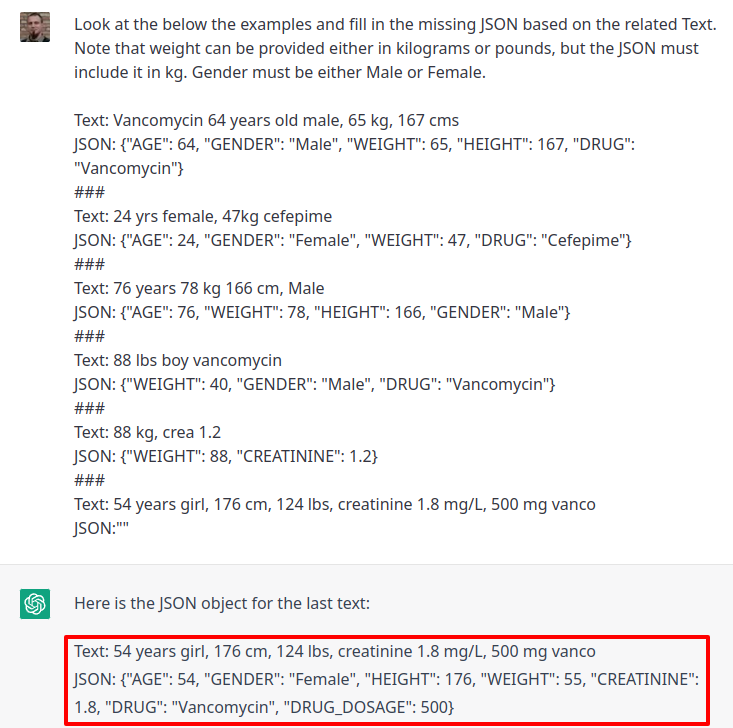
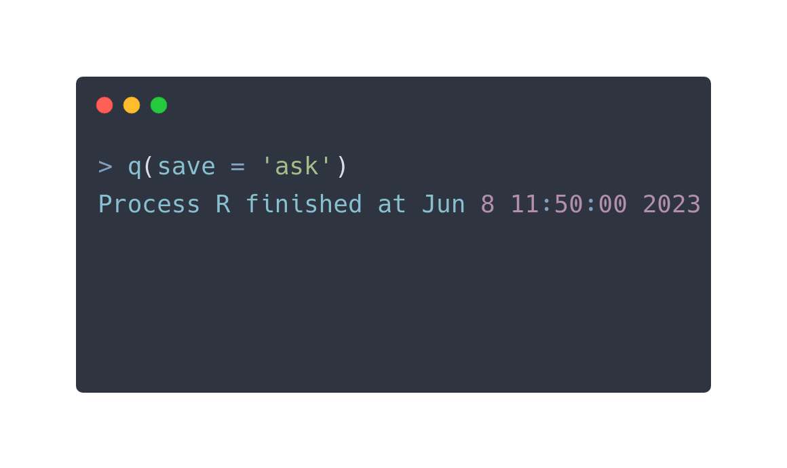

## dummy slide

<!--javascript to remove dummy slide-->
<script>
document.getElementById("dummy-slide").remove();
document.getElementById("coverslide").remove();
</script>

<!--end dummy slide-->
</section>

<section data-background-image="img/burn-bg.png"
         data-background-size="100% auto"
         data-background-position="left top"
         id="coverslide">

<!-- <div style="text-align: right; margin-right: -5%; margin-top: -4%;"> -->
<!--    -->
<!-- </div> -->

<h1 class="subtitle shaded" style="color:#eee;font-size:1.75em;text-align: center; margin-top:17%;">
  Beyond Shiny: an R-based<br />
  Precision Dosing Web Application<br />
</h1>

<h2 class="author shaded" style="color:#eee;padding-top:3%;font-size:1.25em;text-align: center !important;">
  Gergely Daróczi
</h2>

<h3 class="author shaded" style="color:#eee;padding-top:0%;font-size:1.1em;text-align: center !important; padding-top: 0px;font-weight: normal;">
  Co-founder, CTO<br />
  Rx Studio Inc.
</h3>

<div class="notes">
precision dosing application, heavily building on R in a HIPAA compliant environment, and I will try to share an introduction to the related models and some R code as well, so that interested parties can get involved
</div>

</section>

<section>
<section class="titleslide slide level1">
  <h2>&#62; vignette(topic = 'PK/PD models')</h2>
  

<aside class="notes">
* PK is often described as “what the body does to the drug”
* PD as “what the drug does to the body”
</aside>

## > vignette(topic = 'PK/PD models') {data-transition="none"}

<div class="cbox"></div>

Source: Mortensen et al (2008): Introduction to PK/PD modelling.

## > vignette(topic = 'PK/PD models') {data-transition="none"}

<div class="cbox"></div>

Source: Mortensen et al (2008): Introduction to PK/PD modelling.

## > vignette(topic = 'PK/PD models') {data-transition="none"}

<div class="cbox"></div>

Source: Mortensen et al (2008): Introduction to PK/PD modelling.

## > vignette(topic = 'PK/PD models') {data-transition="none"}

<div class="cbox"></div>

Source: Mortensen et al (2008): Introduction to PK/PD modelling.

## > vignette(topic = 'PK/PD models')


Source: <a href="https://en.wikipedia.org/wiki/Spherical_cow" target="_new">Spherical cow</a>

## > vignette(topic = 'PK/PD models') {data-transition="slide-in fade-out"}

::: {.colcontainer}
:::: {.col}



::::
:::: {.col}

::::
:::

## > vignette(topic = 'PK/PD models') {data-transition="fade-in slide-out"}

::: {.colcontainer}
:::: {.col}


::::
:::: {.col}

<br/>

$$C=\frac{A}{V}$$

* $C$ drug concentration
* $A$ drug amount
* $V$ volume of distribution

::::
:::

. . .

Example: 500 mg Panadol ($Vd = 0.9L/kg$) administered for a 70 kg patient

$$C=\frac{500mg}{70kg * 0.9L/kg}=\frac{500mg}{63L}=7.9 mg/L$$

<div class="notes">
paracetamol distributes rapidly and evenly throughout most tissues and fluids and has a volume of distribution of approximately 0.9L/kg
</div>

## > vignette(topic = 'PK/PD models') {data-transition="slide-in fade-out"}


## > vignette(topic = 'PK/PD models') {data-transition="fade-in slide-out"}


$$C_{oral}(t)=\frac{A_{oral}(t)}{V}=\frac{K_aFA_0}{V(K_a-K)}(exp(-K \cdot t) - exp(-K_a \cdot t))$$

<div style="display: flex; justify-content: space-around;">
<div>
* $C$ drug concentration
* $A$ drug amount
* $V$ volume of distribution
</div>
<div>
* $K_a$ absorption constant
* $K$ elimination rate
* $F$ bioavailability
</div>
</div>

<aside class="notes">

CAV - familiar from the previous model, new items:

* bioavailability: the percentage (or the fraction F) of an administered dose of a xenobiotic that reaches the systemic circulation. Bioavailability is practically 100% (F=1) following an intravenous administration
</aside>

## > vignette(topic = 'PK/PD models')


$$C_{oral}(t)=\frac{A_{oral}(t)}{V}=\frac{K_aFA_0}{V(K_a-K)}(exp(-K \cdot t) - exp(-K_a \cdot t))$$

```r
#' Concentration at a time computed using a one-compartment model (oral dose)
#' @param t time (hours)
#' @param dose dose amount (mg)
#' @param v volume of distribution (l)
#' @param k elimination rate constant (h^-1)
#' @param ka absorption rate constant (h^-1)
#' @param f bioavailability
#' @return numeric
#' @export
ct <- function(t, dose, v, k, ka, f) {
    (ka * f * dose) / (v * (ka - k)) * (exp(-k * t) - exp(-ka * t))
}
```

</section></section>

<section>
<section class="titleslide slide level1" data-transition="slide-in fade-out">
  <h2>&#62; example(topic = 'paracetamol')</h2>


Source: Rawlins et al. (1977): Paracetamol (simplified)

## > example(topic = 'paracetamol') {data-transition="fade-in fade-out"}


Source: Rawlins et al. (1977): Paracetamol (simplified)

## > example(topic = 'paracetamol') {data-transition="slide-in fade-out"}

```r
#' Concentration at a time computed using a one-compartment model (oral dose)
#' @param t time (hours)
#' @param dose dose amount (mg)
#' @param v volume of distribution (l)
#' @param k elimination rate constant (h^-1)
#' @param ka absorption rate constant (h^-1)
#' @param f bioavailability
#' @return numeric
#' @export
ct <- function(t, dose, v, k, ka, f) {
    (ka * f * dose) / (v * (ka - k)) * (exp(-k * t) - exp(-ka * t))
}
```

. . .

```r
ctp <- purrr::partial(ct, v = 42, k = 0.28, ka = 1.8, f = 0.89) # 70 kgs adult
```

. . .

::: {.colcontainer}
:::: {.col}

```r
> ctp(t = 1, dose = 1000)
[1] 14.81762
```

::::
:::: {.col}


::::
:::: {.col}

::::
:::

## > example(topic = 'paracetamol') {data-transition="fade-in fade-out"}

```r
#' Concentration at a time computed using a one-compartment model (oral dose)
#' @param t time (hours)
#' @param dose dose amount (mg)
#' @param v volume of distribution (l)
#' @param k elimination rate constant (h^-1)
#' @param ka absorption rate constant (h^-1)
#' @param f bioavailability
#' @return numeric
#' @export
ct <- function(t, dose, v, k, ka, f) {
    (ka * f * dose) / (v * (ka - k)) * (exp(-k * t) - exp(-ka * t))
}
```

```r
ctp <- purrr::partial(ct, v = 42, k = 0.28, ka = 1.8, f = 0.89) # 70 kgs adult
```

::: {.colcontainer}
:::: {.col}

```r
> ctp(t = 1, dose = 1000)
[1] 14.81762
```

::::
:::: {.col}

```r
> ctp(t = 2, dose = 1000)
[1] 13.64825
```

::::
:::: {.col}

::::
:::


## > example(topic = 'paracetamol') {data-transition="fade-in slide-out"}

```r
#' Concentration at a time computed using a one-compartment model (oral dose)
#' @param t time (hours)
#' @param dose dose amount (mg)
#' @param v volume of distribution (l)
#' @param k elimination rate constant (h^-1)
#' @param ka absorption rate constant (h^-1)
#' @param f bioavailability
#' @return numeric
#' @export
ct <- function(t, dose, v, k, ka, f) {
    (ka * f * dose) / (v * (ka - k)) * (exp(-k * t) - exp(-ka * t))
}
```

```r
ctp <- purrr::partial(ct, v = 42, k = 0.28, ka = 1.8, f = 0.89) # 70 kgs adult
```

::: {.colcontainer}
:::: {.col}

```r
> ctp(t = 1, dose = 1000)
[1] 14.81762
```

::::
:::: {.col}

```r
> ctp(t = 2, dose = 1000)
[1] 13.64825
```

::::
:::: {.col}

```r
> ctp(t = 6, dose = 1000)
[1] 4.676354
```

::::
:::


## > example(topic = 'paracetamol')

```r
library(data.table); library(ggplot2)
conc <- data.table(h = seq(0, 24, by = 0.1))
conc[, c := ctp(h, 1000)]
ggplot(conc, aes(h, c)) + geom_line()
```

. . .


## > do.call(ctp, weights)

```r
ctp <- function(t, dose, weight, k = 0.28, ka = 1.8, f = 0.89) {
    ct(t, dose, v = weight * 0.6, k, ka, f)
}
```

```r
conc[, c1 := ctp(h, 1000, weight =  40)]
conc[, c2 := ctp(h, 1000, weight =  60)]
conc[, c3 := ctp(h, 1000, weight =  80)]
conc[, c4 := ctp(h, 1000, weight = 100)]
ggplot(melt(conc, id.vars = 'h'), aes(h, value, color = variable)) +
    geom_line() +
    scale_color_discrete(name = 'Weight',
                         labels = c('40 kg', '60 kg', '80 kg', '100kg')) +
    ylab('Blood concentration forecast') +
    theme(legend.position = 'top') +
    geom_hline(yintercept = 10, color = 'black', linetype = 2, size = 1.25) +
    geom_hline(yintercept = 20, color = 'black', linetype = 2, size = 1.25)
```

<!-- ggsave(file = '/home/daroczig/projects/snowl.net/static/slides/budapestml2023-personalized-drug-doses-via-rx-studio/img/pkpd/paracetamol-weights.png', width = 8, height = 4) -->

## > do.call(ctp, weights)



<div class="notes">
so far, we have been administering the same dose to very different patients, which doesn't make a lot of sense (other than running simulations) .. so let's take a look at a real-life example with actual body weights and drug doses
</div>

## > do.call(ctp, family)

<div style="text-align:left;">
**An anonymized family:**
</div>

* GD (96 kg male): 1 pill of Panadol (500 mg)
* HD (64 kg female): 1 pill of Panadol (500 mg)
* BD (41 kg male): 1 pill of Panadol (500 mg)
* BD (23 kg female): half pill of Panadol (250 mg)
* BD (13 kg female): ~~7-8~~5ml Panadol baby (120 mg)

. . .

<div style="text-align:left;">
**Therapeutic goals for paracetamol:**
</div>

* sub-therapeutic range: < 10 mg/L concentrations
* therapeutic range: ≥ 10 and ≤ 20 mg/L concentrations
* toxic: > 75 mg/L concentrations

## > do.call(ctp, family)

```r
conc[, c1 := ctp(h, 500, weight = 96)]
conc[, c2 := ctp(h, 500, weight = 64)]
conc[, c3 := ctp(h, 500, weight = 41)]
conc[, c4 := ctp(h, 250, weight = 23)]
conc[, c5 := ctp(h, 120, weight = 13)]
ggplot(melt(conc, id.vars = 'h'), aes(h, value, color = variable)) + geom_line() +
    scale_color_discrete(name = 'Weight', labels = c('DG', 'DH', 'DB', 'DB', 'DB')) +
    theme(legend.position = 'top') +
    geom_hline(yintercept = 10, color = 'black', linetype = 2, size = 1.25)
```

<!--
ggsave(file = '/home/daroczig/projects/snowl.net/static/slides/budapestml2023-personalized-drug-doses-via-rx-studio/img/pkpd/daroczi.png', width = 8, height = 4)
-->

## > do.call(ctp, family)



## > do.call(ctp, family, ndoses = 4)

$$C_{MD}(t)=\sum_{n=0}^{N-1} C_{oral}(t-nτ)$$

* $N$ number of doses
* $τ$ dosing interval

Source: Mortensen et al (2008): Introduction to PK/PD modelling.

. . .

```r
ctpm <- function(t, doses, interval, dose, weight) {
    sum(sapply(0:(doses-1), function(n) ctp(t - n*interval, dose, weight)))
}
```

## > do.call(ctp, family, ndoses = 4)

```r
ctpm <- function(t, doses, interval, dose, weight) {
    sum(sapply(0:(doses-1), function(n) ctp(t - n*interval, dose, weight)))
}

conc <- data.table(h = seq(0, 24, by = 0.1))
conc[, doses := pmin(h %/% 4, 3) + 1]
conc[, c1 := ctpm(h, doses, 4, 500, weight =  96), by = .(h, doses)]
conc[, c2 := ctpm(h, doses, 4, 500, weight =  64), by = .(h, doses)]
conc[, c3 := ctpm(h, doses, 4, 500, weight =  41), by = .(h, doses)]
conc[, c4 := ctpm(h, doses, 4, 250, weight =  23), by = .(h, doses)]
conc[, c5 := ctpm(h, doses, 4, 120, weight =  13), by = .(h, doses)]

ggplot(melt(conc[, -'doses'], id.vars = 'h'), aes(h, value, color = variable)) +
    geom_line() +
    scale_color_discrete(name = 'Weight', labels = c('DG', 'DH', 'DB', 'DB', 'DB')) +
    theme(legend.position = 'top') +
    geom_hline(yintercept = 10, color = 'black', linetype = 2, size = 1.25) +
    geom_hline(yintercept = 20, color = 'black', linetype = 2, size = 1.25)
```

## > do.call(ctp, family, ndoses = 4)


</section></section>

<section>
<section class="titleslide slide level1">
<h2>&#62; sd(do.call(ctp, rlnorm(2000)))</h2>


Source: Rawlins et al. (1977): Paracetamol (simplified)

## > sd(do.call(ctp, rlnorm(2000)))

```r
weight <- 70
meanlog <- log((weight * 0.6)^2 / sqrt(0.07^2 + (weight * 0.6)^2))
sdlog <- sqrt(log(1 + (0.07^2 / (weight * 0.6)^2)))
ggplot(data.frame(x = rlnorm(n = 2000L, meanlog, sdlog))) +
    geom_histogram(aes(x)) +
    ggtitle('Volume of distribution for 70 kg') + xlab('')
```

. . .


## > sd(do.call(ctp, rlnorm(2000)))

<!-- conc <- data.table(h = seq(0, 24, by = 0.1)) -->
<!-- conc[, c := ctp(h, 1000, weight = weight)] -->
<!-- (G <- ggplot(conc, aes(h, c)) + geom_line(color = 'black') + theme_bw()) -->

 ```r
for (i in 1:250) {
    meanlog <- log((weight * 0.6)^2 / sqrt(0.07^2 + (weight * 0.6)^2))
    sdlog <- sqrt(log(1 + (0.07^2 / (weight * 0.6)^2)))
    conc <- copy(conc)[, c := ct(h, 1000, v = rlnorm(n = 1L, meanlog, sdlog),
                                 k = 0.28, ka = 1.8, f = 0.89)]
    (G <- G + geom_line(data = conc, color = 'gray', alpha = 0.1))
}
G + geom_line(color = 'black') + ggtitle('250 simulations')
```


## > sd(do.call(ctp, rlnorm(2000)))

```r
simdata <- rbindlist(lapply(1:2000, function(i) {
    meanlog <- log((weight * 0.6)^2 / sqrt(0.07^2 + (weight * 0.6)^2))
    sdlog <- sqrt(log(1 + (0.07^2 / (weight * 0.6)^2))) * 5
    as.data.frame(matrix(
        ct(seq(0, 24, by = 0.1), 1000, v = rlnorm(n = 1L, meanlog, sdlog),
           k = 0.28, ka = 1.8, f = 0.89),
        nrow = 1))
    }))

simagg <- data.frame(
    h = seq(0, 24, by = 0.1),
    min = apply(simdata, 2, FUN = min),
    mean = apply(simdata, 2, FUN = mean),
    max = apply(simdata, 2, FUN = max))

ggplot(simagg, aes(h)) +
    geom_ribbon(aes(ymin=min, ymax=max), fill = 'gray') +
    geom_line(aes(y = mean)) +
    ylab('Blood concentration forecast') +
    theme_bw() + theme(legend.position = 'top')
```

## > sd(do.call(ctp, rlnorm(2000))) {data-transition="slide-in none-out"}


</section></section>

<section>
<section class="titleslide slide level1" data-transition="none-in slide-out">
<h2>&#62; fit(ctp, data.frame(conc = 5))</h2>

<!-- ggplot(simagg, aes(h)) + -->
<!--     geom_ribbon(aes(ymin=min, ymax=max), fill = 'gray') + -->
<!--     geom_line(aes(y = mean)) + -->
<!--     ylab('Blood concentration forecast') + -->
<!--     theme_bw() + theme(legend.position = 'top') + -->
<!--     geom_point(aes(x=5, y=5), color = 'orange', size = 3) -->


## > fit(ctp, data.frame(conc = 5))

```r
library(FME)

concentrations <- data.table(x = 5, y = 5)
model_function <- function(params, x) {
    ct(x, dose = 1000, v = params['v'], k = 0.28, ka = 1.8, f = 0.89)
}
cost_function <- function(params) {
    out <- model_function(params, concentrations$x)
    concentrations$y - out
}

bay <- modFit(f = cost_function, p = c(v = weight * 0.6), method = 'Newton')
bayc <- copy(conc)[, c := ct(seq(0, 24, by = 0.1), 1000, v = bay$par[['v']],
           k = 0.28, ka = 1.8, f = 0.89)]

ggplot(simagg, aes(h)) +
    geom_ribbon(aes(ymin=min, ymax=max), fill = 'gray') +
    geom_line(aes(y = mean)) +
    geom_point(aes(x=5, y=5), color = 'orange', size = 3) +
    geom_line(data = bayc, aes(y = c), color = 'orange') +
    ylab('Blood concentration forecast') +
    theme_bw() + theme(legend.position = 'top')

```

## > fit(ctp, data.frame(conc = 5))

::: {.colcontainer}
:::: {.col}

```r
> 0.60 * 70
[1] 42
```

::::
:::: {.col}

```r
> bay$par[['v']]
[1] 51.954
```

::::
:::

. . .



## > fit(ctp, data.frame(conc = 5))


## > fit(ctp, data.frame(conc = 5))



</section></section>

</section></section>

<section>
<section class="titleslide slide level1">
  <h2>&#62; demo('webR')</h2>

 <div>
  <pre><code id="out">Loading webR, please wait...</code></pre>
  <input spellcheck="false" autocomplete="off" id="input" type="text">
  <button onclick="globalThis.sendInput()" id="run">Run</button>
 </div>

 <script type="module">
   import { WebR } from './webr.mjs';
   const webR = new WebR();
   await webR.init();
   document.getElementById('out').innerHTML = 'webR loaded';

   /* Send input on Enter key */
   input.addEventListener(
     "keydown",
     (evt) => {if(evt.keyCode === 13) globalThis.sendInput()}
   );
  </script>

</section></section>
</section></section>

<section>
<section class="titleslide slide level1">
  <h2>&#62; demo('rx.studio')</h2>

<a href="https://youtu.be/MZUrMFbd9TA" target="_new">
  
</a>

<a style="margin-top:-25px" href="https://youtu.be/MZUrMFbd9TA" target="_new">youtu.be/MZUrMFbd9TA</a>

</section></section>

<section data-transition="none" data-transition="fade">
<section class="titleslide slide level1" data-transition="none">

<h2>&#62; library(chatgpt)</h2>

## > library(chatgpt) {data-transition="fade-in slide-out"}


<div class="notes">
ready.gov is a site of the U.S. Department of Homeland Security
</div>

## > library(chatgpt) {data-transition="slide-in fade-out"}


## > library(chatgpt) {data-transition="fade-in slide-out"}


## > library(chatgpt) {data-transition="fade-in slide-out"}


## > library(chatgpt) {data-transition="fade-in slide-out"}


## > library(chatgpt) {data-transition="fade-in slide-out"}




placeholder as cannot finish with an image

</section></section>

<section data-transition="none">
<section class="titleslide slide level1" data-transition="none">
    <!-- https://carbon.now.sh/?bg=rgba%28255%2C255%2C255%2C1%29&t=nord&wt=none&l=r&width=680&ds=false&dsyoff=20px&dsblur=68px&wc=true&wa=true&pv=56px&ph=56px&ln=false&fl=1&fm=Hack&fs=18px&lh=161%25&si=false&es=2x&wm=false&code=%253E%2520q%28save%2520%253D%2520%27ask%27%29%250AProcess%2520R%2520finished%2520at%2520Jun%25208%252011%253A50%253A00%25202023%250A%250A%253E%2520visit%28%27https%253A%252F%252Frx.studio%27%29%250A%253E%2520email%28%27daroczig%2540rx.studio%27%29%250A%253E%2520follow%28%27%2540daroczig%27%29 -->
   
</section>

<section data-transition="none">
  <section class="titleslide slide level1" data-transition="none">
  
</section>

</section>
